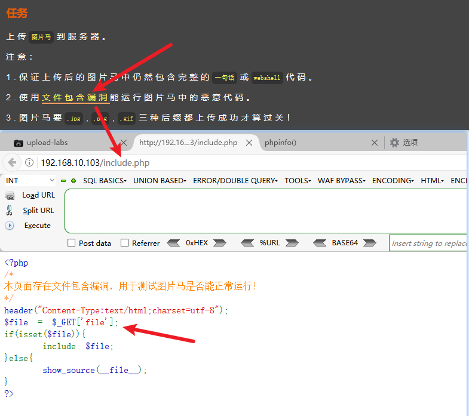

# 文件上传漏洞

## 漏洞原理

文件上传，作为正常的网站功能，被攻击者恶意利用，用于上传恶意文件造成的漏洞，通常为上传可执行文件Getshell、上传html造成存储XSS等，或上传点本身可能存在的SQL注入、XSS、命令执行等类型漏洞

练习靶场：[c0ny1/upload-labs: 一个想帮你总结所有类型的上传漏洞的靶场 (github.com)](https://github.com/c0ny1/upload-labs)

### 漏洞类型分类

### ****上传漏洞类型判断****

### 上传漏洞

由于文件上传功能实现代码没有严格限制用户上传的文件后缀以及文件类型，导致攻击者能够向某个可通过Web访问的目录上传恶意文件，并被脚本解析器执行，这样就可以在远程服务器上执行恶意脚本。

### 上传流程

1. 客户端 Javascript 检测（通常为检测`文件扩展名`）
2. 服务端 MIME 类型检测（检测 `Content-Type` 内容）
3. 服务端目录路径检测（检测跟 `path` 参数相关的内容）
4. 服务端文件扩展名检测（检测跟文件 `extension` 相关的内容）
5. 服务端文件内容检测（检测`内容`是否合法或含有恶意代码）
6. …

## 常见上传限制及Bypass技巧

Link：[文件上传绕过方式和中间件解析漏洞](https://www.freebuf.com/articles/web/265245.html)

### 常见文件上传限制方式

#### 客户端校验

- 客户端 Javascript 校验（一般只校验后缀名）

#### 服务端校验

- 文件头 Content-Type 字段校验（ image/gif）
- 文件内容头校验（GIF89a）
- 后缀名黑名单校验
- 后缀名白名单校验
- 自定义正则校验

#### 文件内容头校验之常见的文件头

php 使用函数来检测文件头内容

| 文件类型 | 文件头内容 |
| --- | --- |
| .JPEG / .JPE / .JPG | JPGGraphic File |
| .gif | GIF 89A |
| .zip | Zip Compressed |
| .doc / .xls / .xlt / .ppt / .apr | MS Compound Document v1 or Lotus Approach APRfile |

#### 文件后缀Bypass技巧

- jsp / jspx / jspf
- asp / asa / cer / aspx
- php / pht / php4 / php5
- aSp / pHp

### 常见中间件解析漏洞

#### IIS

Link: [iis文件解析漏洞](https://yinwc.github.io/2018/07/02/iis%E6%96%87%E4%BB%B6%E8%A7%A3%E6%9E%90%E6%BC%8F%E6%B4%9E/) ，[解析漏洞总结](https://blog.csdn.net/whatday/article/details/54798718)

- **IIS 5.x/6.0** 版本中存在文件解析漏洞，即分号后的不被解析，仍被IIS当做asp程序执行。例如会将 `a.asp;xx.jpg` 解析成 `asp`，原因是被 `;` 符号截断了。
- **IIS**  **5.x/6.0** 版本中存在目录解析漏洞，即新建一个名为 `test.asp` 的目录，该目录中的任何文件都被IIS当做asp程序执行（特殊符号是”/“）。例如 `test.asp/xx.jpg` 中的 `xx.jpg` 文件会被 asp 执行。
- **IIS 7.5** 版本中 `xyz.jpg/.php` 会被解析成 `php` 文件。即：若有文件 `test.jpg`，访问时在其后面加 `/.php`，便可以让IIS把 `test.jpg/.php`交给 php，php”修理”文件路径 `test.jpg/.php` 得到 `test.jpg`，该文件存在便把改文件作为 php 程序执行了。

#### Apache

Link: [apache中间件漏洞解析总结](https://www.freebuf.com/vuls/335282.html)

- 使用**module模式**与php结合的所有版本，Apache存在未知扩展名解析漏洞。

Apache 默认一个文件可以有多个以点分割的后缀，比如 `test.php.xxx`，当最右边的后缀（xxx）无法识别（不在 mime.types 文件内），则继续向左识别，直到识别到合法后缀才能进行解析

- `AddHandler` 指令的作用是：在文件扩展名与特定的处理器之间建立映射关系
- `AddType` 指令在给定的文件扩展名与特定的内容类型之间建立映射关系

#### Nginx

该漏洞与Nginx、php版本无关，属于用户配置不当造成的解析漏洞

- **cgi.fix_pathinfo**
    
    该选项位于配置文件php.ini中，默认值为1，表示开启。当php遇到文件路径 `/test.png/x.php`时，若 `/test.png/x.php`不存在，则会去掉最后的 `/x.php`，然后判断 `/test.png`是否存在，若存在，则把 `/test.png`当做文件 `/test.png/x.php`解析，如若 `test.png`还不存在如果在其前面还有后缀，继续前面的步骤，以此类推。若是关闭该选项，访问 `/test.jpg/x.php` 只会返回找不到文件。
    

#### **Windows 操作系统文件命名规则**

在windows环境下， `xx.jpg[空格]` 或 `xx.jpg.` 这两类文件都是不允许存在的。若这样命名，windows会默认除去空格或点，黑客可以通过抓包，在文件名后加一个空格或者点绕过黑名单。

若上传成功，空格和点都会被windows自动消除，这样也可以getshell。

如果在Apache中 `.htaccess`可被执行，且可被上传，那可以尝试在 `.htaccess`中写入：`<FilesMatch "sec.jpg"> SetHandler application/x-httpd-php </FilesMatch>` ，然后再上传 shell.jpg 的木马,这样 shell.jpg 就可解析为php文件。

以下为不符合 Windows 文件命名规则的文件名：(windows 系统会自动去掉不符合规则符号后面的内容)

- test.asp.
- test.asp[空格]
- test.php:1.jpg
- test.php::$DATA
- shell.php::$DATA……

#### Linux **操作系统文件命名规则**

Linux 系统对大小写敏感，所以在上传`php`不被解析时，可以尝试上传`pHp`后缀的文件名。

## 漏洞实例

#### Javascript 验证突破

场景：应用通过前端的 Javascript 对文件后缀等进行验证

突破：可通过 BurpSuite 拦截请求并修改文件后缀来绕过 Javascript 限制。

原理：首先是上传一个符合 Javascript 验证要求的文件，通过 Javascript 验证后被 BrupSuite 拦截并修改文件后缀，然后将请求发送给服务器从而绕过了 Javascript 的限制。

#### 文件后缀大小写突破

场景：前端限制文件后缀大小写

突破及原理同 Javascript 验证突破

#### 服务端扩展名验证

场景：上传一个正常的PHP文件提示上传失败，判断服务器验证上传文件的后缀。尝试修改文件后缀上传

突破：可通过 BurpSuite 拦截请求并修改文件后缀（例如加空格，双写绕过，配合apache解析漏洞等）来绕过服务器验证。 

原理：服务端可能只做了后缀名黑名单验证，所以可以尝试修改文件后缀名来绕过验证。

#### 目录解析漏洞

场景：IIS 6.0 版本，目录解析漏洞

突破：www.xxx.com/xx.asp/xx.jpg

原理：服务器默认会把 .asp 目录下的文件都解析成 asp 文件。

#### 文件解析漏洞

场景：IIS 6.0 版本，文件解析漏洞

突破：www.xxx.com/xxx.asp;.jpg

原理：服务器会将 xxx.asp;.jpg 解析成 xxx.asp 执行，原因是被 `;` 符号截断了。

#### 服务端过滤文件名

场景：我们还是上传一个PHP文件，上传成功，但是上传后的文件后缀却变成了gif，我们上传`mm.php3` 提示上传成功，但是文件名后缀却变成了`mm.3` 猜测服务器对文件名进行关键字过滤。

突破：尝试上传 `mm.pphphp` 成功绕过上传

原理：如果服务器时过滤 `php`关键字，则 `mm.pphphp` 被过滤后为 `mm.php`

#### 特殊后缀名

场景：当客户端将文件提交到服务端的时候，服务端会根据自己设定的黑白名单对客户端提交上来的文件扩展名进行判断，但是当一些在服务器中不常用的，但是可以被解析的后缀名没有被列入黑名单中时，我们就可以上传不常用的后缀名文件，实现恶意代码的执行。

突破：不常用但能执行的后缀

原理：.asa / .cer / .cdx / .php3 / .php4 / .php5 / .ashx

#### MIME 验证

场景：上传出错，推测服务端可能检测了文件类型MIME。

突破：可通过 BurpSuite 拦截请求并修改 `Content-Type` 属性，然后再转发给服务器。

原理：通过中间人修改参数。

#### 文件内容检测

场景：上传文件后，服务器对文件内容进行检测是否有恶意代码。

突破：一般文件检测使用的函数有 `getimagesize()` 检测文件是否为一个有效的图片文件。可以通过再文件头加入对应文件类型的信息（比如gif文件头`GIF 89A` ）来绕过内容检测。

原理：不同文件类型有不同的文件头信息，一般检测方法就是检测这些文件头信息来判断，图片马就是利用这个原理。

#### 文件重写

场景：当可以对服务器的 `.htaccess` 文件重写时

突破：修改 `.htaccess` 文件，定义解析文件的后缀，从而进行恶意利用。

原理：`.htaccess` 文件提供了针对目录改变配置的方法。

#### 00 截断（目录路径检测）

场景：服务器只允许上传图片

突破：假设文件的上传路径为：`http://xx.xx.xx.xx/upfiles/nsfocus.php.gif` ，通过抓包截断将`nsfocus.php`后面的`.`换成`0x00`，当上传的时候，当文件系统读到`0x00`的时候会认为文件已经结束，从而将`nsfocus.php.gif`中的内容写入到`nsfocus.php`，从而达到攻击目的。

原理：目录路径检测一般就是检测上传的路径是否合法，一旦程序员在写程序的时候对文件的上传路径过滤不严格就很有可能产生`0x00`上传截断漏洞。

## 靶场练习

### Pass-01

场景：本题通过前端 Javascript 限制上传的文件后缀名。

突破：通过修改 HTML 删除调用文件后缀检测函数 `checkFile()` 来绕过即可，然后上传包含一句话木马的 PHP 文件，上传成功后使用蚁剑连接即可getshell。

查看网站HTML代码

一句话木马文件shell.php

上传一句话木马后用蚁剑连接

### Pass-02

场景：本pass在服务端对数据包的MIME进行检查！

突破：本题在服务端对MIME进行检查，只允许 `image/jpeg` 、`image/gif`、`image/png` ，因此可通过BurpSuite拦截请求并修改 Content-Type 属性为上述三种之一，然后 Forward 即可。

查看服务端验证代码

拦截请求并修改 Content-Type 属性为 image/jpeg

### Pass-03

场景：本pass禁止上传.asp|.aspx|.php|.jsp后缀文件！

突破：本题采用了黑名单限制 `.asp|.aspx|.php|.jsp` 后缀文件，可以通过不常用但可执行的后缀来绕过，如 `php3 | php5` 等

查看服务器端源码

通过不常用但可执行的后缀来绕过，如 shell.php3

### Pass-04

场景：本pass禁止上传 `.php|.php5|.php4|.php3|.php2|php1|.html|.htm|.phtml|.pHp|.pHp5|.pHp4|.pHp3|.pHp2|pHp1|.Html|.Htm|.pHtml|.jsp|.jspa|.jspx|.jsw|.jsv|.jspf|.jtml|.jSp|.jSpx|.jSpa|.jSw|.jSv|.jSpf|.jHtml|.asp|.aspx|.asa|.asax|.ascx|.ashx|.asmx|.cer|.aSp|.aSpx|.aSa|.aSax|.aScx|.aShx|.aSmx|.cEr|.sWf|.swf` 后缀文件！

突破：虽然还是黑名单限制，但几乎过滤了所有有问题的后缀名，除了 `.htaccess`，于是首先上传一个`.htaccess`内容为 `SetHandler application/x-httpd-php` ，这样所有文件都会解析为php，然后再上传图片马，就可以解析了。

源码

.htaccess 和 图片马shell.gif 的文件内容

访问图片马shell.gif被PHP解析

### Pass-05

场景：本pass禁止上传`.php|.php5|.php4|.php3|.php2|php1|.html|.htm|.phtml|.pHp|.pHp5|.pHp4|.pHp3|.pHp2|pHp1|.Html|.Htm|.pHtml|.jsp|.jspa|.jspx|.jsw|.jsv|.jspf|.jtml|.jSp|.jSpx|.jSpa|.jSw|.jSv|.jSpf|.jHtml|.asp|.aspx|.asa|.asax|.ascx|.ashx|.asmx|.cer|.aSp|.aSpx|.aSa|.aSax|.aScx|.aShx|.aSmx|.cEr|.sWf|.swf|.htaccess` 后缀文件！

突破：还是黑名单限制，并且限制加上了`.htaccess`文件，但是没有使用`strtolower()`函数将后缀进行大小写统一，于是可以通过大小写绕过。上传 `shell.phP` 成功后，服务器还修改了文件名为日期+随机数，通过找到文件名来访问即可。

源码

shell.phP 文件内容

找到上传文件的目录

访问重命名后的文件

### Pass-06

场景：本pass禁止上传 `.php|.php5|.php4|.php3|.php2|php1|.html|.htm|.phtml|.pHp|.pHp5|.pHp4|.pHp3|.pHp2|pHp1|.Html|.Htm|.pHtml|.jsp|.jspa|.jspx|.jsw|.jsv|.jspf|.jtml|.jSp|.jSpx|.jSpa|.jSw|.jSv|.jSpf|.jHtml|.asp|.aspx|.asa|.asax|.ascx|.ashx|.asmx|.cer|.aSp|.aSpx|.aSa|.aSax|.aScx|.aShx|.aSmx|.cEr|.sWf|.swf`后缀文件！

突破：还是黑名单限制，但是没有对后缀名进行去空处理，可在后缀名中加空绕过。

### Pass-07

场景：本pass禁止上传所有可以解析的后缀！

突破：还是黑名单，但是没有使用 `deldot()` 函数对后缀名进行去”.”处理，利用windows特性，会自动去掉后缀名中最后的”.”，可在后缀名中加”.”绕过。

### Pass-08

场景：本pass禁止上传`.php|.php5|.php4|.php3|.php2|php1|.html|.htm|.phtml|.pHp|.pHp5|.pHp4|.pHp3|.pHp2|pHp1|.Html|.Htm|.pHtml|.jsp|.jspa|.jspx|.jsw|.jsv|.jspf|.jtml|.jSp|.jSpx|.jSpa|.jSw|.jSv|.jSpf|.jHtml|.asp|.aspx|.asa|.asax|.ascx|.ashx|.asmx|.cer|.aSp|.aSpx|.aSa|.aSax|.aScx|.aShx|.aSmx|.cEr|.sWf|.swf|.htaccess` 后缀文件！

突破：还是黑名单，但是没有对后缀名进行去`::$DATA`处理，利用windows特性，可在后缀名中加`::$DATA`绕过。

### Pass-09

场景：本pass只允许上传.jpg|.png|.gif后缀的文件！

突破：黑名单过滤，注意第15行和之前不太一样，路径拼接的是处理后的文件名，于是构造`info.php. .` （点+空格+点），经过处理后，文件名变成`info.php.`，即可绕过。

### Pass-10

场景：本pass会从文件名中去除 `.php|.php5|.php4|.php3|.php2|php1|.html|.htm|.phtml|.pHp|.pHp5|.pHp4|.pHp3|.pHp2|pHp1|.Html|.Htm|.pHtml|.jsp|.jspa|.jspx|.jsw|.jsv|.jspf|.jtml|.jSp|.jSpx|.jSpa|.jSw|.jSv|.jSpf|.jHtml|.asp|.aspx|.asa|.asax|.ascx|.ashx|.asmx|.cer|.aSp|.aSpx|.aSa|.aSax|.aScx|.aShx|.aSmx|.cEr|.sWf|.swf|.htaccess`字符！

突破：依旧是黑名单过滤，注意到，这里是将问题后缀名替换为空，于是可以利用双写绕过。

### Pass-11

场景：本pass上传路径可控！

突破：白名单判断，但是`$img_path`直接拼接，因此可以利用`%00`截断绕过

### Pass-12

场景：本pass上传路径可控！

突破：和十一关不同的是这次的save_path是通过POST传进来的，还是利用00截断，但这次需要在二进制中进行修改，因为POST不会像GET对`%00`进行自动解码，需要在HEX中修改十六进制。

### Pass-13

场景：本pass检查图标内容开头2个字节！

突破：这一关会读取上传文件的前两个字节来判断上传文件类型，并且后端会根据判断得到的文件类型重命名上传文件，使用 `图片马 + 文件包含` 绕过。首先制作图片马，然后上传，上传后文件会被重命名，找到重命名后的文件，然后使用文件包含绕过即可。

制作图片马的知识点：

1. png图片文件包括8字节：`89 50 4E 47 0D 0A 1A 0A` 即为 .PNG
2. jpg图片文件包括2字节：`FF D8`
3. gif图片文件包括6字节：`47 49 46 38 39|37 61`  即为 GIF89(7)a
4. bmp图片文件包括2字节：`42 4D` 即为 BM

源码

制作图片马

上传图片马

找到重命名后的图片马文件名

找到文件包含漏洞参数

文件包含

利用蚁剑连接

### Pass-14

场景：本pass使用`getimagesize()`检查是否为图片文件！

突破：通过使用`getimagesize()`检查是否为图片文件，所以还是通过制作图片马绕过，并使用文件包含漏洞解析图片马。

源码

制作图片马

找到重命名后的图片马，构造url进行文件包含漏洞利用

使用蚁剑连接

### Pass-15

场景：本pass使用`exif_imagetype()`检查是否为图片文件！

突破：由于`exif_imagetype()` 函数的原理时读取图片的第一个字符和后缀名来判断是否为图片，所以还是可以通过制作图片马来绕过。与上一题相同。

`exif_imagetype()`知识点：

`exif_imagetype()`读取一个图像的第一个字节并检查其后缀名。返回值与`getimage()`函数返回的索引2相同，但是速度比`getimage()`快得多。需要开启`php_exif` 模块。

源码

制作图片马

### Pass-16

场景：本pass重新渲染了图片！

突破：这一关对上传图片进行了判断了`后缀名`、`content-type`，以及利用`imagecreatefromgif` 判断是否为`gif` 图片，最后再做了一次二次渲染，但是后端二次渲染需要找到渲染后的图片里面没有发生变化的Hex地方，添加一句话，通过文件包含漏洞执行一句话，使用蚁剑进行连接。

二次渲染（后端重写文件内容）知识点：

- `basename(path[,suffix])` ，没指定suffix则返回后缀名，有则不返回指定的后缀名
- `strrchr(string,char)`函数查找字符串在另一个字符串中最后一次出现的位置，并返回从该位置到字符串结尾的所有字符。
- `imagecreatefromgif()`：创建一块画布，并从 GIF 文件或 URL 地址载入一副图像
- `imagecreatefromjpeg()`：创建一块画布，并从 JPEG 文件或 URL 地址载入一副图像
- `imagecreatefrompng()`：创建一块画布，并从 PNG 文件或 URL 地址载入一副图像

这里有个小提示，对于做文件上传之二次渲染建议用GIF图片，相对于简单一点

上传正常的GIF图片下载回显的图片，用 010Editor编辑器进行对比两个GIF图片内容，找到相同的地方（指的是上传前和上传后，两张图片的部分Hex仍然保持不变的位置）并插入PHP一句话，上传带有PHP一句话木马的GIF图片

这里提供一张网上制作好的GIF图片马（密码为zoe）[https://wwe.lanzoui.com/iFSwwn53jaf](https://wwe.lanzoui.com/iFSwwn53jaf)

源码

找到重命名后的图片马，然后构造url利用文件包含漏洞

使用蚁剑连接