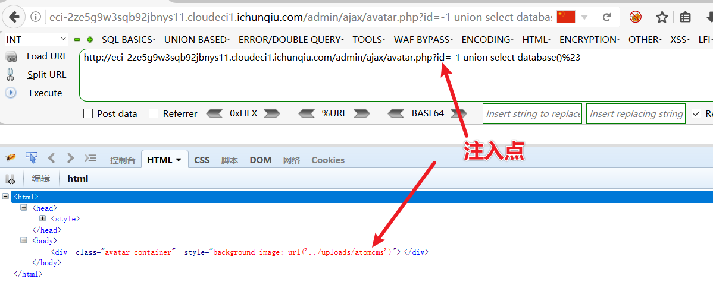
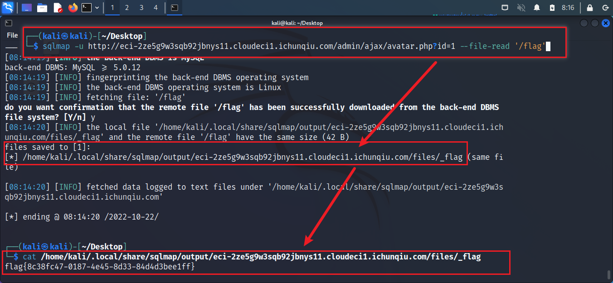

# CVE-2022-25488

## Description

Atom CMS v2.0 在/admin/ajax/avatar.php页面存在 SQL 注入漏洞,攻击者可以通过构造恶意的请求包,执行任意SQL语句,获取敏感信息,甚至导致服务器被入侵控制。

## Explanation of exploit; PoC

1. 文件 `/admin/ajax/avatar.php` 第 7 行没有任何过滤器来保护，如下图：
    
2. 在 `id` 参数通过构造恶意的请求包，返回内容可在 HTML 源码中查看，如下图：
    
3. 使用 Sqlmap 对注入点进行注入，直接读取系统文件，如下图：
    

## Mitigation

该漏洞只要是由于未对 `id` 参数进行过滤，建议添加一些关于 id 的过滤器。

## Refer

- https://github.com/thedigicraft/Atom.CMS/issues/257
- https://nvd.nist.gov/vuln/detail/CVE-2022-25488