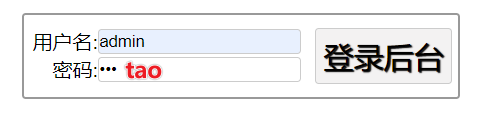
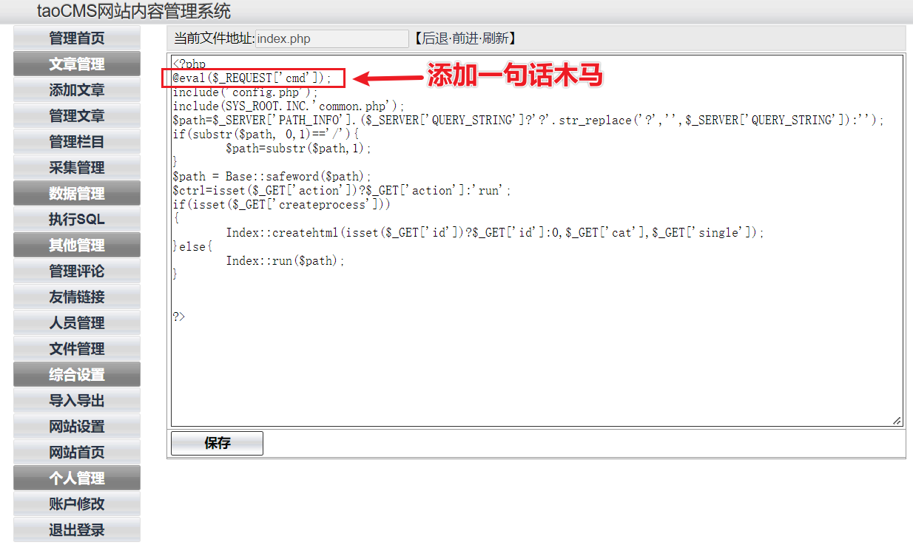
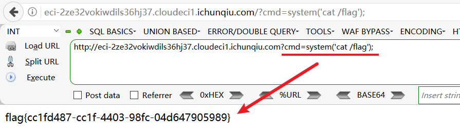

# CVE-2022-25578

## Description

taoCMS是国内最小功能完善的CMS网站内容管理系统，它在文件管理中由于后台管理可以直接修改 `.htaccess` 文件，虽然他是采用白名单上传机制，但是在可以修改 `.htaccess` 的条件下存在远程任意代码执行漏洞。

## Explanation of exploit; PoC

1. 打开首页找到登录入口。
    
2. 使用默认密码 admin:tao 登录后台。
    
3. 点击文件管理，进入文件管理页面。
    
4. 编辑 `index.php` 文件，添加一句话木马。
    
5. 访问 `index.php` 文件，执行系统命令。
    

## Mitigation

由于后台管理可以直接修改 `.htaccess` 文件，这里造成漏洞的关键。所以可以通过修改 `.htaccess` 文件的权限，使其只有管理员才能修改。

## Refer

- http://www.xinxia.ink/?p=78
- https://yunjing.ichunqiu.com/cve/detail/960
- https://github.com/taogogo/taocms/issues/28