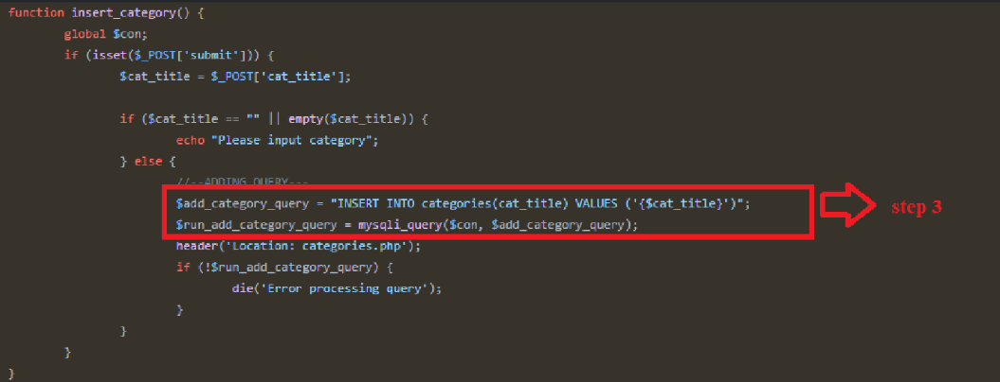
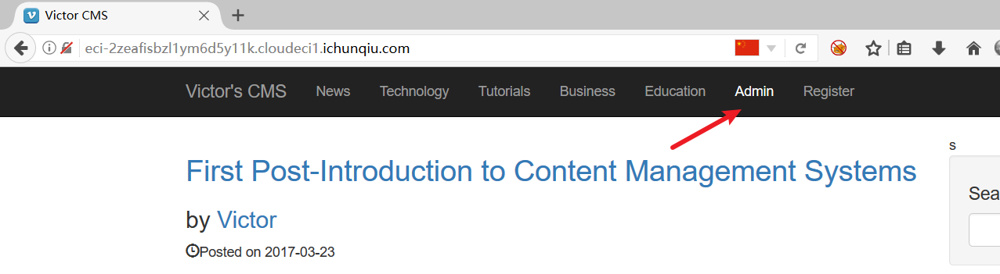
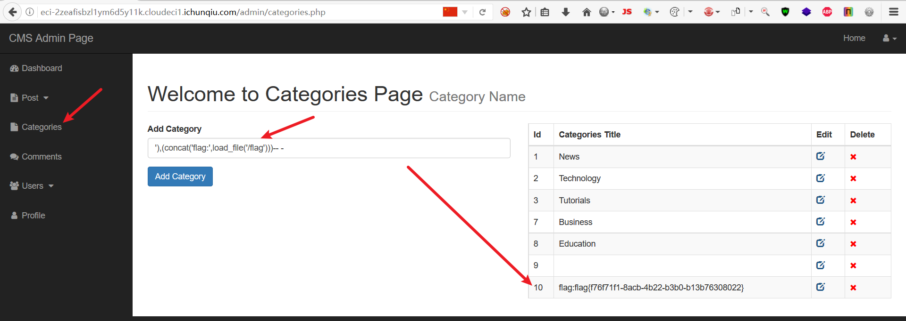

# CVE-2022-26201

## Description

Victor CMS v1.0 发现存在二次注入漏洞

该漏洞存在于 `/admin/categories.php` 中，可以通过POST请求对 `cat_title` 参数注入SQL语句，进而导致二次注入漏洞。

## Explanation of exploit; PoC

1. `/admin/categories.php` 文件分析，如下图：
    

2. `/admin/crud_cat_function.php` 文件分析，如下图：
    

3. 点击导航栏 Admin 管理页面，如下图：
    

4. 点击 Categroies 进入类别管理页面，在输入框中进行 SQL 注入 `'),(concat('flag:',load_file('/flag')))-- -`，如下图：
    

## Mitigation

该漏洞允许攻击者注入和访问，泄露系统上的所有数据。建议：

1. 对用户输入进行过滤。
2. 对用户输入进行转义。
3. 使用预编译的SQL语句。

## Refer

- https://github.com/truonghuuphuc/CVE/blob/main/CVE-2022-26201.pdf
- https://yunjing.ichunqiu.com/cve/detail/965