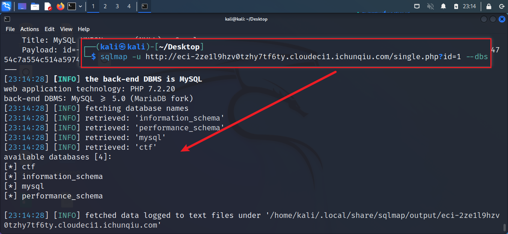
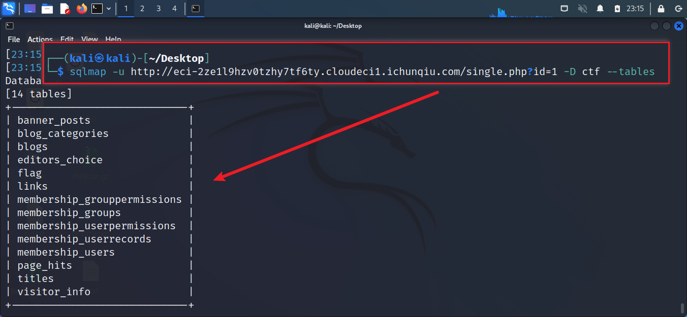
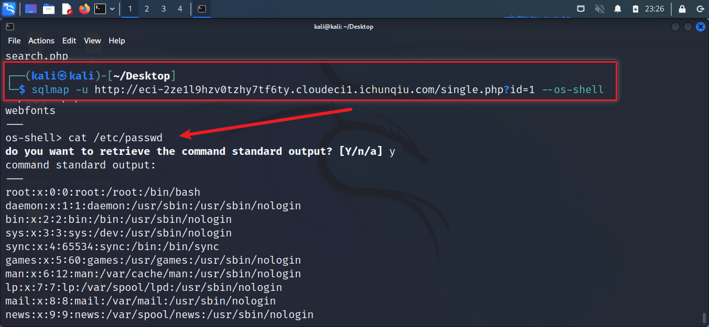

# CVE-2022-28512

## Description

Fantastic Blog (CMS)是一个绝对出色的博客/文章网络内容管理系统。

它使您可以轻松地管理您的网站或博客，它为您提供了广泛的功能来定制您的博客以满足您的需求。

它具有强大的功能，您无需接触任何代码即可启动并运行您的博客。 

该CMS的/single.php路径下，id参数存在一个SQL注入漏洞。

## Explanation of exploit; PoC

1. 通过 Description 可知，该CMS的/single.php路径下，id参数存在一个SQL注入漏洞。
    
2. 使用 Sqlmap 对注入点进行注入，获取数据库信息。
    
3. 使用 Sqlmap 获取数据库表信息。
    
4. 使用 Sqlmap 获取数据库表字段信息。
    
5. 获取flag。
    
6. 获取 os-shell。
    

## Mitigation

1. 对用户输入进行过滤。
2. 对用户输入进行转义。
3. 使用预编译的SQL语句。

## Refer

- https://yunjing.ichunqiu.com/cve/detail/749
- https://nvd.nist.gov/vuln/detail/CVE-2022-28512