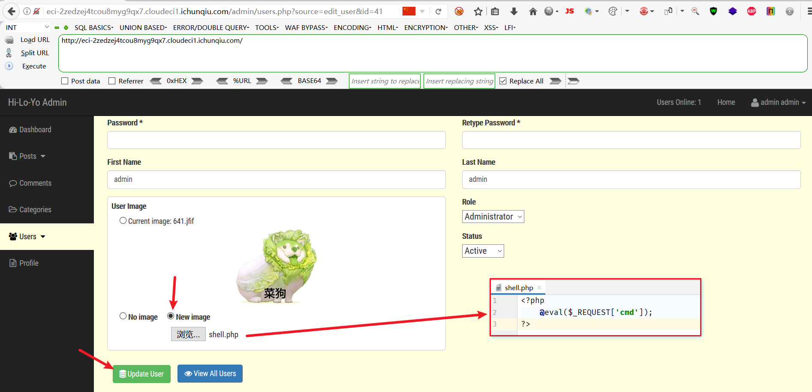

# CVE-2022-28525 ED01-CMS File Inclusion Attack

## Description
ED01-CMS v20180505 存在任意文件上传漏洞，攻击者可通过构造恶意文件，上传至服务器，从而获取服务器权限。

漏洞点位于修改用户信息页面的图片上传功能，上传文件的后缀名没有进行过滤，导致任意文件上传漏洞。

## Explanation of exploit; PoC

1. 首先使用 admin/admin 登录后台，点击用户管理，点击修改用户信息，如下图：

    
2. 点击修改头像，上传任意文件，此处上传webshell，如下图：

    
3. 上传的webshell文件路径为：/images 目录下，如下图：

    
4. 上传成功后，访问webshell，如下图：

    
5. 获取shell成功，如下图：

    

## Mitigation

1. 限制上传文件的后缀名
2. 限制上传文件的类型
3. 限制上传文件的路径
4. 限制上传文件的权限

## Refer

- https://nvd.nist.gov/vuln/detail/CVE-2022-28525
- https://yunjing.ichunqiu.com/cve/detail/1017