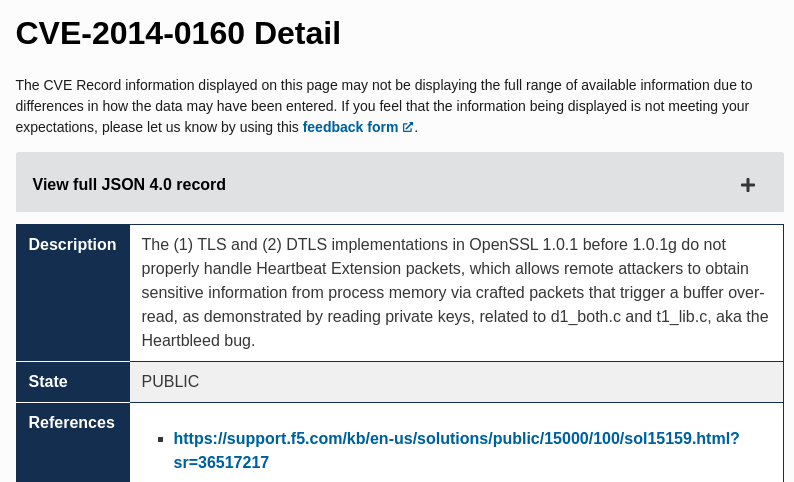
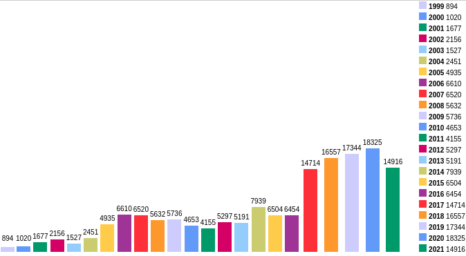
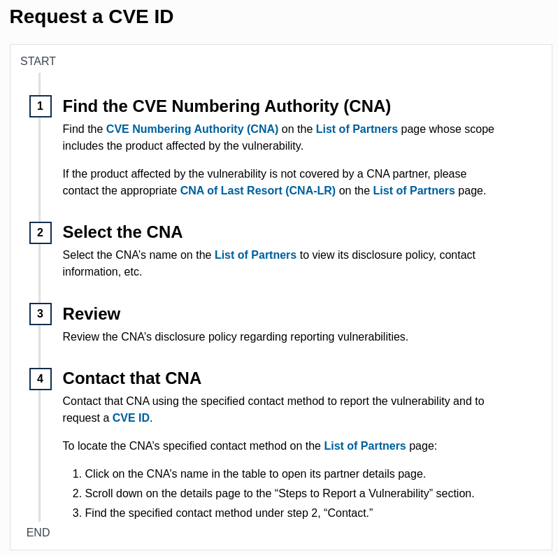

# Introduction

这是一个 CVE 漏洞复现集合，记录了一些 CVE 漏洞的复现过程，以及一些漏洞的分析思路。

## 什么是 CVE？

CVE 全称是 Common Vulnerabilities and Exposures（通用漏洞披露），包含已公开披露的计算机安全漏洞，每个 CVE 漏洞都有一个唯一的 CVE ID，格式如：CVE-YYYY-NNNN，其中 YYYY 是年号，比如 2021，NNNN 原则上是 4 位数字，但必要时可以编码更多位数。CVE 的数据库由非盈利机构 [MITRE](https://cve.mitre.org/) 运营和维护。许多漏洞库都会兼容 CVE，提供 CVE 安全建议。

[cve.org](https://www.cve.org/) 组织记录的 CVE 条目通常很简单，比如下图：

并没有包含风险等级、影响范围、修复指南等相关详细信息，不过有了 CVE ID，你可以通过相关参考链接或者 CNA（CVE 编号管理机构）获取更多详细信息。比如这个 [CVE-2021-24074](https://help.aliyun.com/document_detail/203773.html) ，阿里云就提供了详细的漏洞说明、评级、影响范围、安全建议、解决方法。

## CVE 逐年趋势

每年都有大量 CVE 漏洞被披露，呈现逐年上升的趋势（如下图）

（数据开源：[Browse Vulnerabilities By Date](https://www.cvedetails.com/browse-by-date.php)）

## 通过 CVE 披露漏洞的好处

很多开发者习惯在发现漏洞的时候通过 github issues 进行反馈，但安全漏洞不适合通过这种方式进行反馈，原因是如果在安全漏洞未被仔细分析，影响范围未确定，相关修复措施未完善的时候公开安全漏洞，不法分子容易利用这个修复升级窗口期发起相关攻击。通过 CVE 进行漏洞披露，或者安全邮件列表讨论才能更好地达到安全通知、漏洞修复的目的。

## 如何获取 CVE ID？

CVE ID 由 CNA 组织进行分配（CVE Numbering Authority，CVE 编号管理机构），想要成为 CNA 需要向 MITRE 进行注册，随后会分配给该 CNA一个编号段，用于编码新发现的 CVE 漏洞，不过 CVE 组织会要求 CNA 评估每年所需的 CVE ID 数量，且制定公开的漏洞披露政策等，门槛较高。

目前全球注册的 CNA已有 189 个，其中来自中国的 CNA 有 15 个，其中比较有名的有：阿里巴巴、华为、台湾群暉科技。Debian、Redhat、Ubuntu 等组织也在 CNA 列表中，完整的列表可以看[这里](https://www.cve.org/PartnerInformation/ListofPartners)。

任何人和组织都可以向 CNA 报告 CVE 漏洞，一些供应商会提供漏洞报告奖励，鼓励开发人员披露各种安全漏洞。

如果你发现安全漏洞，可以按下面的步骤申请 CVE ID：

### 0. 前置检查

只有满足一定条件的漏洞才会被分配 CVE ID：

- 可修复：漏洞可以独立于其他漏洞进行单独修复，而不会因为别的安全漏洞修复而消失
- 已记录/已确认：漏洞已被相关供应商确认，且会造成安全影响
- 代码库影响：漏洞会对多个产品造成影响，比如来自某个开源共享库

### 1. 确定 CNA 产品的安全漏洞

如果可以具体到某个 CNA 的产品，你应该首先联系该 CNA，比如阿里巴巴开源的 nacos 安全漏洞，可以联系邮箱：alibaba-cna@list.alibaba-inc.com 进行申请。详细的联系方式可以看[这里](https://www.cve.org/PartnerInformation/ListofPartners)。

### 2. 非 CNA 产品的安全漏洞

如果你发现该漏洞不属于 CNA 列表中供应商的产品，你可以向 MITRE 组织申请漏洞编号，在这个网页提交表单申请即可，需要你提供缺陷类型信息，常见的缺陷类型主要有：

* Buffer Overflow：缓存溢出
* Cross Site Request Forgery（CSRF）：跨站伪造请求
* Cross Site Scripting（XSS）：跨站脚本
* Directory Traversal：目录遍历
* Incorrect Access Control：错误的访问控制
* Insecure Permissions：不安全的许可权限
* Integer Overflow：整数溢出
* Missing SSL Certificate Validation：SSL 验证缺失
* SQL Injection：SQL 注入
* XML External Entity（XXE）：XML外部实体攻击

下面是官方提供的申请流程：

## 参考

- [关于 CVE 漏洞，你需要了解的知识](https://markdowner.net/article/232971472170786816)