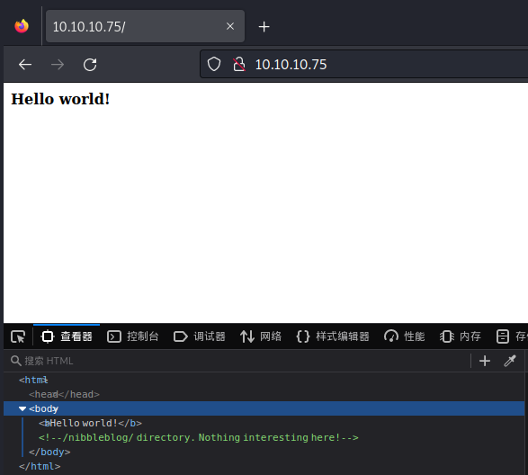
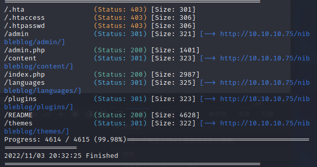
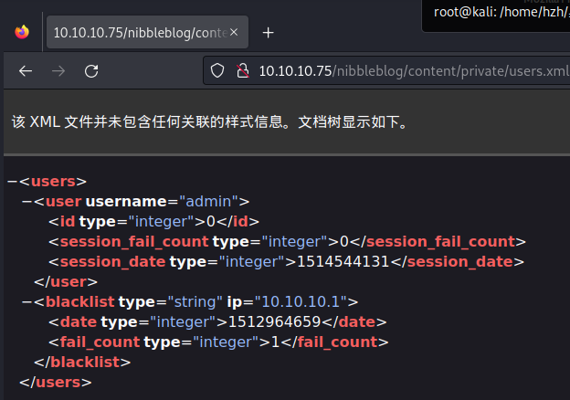
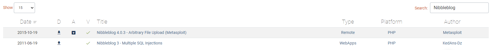
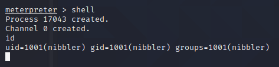
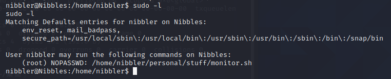
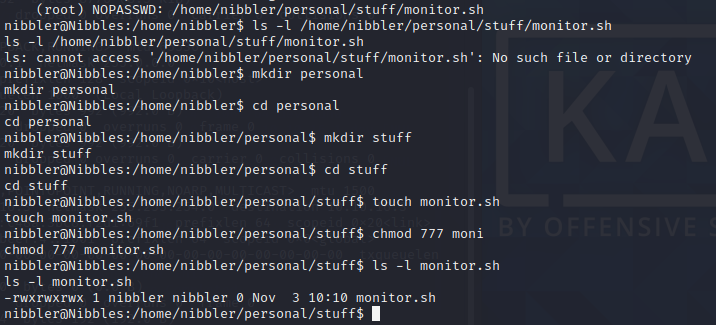

# Nibbles

## Information

Nibbles是一台相当简单的机器，但是由于包含登录黑名单，查找有效凭据的难度更大。 幸运的是，用户名可以被枚举，猜出正确的密码对大多数人来说不需要太长时间。

## 思路
### 0x01 信息搜集
`nmap -p- -sC -sV 10.10.10.75`
可以看到网站开放了22端口和80端口，使用浏览器登录到80端口后，查看网站本身的源代码。

可以再备注里看到还有一个/nibbleblog目录，使用目录遍历工具对/nibbleblog中的内容进行查看，以下三款是常见的爆破工具，本次实验中，我们使用gobuster进行查看
- dirb
- dirsearch
- gobuster

```
gobuster dir -u http://10.10.10.75/nibbleblog -w /usr/share/wordlists/dirb/common.txt
```

首先查看README这个文件，可以从中知道网站是基于Nibbleblog这个博客引擎开发的，并且版本号为v4.0.3，记住这个博客引擎和版本号，后面对该引擎历史漏洞进行检索时将会派上用场。

对其他的文件内容进行检索后，在/content/private/users.xml下发现了一个用户名

在/nibbleblog/admin.php文件中登陆到nibbleblog的后台中，从之前的步骤中，我们已经知道了用户名，接下来需要对用户名密码进行爆破，这一步骤可以使用burpsuite或者自定义脚本的方式实现，在这里我们使用nibbles进行尝试后发现成功，成功进入到/nibbleblog后台中。

### 0x02 漏洞利用
在威胁漏洞数据中进行检索之后，发现在4.0.3版本存在一个任意文件上传的漏洞

在msf中搜索nibbleblog，发现有对应的利用模块，可以直接利用，对nibbleblog网站进行渗透，也可以选择在github上搜索对应的利用脚本。有个需要注意的点，因为HTB的实验是通过VPN连接上去的，因此在设置本地IP时，需要填写的是隧道的端口号。

成功拿到nibbler的用户权限

使用python语句获取一个bash的shell环境
`python -c 'import pty;pty.spawn("/bin/bash")'`

### 0x03 权限提升
使用`sudo -l`来列出当前用户可以用root的身份执行哪些文件

可以发现monitor.sh文件可以在不使用密码的情况下通过sudo运行


显示不存在该文件，可以直接创建该monitor.sh文件

在文件中写入 `bash -i`，然后使用sudo命令执行该文件，即可提权到root用户。
提权后在/root目录下，输入文件内网，成功拿到Flag。