# Node

## Introduce
Node主要关注新推出的软件和糟糕的配置。 这台机器一开始似乎很容易，但随着更多的访问获得，它变得越来越难。 深入枚举需要在几个步骤中进行，以便能够进一步进入机器。


## 思路
### 0x01 信息搜集

显示开放了22和3000端口，分别为SSH和Node.js服务

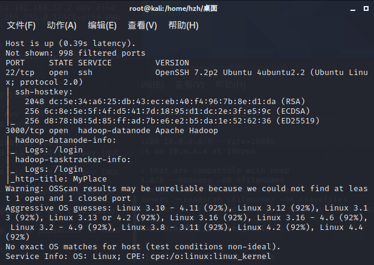

进入3000端口进行查看

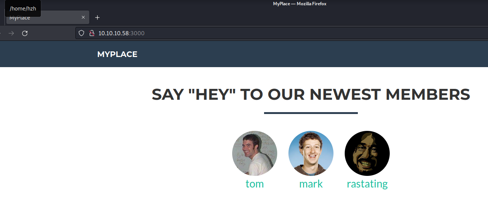

使用gobuster对网站的该端口进行信息搜集，发现哪怕是对不存在的网页返回的状态码都也200，无法对该网站使用暴力猜解的方式进行遍历。
使用开发者工具对网站的源代码进行查看，发现在最底下写有很有的javascript脚本

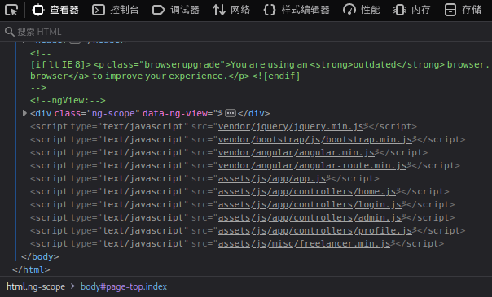

先查看/home.js文件

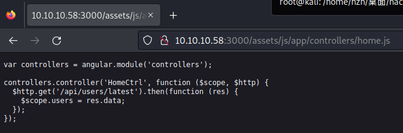

顺藤摸瓜，访问 `http://10.10.10.58/api/users/latest`

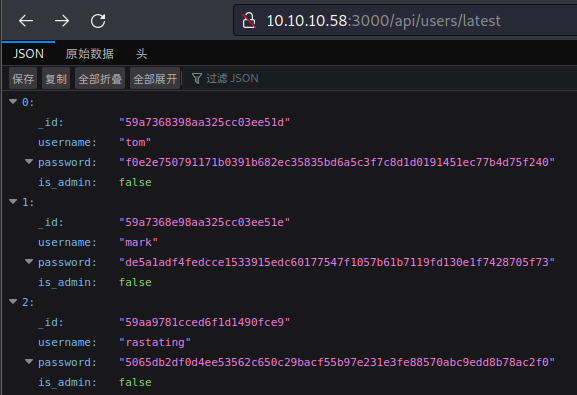

发现了用户名和经过哈希加密后的字符串，但是这三个用户中没有一个是admin用户。
继续探索js脚本的内容，在profile.js文件中，根据代码提示，访问`/api/users/`

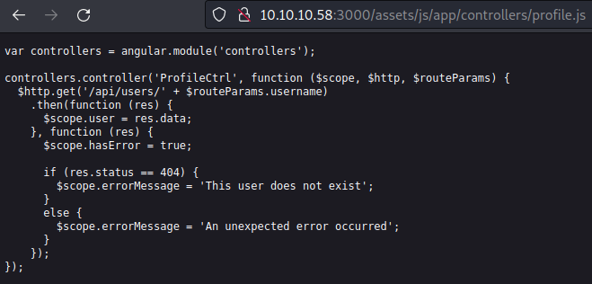

通过访问/api/users，发现了用户名"myP14ceAdm1nAcc0uNT"和它的哈希加密密码，该用户拥有admin权限。

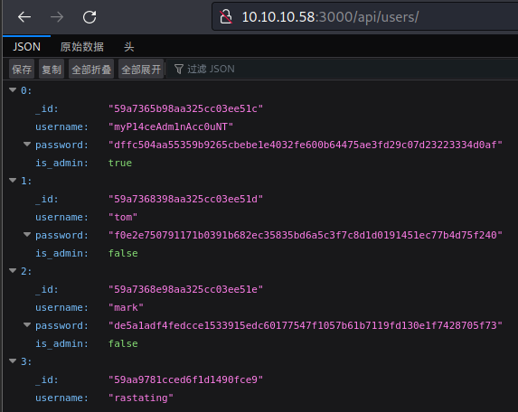

对该哈希值进行破解

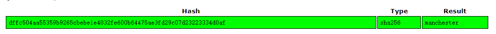

得到密码为manchester    manchester
登录进去之后，可以下载backup文件

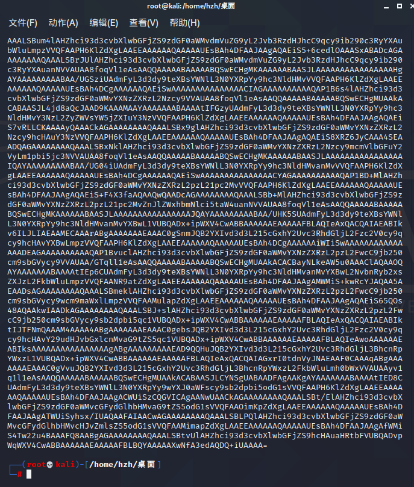

输出该文件之后，发现是以=结尾的，大概率是经过了base64编码，在这里使用base64解码输出文件。
使用`cat myplace | base64 --decode > demyplace`来解压文件到demyplace中，使用file查出是经过zip压缩的压缩文件。
解压过程中发现需要密码，使用fcrackzip的方式对该zip文件进行爆破。可以得到密码magicword。
解压后，得到该网站的源代码备份文件

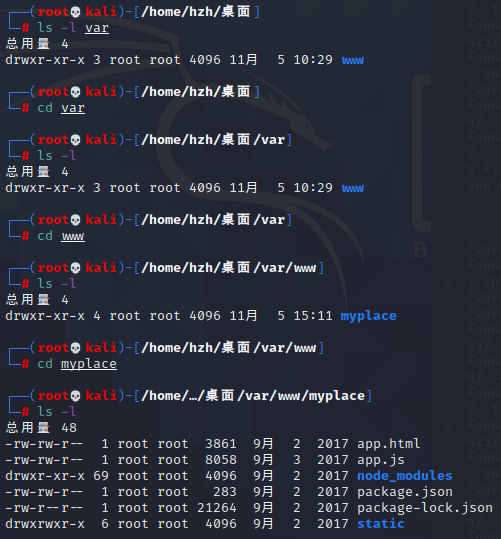

在主程序app.js文件中，发现了mongodb的账号和密码，其中使用了mark用户，使用该密码通过ssh登录目标主机。

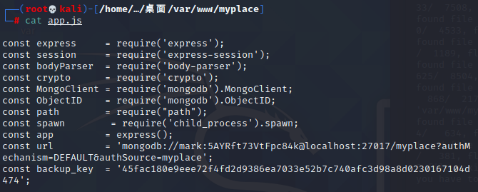


该台机器上存在密码复用，mark账户的密码在多个软件上重复使用，使用mark的身份登录ssh
定位user.txt，发现在tom的用户目录下面，这意味着我们需要横向提权到tom用户，或者是垂直提权到root用户来对文件进行读取。

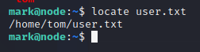

先通过ps来查看用户tom正在运行什么程序

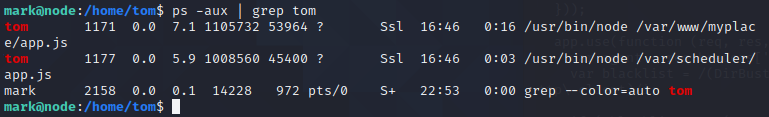

查看/var/scheduler/app.js文件

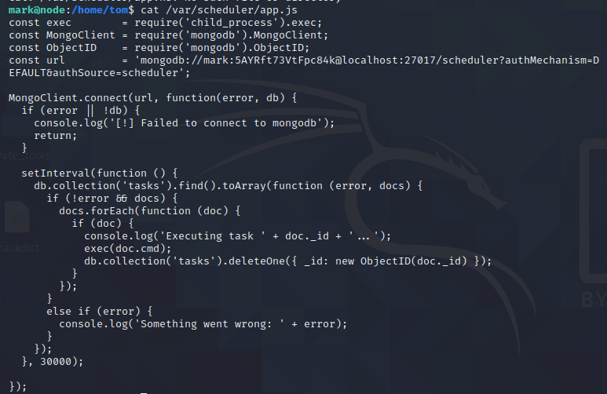

从app.js的代码中可以看到，本代码连接上了scheduler表，查看任务表中的所有任务，然后执行这些任务，并将"cmd"属性的值传递给exec函数。执行完之后把任务给删除了，防止重复执行。并且每隔30s重复一次上述操作。因此我们可以将利用代码写成一个“shell”，来获得"tom"的用户权限。

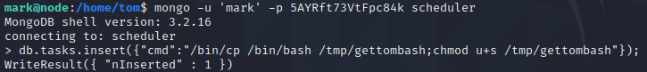

```
/bin/cp /bin/bash /tmp/gettombash;
chmod u+s /tmp/gettombash;
chown tom:tom /tmp/gettombash;
chmod g+s /tmp/gettombash;
```

将bash给复制到临时目录下，并且将该bash赋权为SUID文件,同时将bash修改为tom组


可以看到tmp目录下已经有gettombash文件，并且属于tom是SUID文件

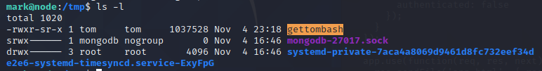

从而拿下user.txt中的flag，{e1156acc3574e04b06908ecf76be91b1}

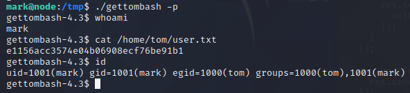

接着需要拿下/root目录下的flag，这里可以通过内核漏洞提权

首先查看该主机的内核版本 `uname -a`

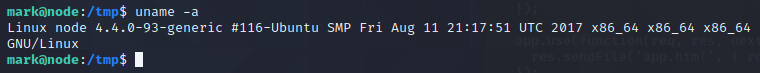

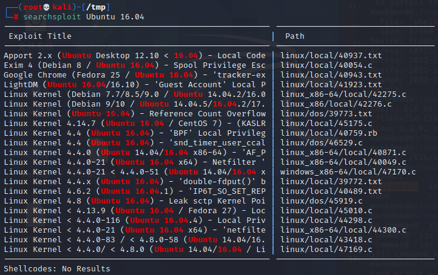

搜索该内核下对应的利用代码，使用scp的方式，将该利用代码传输到受害主机上，编译过后执行，成功拿到root权限。

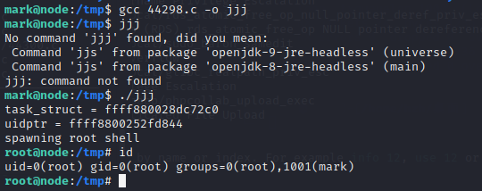

去到root目录下，成功拿下最终的flag，{1722e99ca5f353b362556a62bd5e6be0}