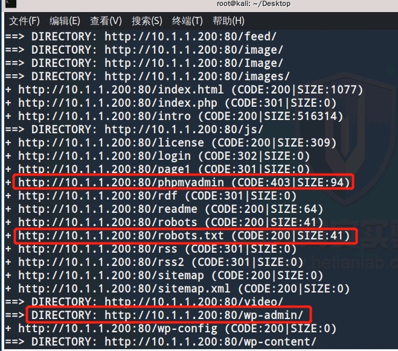
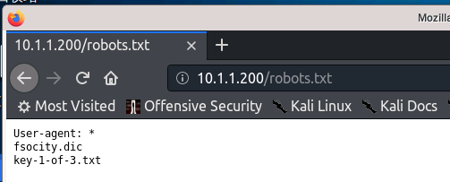
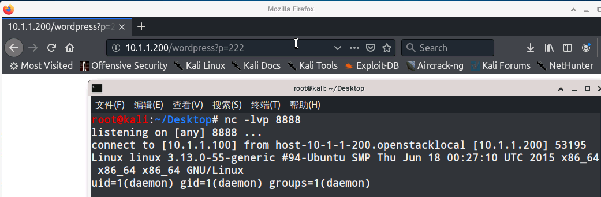
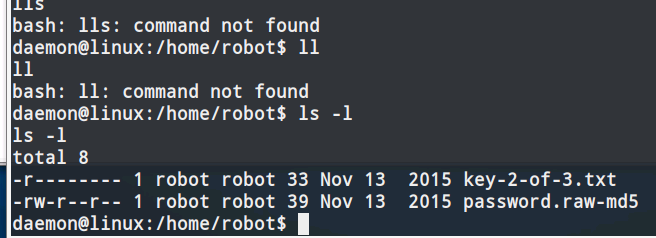
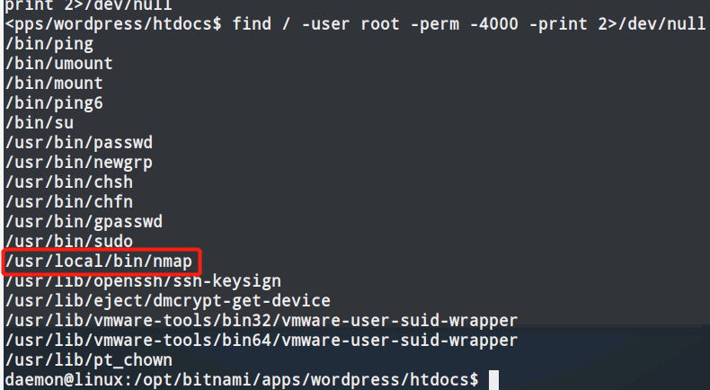

# WordPress2

## Information

**Information** is a vulnerable machine created by [VulnHub](https://www.vulnhub.com/entry/jarbas-1,232/).

## 思路

###  0x01 信息搜集

`arp-scan -l`扫描局域网内的存活主机
`nmap -Pn -sV -A 10.1.1.200` 查找目标主机开放的服务

### 0x02 服务查看

在浏览器中打开10.1.1.200:80后，发现是网页版的ssh，但是无法执行命令，使用dirb查看网站的目录组成结构。



发现有敏感目录，其中wp-admin是wordpress的后台管理目录
phpmyadmin返回显示403代表该目录做了权限控制，普通用户没有访问权限

打开robots.txt查看可以

其中key-1-of-3.txt是第一个key，而fsocity.dic为一个字典文件，可以直接下载

打开phpmyamdin网页，需要填写用户账号和密码，当用户不存在时，页面将会返回"Invalid username"，因此可以通过这段字符来判断用户在wordpress系统中是否存在.
编写脚本，遍历字典，可以得到 `elliot`用户，接着使用burpsuite进行爆破，可以得到密码"ER28-0652".

利用wordpress的模板漏洞，在404模板中写入反弹shell

接着使用nc监听8888端口，并且访问wordpress中不存在的目录，即可成功反弹shell。
使用python获得一个bash的shell环境
```
python -c 'import pty;pty.spawn("/bin/bash")'
```
使用 `ls /home`发现还有一个robot用户

发现key2，但是没有权限打开，读取password.raw-md5文件，发现是一段经过加密的MD5密文，通过john进行解密，得到密码，切换用户后成功拿到key2

接着需要拿到key3，需要提权到root
先考虑使用suid进行提权，使用`find / -user root -perm -4000 -print 2>/dev/null`查找root用户的文件

发现nmap属于root用户，考虑使用nmap交互状态下的!sh来进行提权

去到/root目录下，cat出最后一个key3的内容