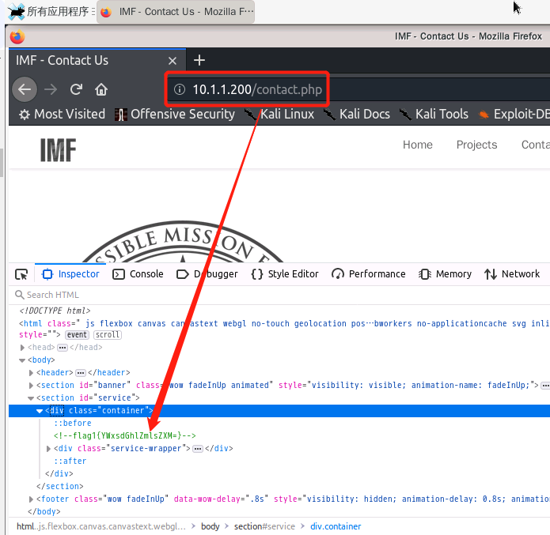
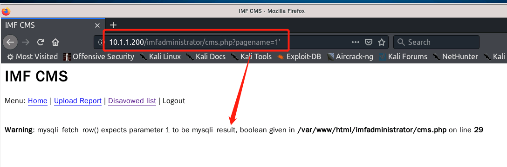
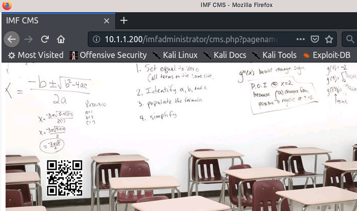
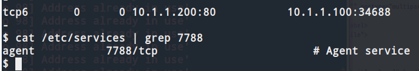
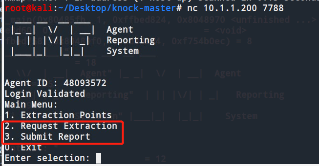

# IMF

### Information

**IMF** is a vulnerable machine created by [VulnHub](https://www.vulnhub.com/entry/jarbas-1,232/).

**题目简介：** 
IMF是一个情报机构，每个flag都包含下一个flag的提示，必须获取所有flag并获得root权限。


### 思路

#### 0x01 信息搜集
`netdiscover -r 10.1.1.1/24` 扫描局域网内的主机
`nmap -Pn -sV 10.1.1.200` 搜集完局域网内的主机后，针对特定目标主机扫描其上开放的服务

#### 0x02 服务查看
10.1.1.200主机开放了80端口，登录进去后查看contact.php网页的源码，发现了flag1

flag以=结尾，说明是base64编码的，解码后得到allthefiles

根据flag1的提示，找到另一段经过base64编码的字符串，解码后得到flag2,为imfadministator


根据flag2的提示，进入http；//10.1.1.200/imfadministator，发现是一个登录界面，在之前的contact.php界面中，发现有两个用户名，使用rmichaels登录，提示为”Invalid password“，表示数据库中存在对应的用户。

查看imfadministator的源码，可以看到作者对密码做了编码处理，猜测是写在php文件中的，使用strcmp之类的函数进行比较
> `strcmp(string $str1,string $str2)`  strcmp是比较两个字符串，如果str1<str2 则返回<0 如果str1大于str2返回>0 如果两者相等 返回0。strcmp比较的是字符串类型，**如果强行传入其他类型参数，会出错，出错后返回值0，正是利用这点进行绕过。**

在imfadministrator.php中，将`<input name="pass" value="" type="password">` 修改为 `<input name="pass[]" value="" type="password">`

登陆后成功拿到flag3，得到提示continueTOcms


发现get方法的sql注入点，使用burpsuite抓包后，赋值cookie值，利用sqlmap进行sql漏洞测试


最后爆破出数据库名admin，表名pages,其中提示tutorials-incomplete未被访问

登录进去后，发现有二维码，扫码破解后得到flag4，得到uploadr942.php


发现文件上传点，该上传点只允许上传图片类(jpg、png、gif)文件，只有gif文件可以执行PHP代码，而且有waf和文件头过滤，需要在文件头钱加GIF89a来绕过检测。
生成webshell脚本上传并且反弹后，拿到用户www-data的权限进入终端。
在当前目录下发现了flag5文件，输出其中的内容并解码后得到agentservices

建立反弹shell，使用netstat -antp查看网络连接情况，发现一个7788端口是处于LISTEN状态的
> `netstat -antp`  查看网络连接情况，-a显示所有连接，-n不解析域名，-t显示tcp连接，-p显示进程信息

> /etc/services文件是记录网络服务名和它们对应使用的端口号及协议。

使用 ```cat /etc/services | grep 7788 ```查看情况

发现是flag5所提示的agentservice

在Shell中搜索agent查找对应的位置

7482，8279，9467端口发现疑似开启了knock进程

使用nmap扫描这三个端口，发现状态是filtered，使用knock敲开这三个进程，再扫描发现处于开放的状态，使用nc连接7788端口。


连接后发现需要输入Agent ID，在shell中运行`ltrace agent`获取agent ID
>ltrace是一个仅运行指定命令，直到退出的程序。它截获并记录，由执行过程调用的动态库调用以及该过程接收的信号，还可以拦截并打印程序执行的系统调用。



2和3的提示用户进行输入，则疑似可以通过缓冲区溢出7788端口的agent程序

使用msfvenom创建一个shellcode，利用缓冲区溢出，成功连接到以root的身份反向链接到受害终端中，去到/root目录下，拿到最终的flag.txt